# 🚀 UV Package Management Guide for QuickHooks

This guide covers best practices for using UV (Astral's ultra-fast Python package manager) with the QuickHooks project.

## 📋 Table of Contents

- [Why UV?](#why-uv)
- [Installation & Setup](#installation--setup)
- [Core UV Commands](#core-uv-commands)
- [Project Workflow](#project-workflow)
- [Development Best Practices](#development-best-practices)
- [Publishing & Distribution](#publishing--distribution)
- [Troubleshooting](#troubleshooting)

## 🌟 Why UV?

UV provides **10-100x faster** dependency resolution and installation compared to traditional tools:

- **Blazing Fast**: Written in Rust, replaces `pip`, `pip-tools`, `pipx`, `poetry`, `pyenv`, `twine`, and `virtualenv`
- **Modern Workflow**: Built-in project management, lockfiles, and virtual environments
- **Consistent Environments**: Reproducible builds with `uv.lock`
- **Simple Commands**: Intuitive CLI that "just works"


## 🔧 Installation & Setup

### Install UV

```bash
# macOS/Linux
curl -LsSf https://astral.sh/uv/install.sh | sh

# Windows PowerShell  
powershell -ExecutionPolicy ByPass -c "irm https://astral.sh/uv/install.ps1 | iex"

# Verify installation
uv --version
```

### Clone & Setup QuickHooks

```bash
git clone https://github.com/kivo360/quickhooks.git
cd quickhooks

# Install all dependencies (including dev extras)
uv sync --all-extras

# Verify installation
uv run python -c "import quickhooks; print('✅ QuickHooks ready!')"
```

## 🎯 Core UV Commands

### Project Management Commands

```bash
# Initialize new project
uv init my-project --lib

# Add dependencies
uv add requests
uv add "pytest>=7.0" --dev
uv add git+https://github.com/user/repo.git

# Remove dependencies  
uv remove requests

# Sync environment with pyproject.toml
uv sync
uv sync --dev  # Include dev dependencies
uv sync --all-extras  # Include all optional dependencies

# Lock dependencies
uv lock
uv lock --upgrade  # Upgrade all dependencies
uv lock --upgrade-package requests  # Upgrade specific package

# Run commands in project environment
uv run python script.py
uv run pytest
uv run mypy src/

# View dependency tree
uv tree
uv tree --show-version-specifiers
```

### Build & Publish Commands

```bash
# Build distributions
uv build
uv build --no-sources  # Recommended for publishing

# Publish to PyPI
uv publish
uv publish --token $PYPI_TOKEN
uv publish --index testpypi  # Publish to Test PyPI
```

## 📊 Project Workflow

### Development Lifecycle

```mermaid
graph TD
    A[🚀 Project Start] --> B[uv init --lib quickhooks]
    B --> C[📝 Edit pyproject.toml]
    C --> D[📦 uv add dependencies]
    D --> E[💻 Write Code]
    E --> F[🧪 uv run pytest]
    F --> G{Tests Pass?}
    G -->|No| E
    G -->|Yes| H[🔒 uv lock]
    H --> I[🔄 uv sync]
    I --> J[📋 uv tree]
    J --> K[🏗️ uv build]
    K --> L[📤 uv publish]
    
    style A fill:#e3f2fd
    style K fill:#f1f8e9  
    style L fill:#e8f5e8
    style G fill:#fff3e0
```



### Daily Development Commands

```bash
# Start development session
cd quickhooks
uv sync --dev  # Ensure environment is up-to-date

# Add new dependency
uv add new-package
uv lock  # Update lockfile

# Run development server
uv run make dev
# OR
uv run quickhooks-dev run src/

# Run tests
uv run pytest tests/ -v
uv run pytest --cov=quickhooks

# Type checking
uv run mypy src/quickhooks

# Linting & formatting
uv run ruff check src/
uv run ruff format src/
```

## 🏆 Development Best Practices

### 1. Environment Management

```bash
# Always sync before starting work
uv sync --dev

# Use specific Python version
uv python pin 3.12

# Verify environment consistency
uv run python --version
```

### 2. Dependency Management

```toml
# pyproject.toml - Organize dependencies clearly
[project]
dependencies = [
    "typer[all]>=0.9.0",
    "pydantic>=2.5.0",
    # Production dependencies only
]

[project.optional-dependencies]
dev = [
    "pytest>=7.4.0",
    "mypy>=1.8.0",  
    "ruff>=0.1.9",
    # Development-only dependencies
]
agent-analysis = [
    "groq>=0.13.0",
    "chromadb>=0.4.0",
    # Feature-specific dependencies
]
```

### 3. Lockfile Best Practices

```bash
# Commit uv.lock to version control
git add uv.lock

# Update lockfile regularly
uv lock --upgrade

# Use frozen mode in CI/production
uv sync --frozen  # Don't modify uv.lock
uv run --frozen pytest  # Don't sync environment
```

### 4. Build Configuration

```toml
# pyproject.toml - UV build backend
[build-system]
requires = ["uv_build>=0.8.3,<0.9.0"]
build-backend = "uv_build"

[tool.uv]
# Development dependencies (UV-specific)
dev-dependencies = [
    "pytest>=7.4.0",
    "mypy>=1.8.0",
    "ruff>=0.1.9",
]
```

## 📦 Publishing & Distribution

### Pre-publish Checklist

```mermaid
graph TD
    A[📋 Pre-publish Checklist] --> B{Version Updated?}
    B -->|No| C[Update version in pyproject.toml]
    B -->|Yes| D{Tests Pass?}
    C --> D
    D -->|No| E[Fix tests: uv run pytest]
    D -->|Yes| F{Build Clean?}
    E --> F
    F -->|No| G[Fix build: uv build --no-sources]
    F -->|Yes| H[🚀 Ready to Publish]
    G --> H
    
    style H fill:#4caf50,color:#fff
    style A fill:#2196f3,color:#fff
```



### Publishing Commands

```bash
# 1. Ensure clean build
uv build --no-sources

# 2. Test on TestPyPI first
uv publish --index testpypi

# 3. Install and test from TestPyPI
pip install --index-url https://test.pypi.org/simple/ quickhooks

# 4. Publish to PyPI  
uv publish --token $PYPI_TOKEN

# 5. Create GitHub release
git tag v0.1.0
git push origin v0.1.0
```

### Environment Variables

```bash
# Set up publishing credentials
export PYPI_TOKEN="your-pypi-token"
export UV_PUBLISH_TOKEN="$PYPI_TOKEN"

# For GitHub Actions
export UV_PUBLISH_URL="https://upload.pypi.org/legacy/"
export UV_PUBLISH_USERNAME="__token__"
```

## 🔧 QuickHooks-Specific Commands

### Core Development Workflow

```bash
# Install QuickHooks for development
uv sync --all-extras

# Run agent analysis
uv run quickhooks agents analyze "Write a Python function"

# Start development server with hot reload
uv run quickhooks-dev run src/ --delay 0.5

# Run comprehensive tests
uv run pytest tests/ --cov=quickhooks --cov-report=term-missing

# Global installation for Claude Code integration
uv run python -m quickhooks install install-global

# Validate Claude Code settings schema
uv run python test_schema_compliance_audit.py
```

### Makefile Integration

The project includes a UV-optimized Makefile:

```bash
# Install dependencies
make install  # Uses: uv pip install -e ".[dev]"

# Run development server  
make dev  # Uses: uv run quickhooks-dev

# Run tests
make test  # Uses: uv run pytest

# Format code
make format  # Uses: uv run ruff format

# Type check
make typecheck  # Uses: uv run mypy

# All checks
make check  # Runs lint, typecheck, test
```

## 🐛 Troubleshooting

### Common Issues & Solutions

#### 1. Environment Sync Issues

```bash
# Problem: Dependencies out of sync
# Solution: Force sync
uv sync --dev --upgrade

# Problem: Lockfile conflicts
# Solution: Regenerate lockfile
rm uv.lock
uv lock
```

#### 2. Build Failures

```bash
# Problem: Build fails with missing dependencies
# Solution: Use --no-sources for publishing
uv build --no-sources

# Problem: Build backend issues
# Solution: Check build-system in pyproject.toml
[build-system]
requires = ["uv_build>=0.8.3,<0.9.0"]
build-backend = "uv_build"
```

#### 3. Python Version Issues

```bash
# Problem: Wrong Python version
# Solution: Pin specific version
uv python pin 3.12

# Check available Python versions
uv python list

# Install specific Python version
uv python install 3.12
```

#### 4. Cache Issues

```bash
# Problem: Corrupted cache
# Solution: Clear UV cache
uv cache clean

# Problem: Outdated cached packages
# Solution: Clean specific package
uv cache clean requests
```

### Performance Tips

1. **Use `--frozen` in CI/production**:
   ```bash
   uv sync --frozen  # Don't update lockfile
   uv run --frozen pytest  # Skip environment sync
   ```

2. **Leverage UV's native build backend**:
   ```toml
   [build-system]
   requires = ["uv_build"]
   build-backend = "uv_build" 
   ```

3. **Pin Python version locally**:
   ```bash
   uv python pin 3.12  # Creates .python-version
   ```

4. **Use extras for optional features**:
   ```bash
   uv sync --extra agent-analysis  # Only install AI features
   ```

## 📚 Additional Resources

- [UV Documentation](https://docs.astral.sh/uv/)
- [UV GitHub Repository](https://github.com/astral-sh/uv)
- [Python Packaging Guide](https://packaging.python.org/)
- [PyPI Publishing Guide](https://packaging.python.org/tutorials/packaging-projects/)

---

**Next**: Check out our [Contribution Guide](../CONTRIBUTING.md) for UV-based development workflows!