# 📦 Package Lifecycle Workflows

This document contains Mermaid diagrams documenting the complete package lifecycle for QuickHooks using UV.

## 🚀 Development Workflow

### Complete Development Lifecycle

```mermaid
graph TD
    %% Project Initialization
    A[🚀 Start New Project] --> B[uv init quickhooks --lib]
    B --> C[📝 Configure pyproject.toml]
    C --> D[📦 Add Dependencies]
    
    %% Development Phase
    D --> E[💻 Write Code]
    E --> F[🧪 Run Tests]
    F --> G{Tests Pass?}
    G -->|No| H[🐛 Fix Issues]
    H --> E
    G -->|Yes| I[📋 Code Review]
    
    %% Quality Assurance
    I --> J[🔍 Type Check]
    J --> K[📏 Lint & Format]
    K --> L[🏗️ Build Check]
    L --> M{Quality OK?}
    M -->|No| N[🔧 Fix Quality Issues]
    N --> E
    M -->|Yes| O[🔒 Lock Dependencies]
    
    %% Release Preparation
    O --> P[📦 Build Package]
    P --> Q[🧪 Test Distribution]
    Q --> R[📤 Publish]
    R --> S[🏷️ Tag Release]
    S --> T[📝 Update Docs]
    
    %% Styling
    style A fill:#e3f2fd,stroke:#1976d2
    style R fill:#e8f5e8,stroke:#388e3c
    style G fill:#fff3e0,stroke:#f57c00
    style M fill:#fff3e0,stroke:#f57c00
    style T fill:#f3e5f5,stroke:#7b1fa2
```

### Daily Development Commands

```mermaid
graph LR
    subgraph "🌅 Morning Setup"
        A[uv sync --dev] --> B[uv run python --version]
        B --> C[uv tree]
    end
    
    subgraph "💻 Development"
        D[uv run quickhooks-dev] --> E[Edit Code]
        E --> F[uv run pytest -x]
        F --> G[uv run ruff format]
    end
    
    subgraph "🌙 End of Day"
        H[uv run make check] --> I[uv lock]
        I --> J[git commit]
    end
    
    C --> D
    G --> H
    
    style A fill:#bbdefb
    style H fill:#c8e6c9
    style J fill:#d1c4e9
```

## 🔄 Dependency Management

### Adding Dependencies

```mermaid
flowchart TD
    A[Need New Dependency] --> B{Dependency Type?}
    
    B -->|Production| C[uv add package]
    B -->|Development| D[uv add package --dev]
    B -->|Optional Feature| E[uv add package --optional extra]
    B -->|Git Repository| F[uv add git+https://github.com/user/repo.git]
    
    C --> G[Update pyproject.toml]
    D --> G
    E --> G  
    F --> G
    
    G --> H[uv lock]
    H --> I[Update uv.lock]
    I --> J[uv sync]
    J --> K[✅ Ready for Development]
    
    style A fill:#fff3e0
    style K fill:#e8f5e8
    style B fill:#e1f5fe
```

### Dependency Resolution Flow

```mermaid
graph TD
    A[📋 pyproject.toml] --> B[🔍 UV Resolver]
    B --> C[📦 Package Index]
    B --> D[🔄 Existing uv.lock]
    
    C --> E[🧮 Constraint Solving]
    D --> E
    
    E --> F{Conflicts?}
    F -->|Yes| G[⚠️ Resolution Error]
    F -->|No| H[📝 Generate uv.lock]
    
    G --> I[🔧 Fix Constraints]
    I --> B
    
    H --> J[🔄 uv sync]
    J --> K[📁 .venv Environment]
    
    style A fill:#e3f2fd
    style H fill:#e8f5e8
    style G fill:#ffebee
    style K fill:#f1f8e9
```

## 🧪 Testing Workflow

### Test Execution Pipeline

```mermaid
graph TD
    A[💻 Code Changes] --> B[🔄 uv sync --dev]
    B --> C[🧪 Unit Tests]
    C --> D[🔗 Integration Tests]
    D --> E[🎯 Coverage Analysis]
    
    E --> F{Coverage >= 80%?}
    F -->|No| G[📝 Add More Tests]
    F -->|Yes| H[🔍 Type Checking]
    
    G --> C
    
    H --> I[📏 Linting]
    I --> J[🎨 Formatting]
    J --> K[✅ All Checks Pass]
    
    subgraph "Test Commands"
        L[uv run pytest]
        M[uv run pytest --cov]
        N[uv run mypy src/]
        O[uv run ruff check]
        P[uv run ruff format]
    end
    
    style A fill:#e3f2fd
    style K fill:#e8f5e8
    style F fill:#fff3e0
```

### Test Types & Strategy

```mermaid
graph LR
    subgraph "🧪 Test Pyramid"
        A[Unit Tests<br/>Fast, Isolated]
        B[Integration Tests<br/>Component Interaction]  
        C[End-to-End Tests<br/>Full Workflow]
        
        A --> B
        B --> C
    end
    
    subgraph "🎯 Test Categories"
        D[Models & Types]
        E[Business Logic]
        F[CLI Commands]
        G[Agent Analysis]
        H[Hook Execution]
    end
    
    subgraph "📊 Coverage Goals"
        I[Unit: 90%+]
        J[Integration: 80%+]
        K[E2E: 70%+]
    end
    
    style A fill:#c8e6c9
    style B fill:#ffecb3
    style C fill:#ffcdd2
```

## 🏗️ Build & Distribution

### Build Process

```mermaid
graph TD
    A[📝 Source Code] --> B[🔍 Pre-build Checks]
    B --> C{Checks Pass?}
    C -->|No| D[🔧 Fix Issues]
    D --> B
    C -->|Yes| E[📦 uv build]
    
    E --> F[🏗️ Build Backend]
    F --> G[📋 Source Distribution]
    F --> H[⚙️ Wheel Distribution]
    
    G --> I[📁 dist/ Directory]
    H --> I
    
    I --> J[🧪 Build Verification]
    J --> K{Build Valid?}
    K -->|No| L[🐛 Debug Build]
    K -->|Yes| M[✅ Ready for Publish]
    
    L --> E
    
    style A fill:#e3f2fd
    style M fill:#e8f5e8
    style K fill:#fff3e0
```

### Publication Pipeline

```mermaid
graph TD
    A[🏗️ Built Package] --> B[🧪 Test PyPI Upload]
    B --> C[uv publish --index testpypi]
    C --> D[🔍 Test Installation]
    D --> E{Test Success?}
    
    E -->|No| F[🐛 Fix Issues]
    F --> A
    E -->|Yes| G[🚀 Production Upload]
    
    G --> H[uv publish --token $PYPI_TOKEN]
    H --> I[📦 PyPI Package]
    I --> J[🏷️ Git Tag]
    J --> K[📝 GitHub Release]
    K --> L[📢 Announcement]
    
    style A fill:#e3f2fd
    style I fill:#e8f5e8
    style L fill:#f3e5f5
    style E fill:#fff3e0
```

## 🚢 Deployment Strategies

### Environment-Specific Deployments

```mermaid
graph TD
    subgraph "🧪 Development"
        A[uv sync --dev]
        A --> B[All Dependencies]
        B --> C[Test Tools]
        C --> D[Hot Reload]
    end
    
    subgraph "🎭 Staging" 
        E[uv sync --frozen]
        E --> F[Production Deps Only]
        F --> G[Performance Testing]
    end
    
    subgraph "🚀 Production"
        H[uv pip install quickhooks]
        H --> I[Minimal Dependencies]
        I --> J[Optimized Performance]
    end
    
    D --> E
    G --> H
    
    style A fill:#bbdefb
    style E fill:#ffecb3
    style H fill:#c8e6c9
```

### CI/CD Pipeline

```mermaid
graph TD
    A[📤 Git Push] --> B[🏃 GitHub Actions]
    B --> C[🐍 Setup Python]
    C --> D[📦 Install UV]
    D --> E[uv sync --frozen]
    
    E --> F[🧪 Run Tests]
    F --> G[📊 Coverage Report]
    G --> H[🔍 Quality Checks]
    H --> I[🏗️ Build Package]
    
    I --> J{Branch?}
    J -->|main| K[🚀 Auto Deploy]
    J -->|feature| L[📋 PR Checks]
    
    K --> M[📦 Publish to PyPI]
    M --> N[🏷️ Create Release]
    
    style A fill:#e3f2fd
    style M fill:#e8f5e8
    style J fill:#fff3e0
```

## 🔄 Maintenance Workflows

### Dependency Updates

```mermaid
graph TD
    A[📅 Weekly Schedule] --> B[uv lock --upgrade]
    B --> C[🧪 Run Test Suite]
    C --> D{Tests Pass?}
    
    D -->|No| E[🔍 Check Breaking Changes]
    E --> F[📝 Update Code]
    F --> C
    
    D -->|Yes| G[📋 Review Changes]
    G --> H[🔒 Commit uv.lock]
    H --> I[📤 Create PR]
    
    I --> J[🤖 CI Validation]
    J --> K[👥 Code Review]
    K --> L[🔄 Merge Updates]
    
    style A fill:#e3f2fd
    style L fill:#e8f5e8
    style D fill:#fff3e0
```

### Security Monitoring

```mermaid
graph LR
    subgraph "🔒 Security Checks"
        A[uv audit] --> B[Vulnerability Scan]
        B --> C[Security Report]
    end
    
    subgraph "🚨 Alert Response"
        D[Security Alert] --> E[Impact Assessment]
        E --> F[Update Dependencies]
        F --> G[Test & Deploy]
    end
    
    subgraph "📊 Monitoring"
        H[Automated Scans] --> I[Weekly Reports]
        I --> J[Dependency Health]
    end
    
    C --> D
    G --> H
    
    style B fill:#ffcdd2
    style F fill:#c8e6c9
    style I fill:#e1f5fe
```

---

## 📚 Command Reference

### Essential UV Commands

| Command | Description | Example |
|---------|-------------|---------|
| `uv init` | Initialize new project | `uv init quickhooks --lib` |
| `uv add` | Add dependency | `uv add requests --dev` |
| `uv remove` | Remove dependency | `uv remove requests` |
| `uv sync` | Sync environment | `uv sync --all-extras` |
| `uv lock` | Update lockfile | `uv lock --upgrade` |
| `uv run` | Run command | `uv run pytest` |
| `uv build` | Build package | `uv build --no-sources` |
| `uv publish` | Publish package | `uv publish --token $TOKEN` |
| `uv tree` | View dependencies | `uv tree --show-version-specifiers` |

### Workflow Aliases

```bash
# Add to ~/.bashrc or ~/.zshrc
alias uvdev="uv sync --dev && uv run quickhooks-dev"
alias uvtest="uv run pytest --cov=quickhooks"
alias uvcheck="uv run make check"
alias uvbuild="uv build --no-sources"
alias uvpub="uv publish --token $PYPI_TOKEN"
```

This completes the package lifecycle documentation with comprehensive Mermaid diagrams showing all aspects of UV-based development workflow!