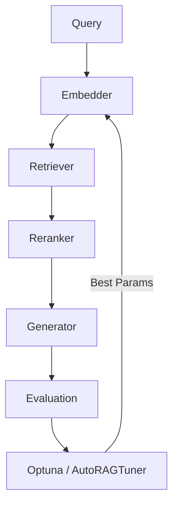

# Ragmint


**Ragmint** (Retrieval-Augmented Generation Model Inspection & Tuning) is a modular, developer-friendly Python library for **evaluating, optimizing, and tuning RAG (Retrieval-Augmented Generation) pipelines**.

It provides a complete toolkit for **retriever selection**, **embedding model tuning**, and **automated RAG evaluation** with support for **Optuna-based Bayesian optimization**, **Auto-RAG tuning**, and **explainability** through Gemini or Claude.

---

## ✨ Features

- ✅ **Automated hyperparameter optimization** (Grid, Random, Bayesian via Optuna)  
- 🤖 **Auto-RAG Tuner** — dynamically recommends retriever–embedding pairs based on corpus size  
- 🧠 **Explainability Layer** — interprets RAG performance via Gemini or Claude APIs  
- 🏆 **Leaderboard Tracking** — stores and ranks experiment runs via JSON or external DB  
- 🔍 **Built-in RAG evaluation metrics** — faithfulness, recall, BLEU, ROUGE, latency  
- ⚙️ **Retrievers** — FAISS, Chroma, scikit-learn  
- 🧩 **Embeddings** — Hugging Face  
- 💾 **Caching, experiment tracking, and reproducibility** out of the box  
- 🧰 **Clean modular structure** for easy integration in research and production setups  

---

## 🚀 Quick Start

### 1️⃣ Installation

```bash
git clone https://github.com/andyolivers/ragmint.git
cd ragmint
pip install -e .
```

> The `-e` flag installs Ragmint in editable (development) mode.  
> Requires **Python ≥ 3.9**.

---

### 2️⃣ Run a RAG Optimization Experiment

```bash
python ragmint/main.py --config configs/default.yaml --search bayesian
```

Example `configs/default.yaml`:
```yaml
retriever: faiss
embedding_model: text-embedding-3-small
reranker:
  mode: mmr
  lambda_param: 0.5
optimization:
  search_method: bayesian
  n_trials: 20
```

---

### 3️⃣ Manual Pipeline Usage

```python
from ragmint.tuner import RAGMint

# Initialize RAGMint with available components
rag = RAGMint(
    docs_path="data/docs/",
    retrievers=["faiss", "chroma", "sklearn"],
    embeddings=["all-MiniLM-L6-v2", "sentence-transformers/all-MiniLM-L12-v2"],
    rerankers=["mmr"]
)

# Run optimization over 3 trials using the default validation set
best, results = rag.optimize(
    validation_set=None,
    metric="faithfulness",
    trials=3
)

print("Best configuration:", best)
```
---
# 🧩 Embeddings and Retrievers

**Ragmint** supports a flexible set of embeddings and retrievers, allowing you to adapt easily to various **RAG architectures**.

---

## 🔤 Available Embeddings (Hugging Face / OpenAI)

You can select from the following models:

* `sentence-transformers/all-MiniLM-L6-v2` — **lightweight**, general-purpose
* `sentence-transformers/all-mpnet-base-v2` — **higher accuracy**, slower
* `BAAI/bge-base-en-v1.5` — **multilingual**, dense embeddings
* `intfloat/multilingual-e5-base` — ideal for **multilingual corpora**


### Configuration Example

Use the following format in your config file to specify the embedding model:

```yaml
embedding_model: sentence-transformers/all-MiniLM-L6-v2
```
---

## 🔍 Available Retrievers

**Ragmint** integrates multiple **retrieval backends** to suit different needs:

| Retriever | Description |
| :--- | :--- |
| **FAISS** | Fast vector similarity search; efficient for dense embeddings |
| **Chroma** | Persistent vector DB; works well for incremental updates |
| **scikit-learn (NearestNeighbors)** | Lightweight, zero-dependency local retriever |


### Configuration Example

To specify the retriever in your configuration file, use the following format:

```yaml
retriever: faiss
```

---

## 🧪 Dataset Options

Ragmint can automatically load evaluation datasets for your RAG pipeline:

| Mode | Example | Description |
|------|----------|-------------|
| 🧱 **Default** | `validation_set=None` | Uses built-in `experiments/validation_qa.json` |
| 📁 **Custom File** | `validation_set="data/my_eval.json"` | Load your own QA dataset (JSON or CSV) |
| 🌐 **Hugging Face Dataset** | `validation_set="squad"` | Automatically downloads benchmark datasets (requires `pip install datasets`) |

### Example

```python
from ragmint.tuner import RAGMint

ragmint = RAGMint(
    docs_path="data/docs/",
    retrievers=["faiss", "chroma"],
    embeddings=["text-embedding-3-small"],
    rerankers=["mmr"],
)

# Use built-in default
ragmint.optimize(validation_set=None)

# Use Hugging Face benchmark
ragmint.optimize(validation_set="squad")

# Use your own dataset
ragmint.optimize(validation_set="data/custom_qa.json")
```

---

## 🧠 Auto-RAG Tuner

The **AutoRAGTuner** automatically recommends retriever–embedding combinations
based on corpus size and average document length.

```python
from ragmint.autotuner import AutoRAGTuner

corpus_stats = {"size": 5000, "avg_len": 250}
tuner = AutoRAGTuner(corpus_stats)
recommendation = tuner.recommend()
print(recommendation)
# Example output: {"retriever": "Chroma", "embedding_model": "SentenceTransformers"}
```

---

## 🏆 Leaderboard Tracking

Track and visualize your best experiments across runs.

```python
from ragmint.leaderboard import Leaderboard

lb = Leaderboard("experiments/leaderboard.json")
lb.add_entry({"trial": 1, "faithfulness": 0.87, "latency": 0.12})
lb.show_top(3)
```

---

## 🧠 Explainability with Gemini / Claude

Compare two RAG configurations and receive **natural language insights** on why one performs better.

```python
from ragmint.explainer import explain_results

config_a = {"retriever": "FAISS", "embedding_model": "OpenAI"}
config_b = {"retriever": "Chroma", "embedding_model": "SentenceTransformers"}

explanation = explain_results(config_a, config_b, model="gemini")
print(explanation)
```

> Set your API keys in a `.env` file or via environment variables:
> ```
> export GEMINI_API_KEY="your_gemini_key"
> export ANTHROPIC_API_KEY="your_claude_key"
> ```

---

## 🧩 Folder Structure

```
ragmint/
├── core/
│   ├── pipeline.py
│   ├── retriever.py
│   ├── reranker.py
│   ├── embedding.py
│   └── evaluation.py
├── autotuner.py
├── explainer.py
├── leaderboard.py
├── tuner.py
├── utils/
├── configs/
├── experiments/
├── tests/
└── main.py
```

---

## 🧪 Running Tests

```bash
pytest -v
```

To include integration tests with Gemini or Claude APIs:
```bash
pytest -m integration
```

---

## ⚙️ Configuration via `pyproject.toml`

Your `pyproject.toml` includes all required dependencies:

```toml
[project]
name = "ragmint"
version = "0.1.0"
dependencies = [
  "numpy<2.0.0",
  "pandas>=2.0",
  "scikit-learn>=1.3",
  "openai>=1.0",
  "tqdm",
  "pyyaml",
  "chromadb>=0.4",
  "faiss-cpu; sys_platform != 'darwin'",
  "optuna>=3.0",
  "pytest",
  "colorama",
  "google-generativeai>=0.8.0",
  "supabase>=2.4.0",
  "python-dotenv",
  "sentence-transformers"
]
```

---

## 📊 Example Experiment Workflow

1. Define your retriever, embedding, and reranker setup  
2. Launch optimization (Grid, Random, Bayesian) or AutoTune  
3. Compare performance with explainability  
4. Persist results to leaderboard for later inspection  

---

## 🧬 Architecture Overview



---

## 📘 Example Output

```
[INFO] Starting Bayesian optimization with Optuna
[INFO] Trial 7 finished: faithfulness=0.83, latency=0.42s
[INFO] Best parameters: {'lambda_param': 0.6, 'retriever': 'faiss'}
[INFO] AutoRAGTuner: Suggested retriever=Chroma for medium corpus
```

---

## 🧠 Why Ragmint?

- Built for **RAG researchers**, **AI engineers**, and **LLM ops**  
- Works with **LangChain**, **LlamaIndex**, or standalone setups  
- Designed for **extensibility** — plug in your own retrievers, models, or metrics  
- Integrated **explainability and leaderboard** modules for research and production  

---

## ⚖️ License

Licensed under the **Apache License 2.0** — free for personal, research, and commercial use.

---

## 👤 Author

**André Oliveira**  
[andyolivers.com](https://andyolivers.com)  
Data Scientist | AI Engineer