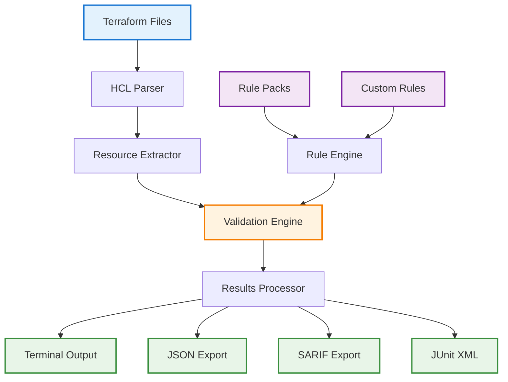
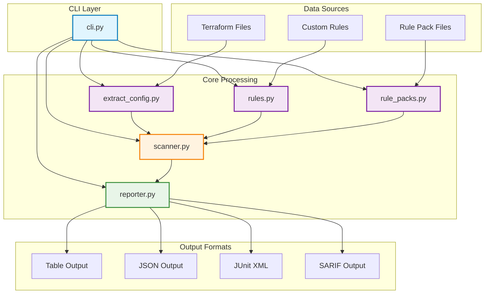
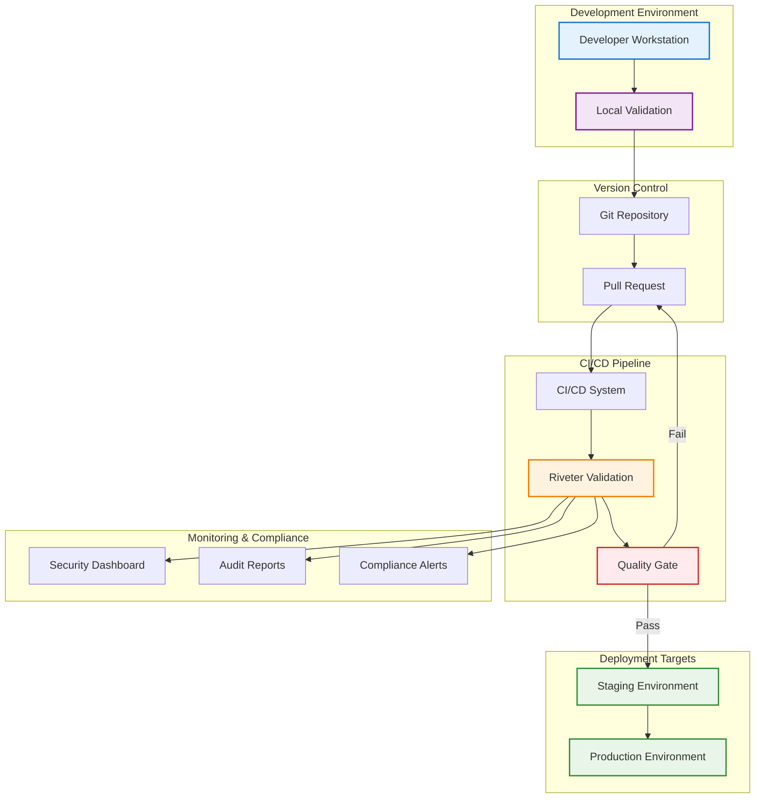
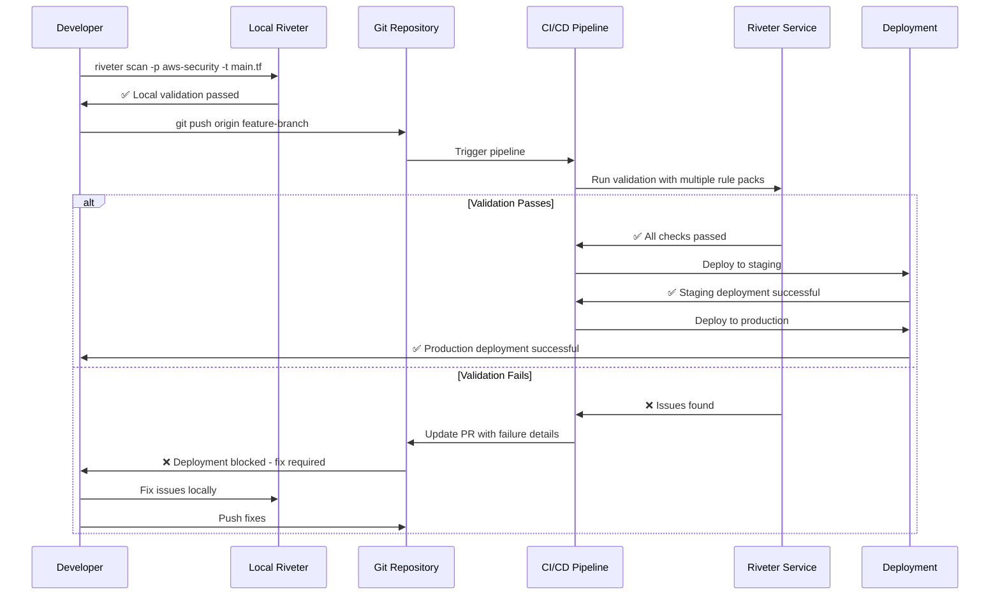
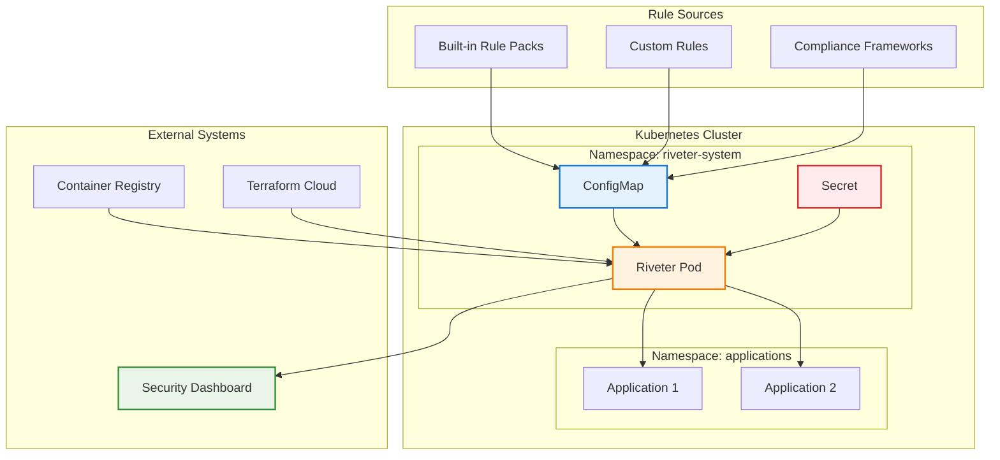
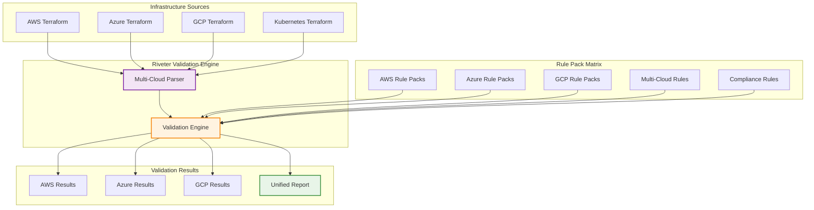
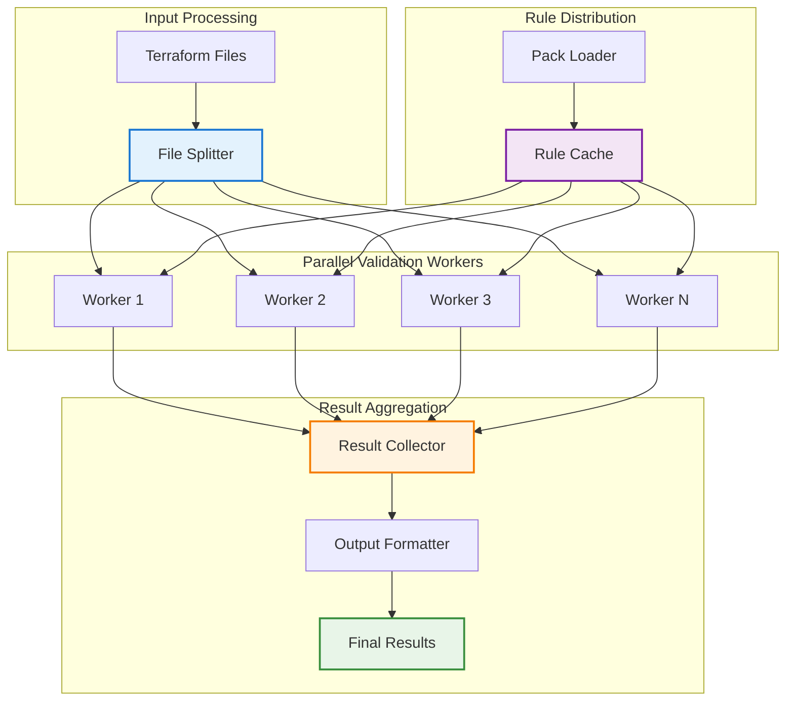
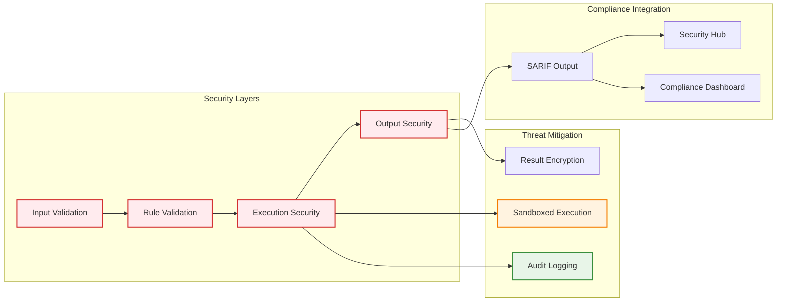
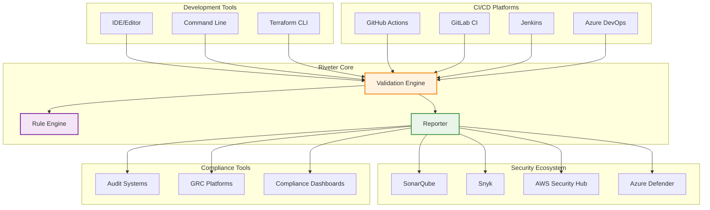

# Architecture Diagrams

This document contains comprehensive visual documentation of Riveter's architecture, workflow, and integration patterns.

## High-Level System Architecture

### Terraform → Riveter → Results Flow



**Component Descriptions:**
- **Terraform Files**: Infrastructure as Code definitions in HCL format
- **HCL Parser**: Converts Terraform syntax into structured data
- **Rule Packs**: Pre-built compliance and security rule collections
- **Custom Rules**: Organization-specific validation rules
- **Rule Engine**: Loads and processes all rule definitions
- **Resource Extractor**: Identifies and categorizes infrastructure resources
- **Validation Engine**: Core logic that evaluates resources against rules
- **Results Processor**: Formats validation results for different outputs

## Detailed Component Architecture

### Internal Module Interactions



**Module Responsibilities:**
- **cli.py**: Command-line interface and argument parsing
- **extract_config.py**: Terraform HCL parsing and resource extraction
- **rules.py**: Custom rule loading and validation
- **rule_packs.py**: Pre-built rule pack management
- **scanner.py**: Core validation logic and rule evaluation
- **reporter.py**: Result formatting and output generation

## Deployment Architecture

### CI/CD Integration Patterns



### Multi-Environment Validation Flow



## Container and Kubernetes Architecture

### Kubernetes Integration Pattern



### Docker Container Architecture

```mermaid
graph LR
    subgraph "Riveter Container"
        BINARY[Riveter Binary]
        RULES[Rule Packs]
        CONFIG[Configuration]
    end

    subgraph "Mounted Volumes"
        WORKSPACE[/workspace]
        RESULTS[/results]
    end

    subgraph "Host System"
        TF_FILES[Terraform Files]
        OUTPUT[Output Files]
    end

    TF_FILES --> WORKSPACE
    WORKSPACE --> BINARY
    RULES --> BINARY
    CONFIG --> BINARY
    BINARY --> RESULTS
    RESULTS --> OUTPUT

    style BINARY fill:#fff3e0,stroke:#f57c00,stroke-width:2px
    style WORKSPACE fill:#e3f2fd,stroke:#1976d2,stroke-width:2px
    style RESULTS fill:#e8f5e8,stroke:#388e3c,stroke-width:2px
```

## Multi-Cloud Architecture Patterns

### Cross-Cloud Validation Strategy



## Performance and Scalability Architecture

### Parallel Processing Model



## Security Architecture

### Security Validation Pipeline



## Integration Architecture Patterns

### Enterprise Integration Model



---

*These architecture diagrams provide a comprehensive view of how Riveter integrates into modern infrastructure and security workflows.*
