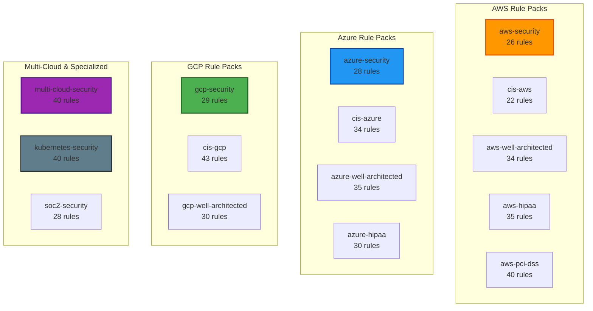
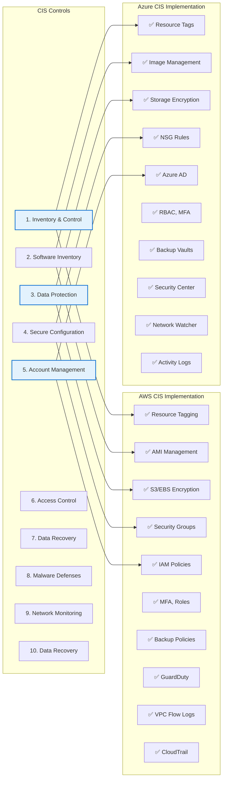
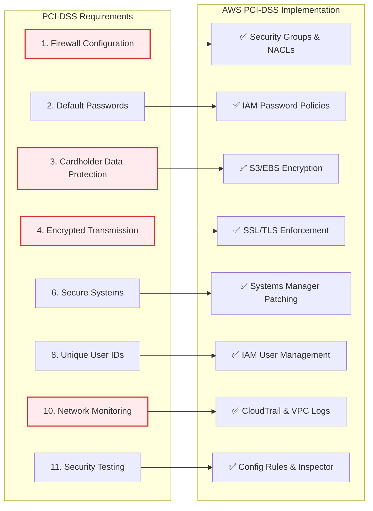
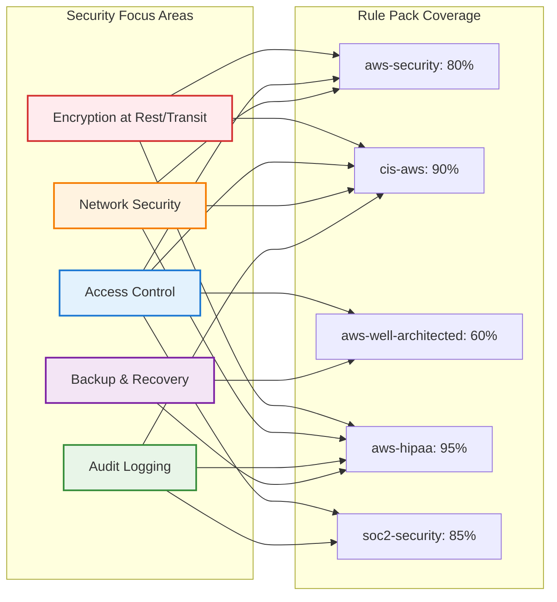
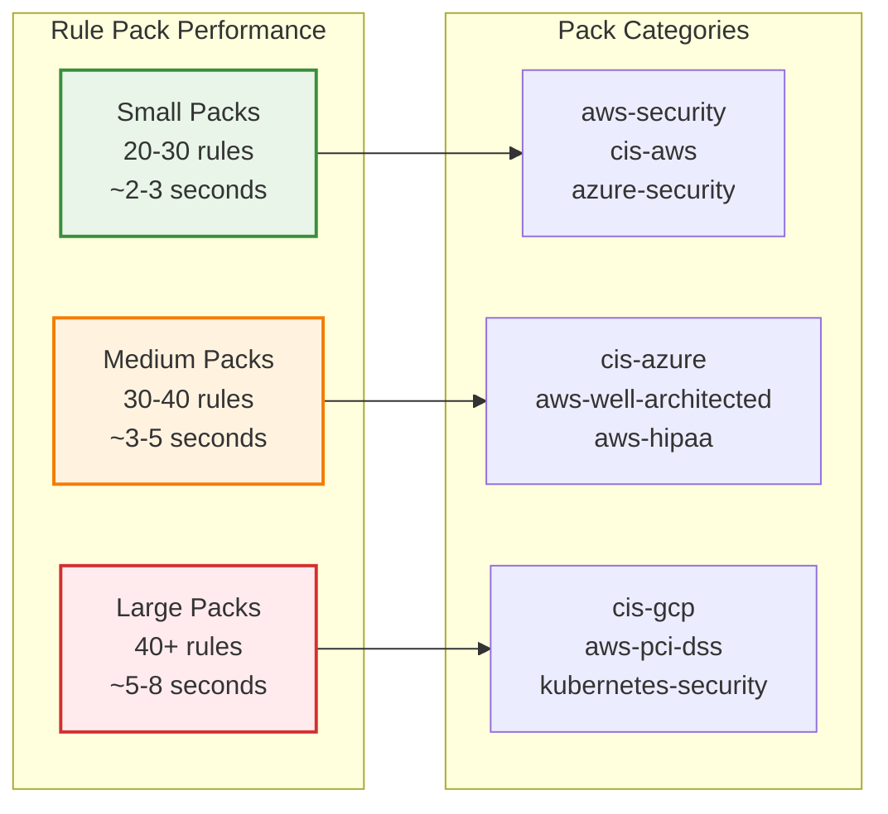

# Rule Pack Comparison Visuals

This document provides comprehensive visual comparisons of rule pack coverage, compliance framework mappings, and validation result examples.

## Rule Pack Coverage Matrix

### Cloud Provider Coverage Overview



### Detailed Coverage Matrix by Service Category

| Service Category | AWS | Azure | GCP | Multi-Cloud | Kubernetes |
|------------------|-----|-------|-----|-------------|------------|
| **Compute** | ✅ EC2, Lambda, Auto Scaling | ✅ VMs, App Service, Functions | ✅ Compute Engine, Cloud Functions | ✅ Common patterns | ✅ Pods, Deployments |
| **Storage** | ✅ S3, EBS, EFS | ✅ Storage Accounts, Disks | ✅ Cloud Storage, Persistent Disks | ✅ Encryption, Access | ✅ Volumes, Storage Classes |
| **Database** | ✅ RDS, DynamoDB, Redshift | ✅ SQL Database, Cosmos DB | ✅ Cloud SQL, Firestore | ✅ Encryption, Backup | ✅ StatefulSets |
| **Networking** | ✅ VPC, Security Groups, ALB | ✅ VNet, NSGs, Load Balancer | ✅ VPC, Firewall, Load Balancer | ✅ Network Security | ✅ Network Policies |
| **Identity & Access** | ✅ IAM, Roles, Policies | ✅ Azure AD, RBAC | ✅ IAM, Service Accounts | ✅ Access Control | ✅ RBAC, Service Accounts |
| **Security** | ✅ KMS, CloudTrail, Config | ✅ Key Vault, Security Center | ✅ KMS, Cloud Logging | ✅ Encryption, Logging | ✅ Pod Security, Secrets |
| **Monitoring** | ✅ CloudWatch, X-Ray | ✅ Monitor, Application Insights | ✅ Cloud Monitoring, Trace | ✅ Observability | ✅ Monitoring, Logging |

## Compliance Framework Mapping

### CIS Benchmark Coverage Comparison



### Healthcare Compliance (HIPAA) Coverage

```mermaid
graph TD
    subgraph "HIPAA Requirements"
        ADMIN[Administrative Safeguards]
        PHYSICAL[Physical Safeguards]
        TECHNICAL[Technical Safeguards]
    end

    subgraph "Administrative Safeguards"
        A1[Security Officer Assignment]
        A2[Workforce Training]
        A3[Access Management]
        A4[Incident Response]
    end

    subgraph "Physical Safeguards"
        P1[Facility Access Controls]
        P2[Workstation Use]
        P3[Device Controls]
        P4[Media Controls]
    end

    subgraph "Technical Safeguards"
        T1[Access Control]
        T2[Audit Controls]
        T3[Integrity]
        T4[Transmission Security]
    end

    subgraph "AWS HIPAA Rule Pack"
        AWS_A[✅ IAM Policies & Roles]
        AWS_P[✅ VPC & Security Groups]
        AWS_T[✅ Encryption & CloudTrail]
    end

    subgraph "Azure HIPAA Rule Pack"
        AZURE_A[✅ Azure AD & RBAC]
        AZURE_P[✅ Network Security]
        AZURE_T[✅ Key Vault & Monitoring]
    end

    ADMIN --> A1
    ADMIN --> A2
    ADMIN --> A3
    ADMIN --> A4

    PHYSICAL --> P1
    PHYSICAL --> P2
    PHYSICAL --> P3
    PHYSICAL --> P4

    TECHNICAL --> T1
    TECHNICAL --> T2
    TECHNICAL --> T3
    TECHNICAL --> T4

    A3 --> AWS_A
    A3 --> AZURE_A
    P1 --> AWS_P
    P1 --> AZURE_P
    T1 --> AWS_T
    T2 --> AWS_T
    T3 --> AWS_T
    T4 --> AWS_T
    T1 --> AZURE_T
    T2 --> AZURE_T

    style ADMIN fill:#fff3e0,stroke:#f57c00,stroke-width:2px
    style PHYSICAL fill:#e8f5e8,stroke:#388e3c,stroke-width:2px
    style TECHNICAL fill:#e3f2fd,stroke:#1976d2,stroke-width:2px
```



### Financial Services Compliance (PCI-DSS) Coverage



## Rule Pack Combination Strategies

### Recommended Combinations by Use Case

```mermaid
graph TD
    subgraph "Startup/SMB"
        STARTUP_BASE[Base Security]
        STARTUP_COMBO[aws-security + cis-aws]
    end

    subgraph "Enterprise"
        ENTERPRISE_BASE[Comprehensive Coverage]
        ENTERPRISE_COMBO[Security + CIS + Well-Architected + SOC2]
    end

    subgraph "Healthcare"
        HEALTHCARE_BASE[HIPAA Compliance]
        HEALTHCARE_COMBO[aws-hipaa + azure-hipaa + aws-security + cis-aws]
    end

    subgraph "Financial Services"
        FINANCE_BASE[PCI-DSS Compliance]
        FINANCE_COMBO[aws-pci-dss + soc2-security + aws-security + cis-aws]
    end

    subgraph "Multi-Cloud"
        MULTICLOUD_BASE[Cross-Platform]
        MULTICLOUD_COMBO[multi-cloud-security + aws-security + azure-security + gcp-security]
    end

    subgraph "Kubernetes"
        K8S_BASE[Container Security]
        K8S_COMBO[kubernetes-security + multi-cloud-security + cis-aws/azure/gcp]
    end

    STARTUP_BASE --> STARTUP_COMBO
    ENTERPRISE_BASE --> ENTERPRISE_COMBO
    HEALTHCARE_BASE --> HEALTHCARE_COMBO
    FINANCE_BASE --> FINANCE_COMBO
    MULTICLOUD_BASE --> MULTICLOUD_COMBO
    K8S_BASE --> K8S_COMBO

    style STARTUP_COMBO fill:#e8f5e8,stroke:#388e3c,stroke-width:2px
    style ENTERPRISE_COMBO fill:#e3f2fd,stroke:#1976d2,stroke-width:2px
    style HEALTHCARE_COMBO fill:#fff3e0,stroke:#f57c00,stroke-width:2px
    style FINANCE_COMBO fill:#ffebee,stroke:#d32f2f,stroke-width:2px
    style MULTICLOUD_COMBO fill:#f3e5f5,stroke:#7b1fa2,stroke-width:2px
    style K8S_COMBO fill:#e0f2f1,stroke:#00695c,stroke-width:2px
```



### Rule Pack Overlap Analysis



## Before/After Validation Results Examples

### Example 1: S3 Bucket Security Validation

#### Before Fixing Issues

```
┌─────────────────────────────────────────────────────────────────────────────┐
│ Riveter Validation Results - aws-security Rule Pack                         │
├─────────────────────────────────────────────────────────────────────────────┤
│ ❌ FAIL │ aws_s3_bucket.documents    │ S3 bucket must have encryption      │
│ ❌ FAIL │ aws_s3_bucket.documents    │ S3 bucket must block public access  │
│ ❌ FAIL │ aws_s3_bucket.documents    │ S3 bucket must have versioning      │
│ ❌ FAIL │ aws_s3_bucket.backups      │ S3 bucket must have encryption      │
│ ❌ FAIL │ aws_s3_bucket.backups      │ S3 bucket must have lifecycle rules │
├─────────────────────────────────────────────────────────────────────────────┤
│ Summary: 5 failures, 0 passed                                              │
│ Success Rate: 0%                                                            │
└─────────────────────────────────────────────────────────────────────────────┘
```

#### After Fixing Issues

```
┌─────────────────────────────────────────────────────────────────────────────┐
│ Riveter Validation Results - aws-security Rule Pack                         │
├─────────────────────────────────────────────────────────────────────────────┤
│ ✅ PASS │ aws_s3_bucket.documents    │ S3 bucket encryption enabled        │
│ ✅ PASS │ aws_s3_bucket.documents    │ S3 bucket public access blocked     │
│ ✅ PASS │ aws_s3_bucket.documents    │ S3 bucket versioning enabled        │
│ ✅ PASS │ aws_s3_bucket.backups      │ S3 bucket encryption enabled        │
│ ✅ PASS │ aws_s3_bucket.backups      │ S3 bucket lifecycle rules configured│
├─────────────────────────────────────────────────────────────────────────────┤
│ Summary: 0 failures, 5 passed                                              │
│ Success Rate: 100%                                                          │
└─────────────────────────────────────────────────────────────────────────────┘
```

### Example 2: Multi-Cloud Security Validation

#### Before: Mixed Cloud Infrastructure Issues

```
┌─────────────────────────────────────────────────────────────────────────────┐
│ Riveter Multi-Cloud Validation Results                                      │
├─────────────────────────────────────────────────────────────────────────────┤
│ AWS Resources:                                                              │
│ ❌ FAIL │ aws_instance.web           │ EC2 instance has public IP          │
│ ❌ FAIL │ aws_security_group.web     │ Security group allows SSH from 0/0  │
│ ✅ PASS │ aws_s3_bucket.data         │ S3 bucket properly encrypted        │
│                                                                             │
│ Azure Resources:                                                            │
│ ❌ FAIL │ azurerm_virtual_machine.app│ VM disk encryption not enabled      │
│ ✅ PASS │ azurerm_storage_account.st │ Storage account secure transfer     │
│ ❌ FAIL │ azurerm_network_security_group.nsg │ NSG allows RDP from internet │
│                                                                             │
│ GCP Resources:                                                              │
│ ✅ PASS │ google_compute_instance.vm │ VM uses service account             │
│ ❌ FAIL │ google_storage_bucket.data │ Bucket allows public access         │
├─────────────────────────────────────────────────────────────────────────────┤
│ Summary: 5 failures, 3 passed across 3 cloud providers                     │
│ Success Rate: 37.5%                                                         │
└─────────────────────────────────────────────────────────────────────────────┘
```

#### After: Secured Multi-Cloud Infrastructure

```
┌─────────────────────────────────────────────────────────────────────────────┐
│ Riveter Multi-Cloud Validation Results                                      │
├─────────────────────────────────────────────────────────────────────────────┤
│ AWS Resources:                                                              │
│ ✅ PASS │ aws_instance.web           │ EC2 instance in private subnet      │
│ ✅ PASS │ aws_security_group.web     │ Security group properly configured  │
│ ✅ PASS │ aws_s3_bucket.data         │ S3 bucket properly encrypted        │
│                                                                             │
│ Azure Resources:                                                            │
│ ✅ PASS │ azurerm_virtual_machine.app│ VM disk encryption enabled          │
│ ✅ PASS │ azurerm_storage_account.st │ Storage account secure transfer     │
│ ✅ PASS │ azurerm_network_security_group.nsg │ NSG properly configured     │
│                                                                             │
│ GCP Resources:                                                              │
│ ✅ PASS │ google_compute_instance.vm │ VM uses service account             │
│ ✅ PASS │ google_storage_bucket.data │ Bucket access properly restricted   │
├─────────────────────────────────────────────────────────────────────────────┤
│ Summary: 0 failures, 8 passed across 3 cloud providers                     │
│ Success Rate: 100%                                                          │
└─────────────────────────────────────────────────────────────────────────────┘
```

### Example 3: Compliance Validation (HIPAA)

#### Before: Non-Compliant Healthcare Infrastructure

```
┌─────────────────────────────────────────────────────────────────────────────┐
│ HIPAA Compliance Validation Results                                         │
├─────────────────────────────────────────────────────────────────────────────┤
│ Administrative Safeguards:                                                  │
│ ❌ FAIL │ aws_iam_user.doctor        │ MFA not enabled for privileged user │
│ ❌ FAIL │ aws_iam_policy.access      │ Overly permissive access policy     │
│                                                                             │
│ Physical Safeguards:                                                        │
│ ❌ FAIL │ aws_instance.app_server    │ Instance in public subnet           │
│ ❌ FAIL │ aws_security_group.app     │ Allows unrestricted inbound access  │
│                                                                             │
│ Technical Safeguards:                                                       │
│ ❌ FAIL │ aws_s3_bucket.patient_data │ Bucket not encrypted                │
│ ❌ FAIL │ aws_rds_instance.patients  │ Database not encrypted              │
│ ❌ FAIL │ aws_cloudtrail.audit       │ CloudTrail not configured           │
├─────────────────────────────────────────────────────────────────────────────┤
│ HIPAA Compliance Status: ❌ NON-COMPLIANT                                   │
│ Critical Issues: 7                                                          │
│ Compliance Score: 0%                                                        │
└─────────────────────────────────────────────────────────────────────────────┘
```

#### After: HIPAA-Compliant Healthcare Infrastructure

```
┌─────────────────────────────────────────────────────────────────────────────┐
│ HIPAA Compliance Validation Results                                         │
├─────────────────────────────────────────────────────────────────────────────┤
│ Administrative Safeguards:                                                  │
│ ✅ PASS │ aws_iam_user.doctor        │ MFA enabled for all privileged users│
│ ✅ PASS │ aws_iam_policy.access      │ Least privilege access implemented  │
│                                                                             │
│ Physical Safeguards:                                                        │
│ ✅ PASS │ aws_instance.app_server    │ Instance in private subnet          │
│ ✅ PASS │ aws_security_group.app     │ Restricted access properly configured│
│                                                                             │
│ Technical Safeguards:                                                       │
│ ✅ PASS │ aws_s3_bucket.patient_data │ Bucket encrypted with KMS           │
│ ✅ PASS │ aws_rds_instance.patients  │ Database encrypted at rest/transit  │
│ ✅ PASS │ aws_cloudtrail.audit       │ Comprehensive audit logging enabled │
├─────────────────────────────────────────────────────────────────────────────┤
│ HIPAA Compliance Status: ✅ COMPLIANT                                       │
│ Critical Issues: 0                                                          │
│ Compliance Score: 100%                                                      │
└─────────────────────────────────────────────────────────────────────────────┘
```

## Rule Pack Performance Comparison

### Validation Speed by Rule Pack Size



### Memory Usage Comparison

| Rule Pack Combination | Memory Usage | Validation Time | Recommended For |
|----------------------|--------------|-----------------|-----------------|
| Single pack (aws-security) | ~50MB | 2-3 seconds | Development, Quick checks |
| Dual pack (aws-security + cis-aws) | ~75MB | 4-5 seconds | Standard validation |
| Triple pack (security + cis + well-architected) | ~100MB | 6-8 seconds | Comprehensive validation |
| Full compliance (all applicable packs) | ~150MB | 10-15 seconds | Production, Audit |
| Multi-cloud (all cloud providers) | ~200MB | 15-20 seconds | Enterprise, Multi-cloud |

---

*These visual comparisons help users understand rule pack coverage, select appropriate combinations, and see the impact of validation improvements.*
