# Visual Design System

This document establishes consistent visual styling, color schemes, iconography, and accessibility guidelines for all Riveter documentation diagrams and visual elements.

## Color Palette

### Primary Colors

| Color | Hex Code | Usage | Accessibility |
|-------|----------|-------|---------------|
| **Riveter Blue** | `#1976d2` | Primary brand, headers, key elements | WCAG AA compliant |
| **Success Green** | `#388e3c` | Passed validations, success states | WCAG AA compliant |
| **Error Red** | `#d32f2f` | Failed validations, errors, warnings | WCAG AA compliant |
| **Warning Orange** | `#f57c00` | Processing, intermediate states | WCAG AA compliant |
| **Info Purple** | `#7b1fa2` | Information, secondary elements | WCAG AA compliant |

### Cloud Provider Colors

| Provider | Primary | Secondary | Usage |
|----------|---------|-----------|-------|
| **AWS** | `#ff9800` (Orange) | `#e65100` (Dark Orange) | AWS-specific diagrams and elements |
| **Azure** | `#2196f3` (Blue) | `#0d47a1` (Dark Blue) | Azure-specific diagrams and elements |
| **GCP** | `#4caf50` (Green) | `#1b5e20` (Dark Green) | GCP-specific diagrams and elements |
| **Multi-Cloud** | `#9c27b0` (Purple) | `#4a148c` (Dark Purple) | Cross-cloud elements |
| **Kubernetes** | `#607d8b` (Blue Grey) | `#263238` (Dark Blue Grey) | Container/K8s elements |

### Background Colors (Light Theme)

| Element | Background | Border | Text |
|---------|------------|--------|------|
| **Input/Source** | `#e3f2fd` | `#1976d2` | `#0d47a1` |
| **Processing** | `#fff3e0` | `#f57c00` | `#e65100` |
| **Success/Output** | `#e8f5e8` | `#388e3c` | `#1b5e20` |
| **Error/Warning** | `#ffebee` | `#d32f2f` | `#b71c1c` |
| **Information** | `#f3e5f5` | `#7b1fa2` | `#4a148c` |
| **Neutral** | `#f5f5f5` | `#9e9e9e` | `#424242` |

### Accessibility Considerations

#### Color-Blind Friendly Palette


#### High Contrast Mode

| Element | Standard | High Contrast |
|---------|----------|---------------|
| **Text on Light** | `#424242` | `#000000` |
| **Text on Dark** | `#ffffff` | `#ffffff` |
| **Borders** | `2px` | `3px` |
| **Focus Indicators** | `2px solid #1976d2` | `4px solid #000000` |

## Typography and Text Styling

### Diagram Text Hierarchy

```mermaid
graph TD
    H1["📋 Title Text<br/>16px Bold<br/>#000000 on #ffffff"]
    H2["📝 Section Headers<br/>14px Bold<br/>#000000 on #f8f9fa"]
    H3["🏷️ Node Labels<br/>12px Regular<br/>#000000 on #ffffff"]
    H4["💬 Annotations<br/>10px Regular<br/>#000000 on #ffffff"]

    style H1 fill:#ffffff,stroke:#2196f3,stroke-width:3px,color:#000000
    style H2 fill:#f8f9fa,stroke:#2196f3,stroke-width:2px,color:#000000
    style H3 fill:#ffffff,stroke:#9e9e9e,stroke-width:2px,color:#000000
    style H4 fill:#ffffff,stroke:#e0e0e0,stroke-width:1px,color:#000000
```



### Font Specifications

- **Primary Font**: System fonts (SF Pro, Segoe UI, Roboto)
- **Monospace Font**: Consolas, Monaco, 'Courier New'
- **Minimum Size**: 10px for accessibility
- **Line Height**: 1.4 for readability
- **Letter Spacing**: Normal (0)

### Accessibility Standards

#### High Contrast Color Scheme
All diagrams now use high-contrast colors for maximum readability:

- **Background**: White (#ffffff) or Light Gray (#f8f9fa)
- **Text**: Black (#000000) for maximum contrast
- **Borders**: Strong colors with 2-3px width for visibility
- **Status Colors**:
  - Success: Green (#4caf50)
  - Error: Red (#f44336)
  - Warning: Orange (#ff9800)
  - Info: Blue (#2196f3)
  - Process: Purple (#9c27b0)

#### WCAG 2.1 Compliance
- **Contrast Ratio**: Minimum 4.5:1 for normal text
- **Color Independence**: Information not conveyed by color alone
- **Text Size**: Minimum 12px for diagram labels
- **Icon Support**: Emojis and symbols supplement color coding

## Iconography System

### Core Icons and Symbols

```mermaid
graph LR
    subgraph "Status Icons"
        PASS[✅ Pass/Success]
        FAIL[❌ Fail/Error]
        WARN[⚠️ Warning]
        INFO[ℹ️ Information]
        PROCESS[🔄 Processing]
    end

    subgraph "Cloud Provider Icons"
        AWS[☁️ AWS]
        AZURE[🔷 Azure]
        GCP[🟢 GCP]
        K8S[⚙️ Kubernetes]
        MULTI[🌐 Multi-Cloud]
    end

    subgraph "Component Icons"
        CONFIG[📄 Configuration]
        RULES[📋 Rules]
        SECURITY[🔒 Security]
        COMPLIANCE[📊 Compliance]
        REPORT[📈 Reports]
    end

    style PASS fill:#e8f5e8,stroke:#388e3c,stroke-width:2px
    style FAIL fill:#ffebee,stroke:#d32f2f,stroke-width:2px
    style WARN fill:#fff3e0,stroke:#f57c00,stroke-width:2px
    style AWS fill:#fff3e0,stroke:#ff9800,stroke-width:2px
    style AZURE fill:#e3f2fd,stroke:#2196f3,stroke-width:2px
    style GCP fill:#e8f5e8,stroke:#4caf50,stroke-width:2px
```



### Icon Usage Guidelines

| Context | Icon | Color | Size | Usage |
|---------|------|-------|------|-------|
| **Validation Results** | ✅/❌ | Green/Red | 16px | Status indicators |
| **Cloud Providers** | ☁️/🔷/🟢 | Brand colors | 20px | Provider identification |
| **Process Steps** | 🔄/➡️ | Blue | 14px | Flow indicators |
| **Security Elements** | 🔒/🛡️ | Red/Orange | 18px | Security contexts |
| **Documentation** | 📄/📋 | Grey | 16px | Content types |

## Diagram Templates

### Standard Flowchart Template


### Architecture Diagram Template


### Sequence Diagram Template


## Component Library

### Standard Node Shapes and Meanings

| Shape | Mermaid Syntax | Meaning | Usage |
|-------|----------------|---------|-------|
| **Rectangle** | `[Text]` | Process, Component | Standard processing steps |
| **Rounded Rectangle** | `([Text])` | Start/End, Terminal | Flow start/end points |
| **Diamond** | `{Text}` | Decision, Condition | Conditional logic |
| **Circle** | `((Text))` | Connector, State | Connection points |
| **Hexagon** | `{{Text}}` | Preparation, Setup | Setup/preparation steps |
| **Parallelogram** | `[/Text/]` | Input/Output | Data flow |
| **Trapezoid** | `[\Text\]` | Manual Process | Human intervention |

### Connector Styles

| Connection Type | Syntax | Visual | Usage |
|----------------|--------|--------|-------|
| **Solid Arrow** | `-->` | ——————▶ | Standard flow |
| **Dashed Arrow** | `-.->` | - - - - ▶ | Optional/conditional |
| **Thick Arrow** | `==>` | ══════▶ | Primary/important flow |
| **Dotted Line** | `...` | ········ | Relationship/reference |
| **Bidirectional** | `<-->` | ◀——————▶ | Two-way communication |

### Subgraph Styling


## Responsive Design Guidelines

### Diagram Scaling

| Screen Size | Diagram Width | Font Size | Stroke Width |
|-------------|---------------|-----------|--------------|
| **Mobile** (< 768px) | 100% | 10px min | 1px |
| **Tablet** (768-1024px) | 90% | 12px | 2px |
| **Desktop** (> 1024px) | 80% | 14px | 2px |
| **Large Screen** (> 1440px) | 70% | 16px | 3px |

### Text Wrapping Guidelines

- **Node Labels**: Maximum 20 characters per line
- **Descriptions**: Maximum 40 characters per line
- **Long Text**: Use line breaks (`<br/>`) for readability
- **Abbreviations**: Use consistent abbreviations for space constraints

## Accessibility Standards

### WCAG 2.1 Compliance

#### Color Contrast Requirements

| Element Combination | Contrast Ratio | WCAG Level |
|-------------------|----------------|------------|
| **Text on Background** | 4.5:1 minimum | AA |
| **Large Text (18px+)** | 3:1 minimum | AA |
| **UI Components** | 3:1 minimum | AA |
| **Enhanced Contrast** | 7:1 minimum | AAA |

#### Alternative Text Guidelines

```markdown
<!-- Good: Descriptive alt text -->
![Architecture diagram showing Terraform files flowing through Riveter validation engine to produce multiple output formats including JSON, SARIF, and JUnit XML]

<!-- Bad: Generic alt text -->
![Diagram]
```

#### Screen Reader Considerations

- Use semantic HTML structure
- Provide text alternatives for all visual elements
- Include diagram descriptions in surrounding text
- Use ARIA labels for complex diagrams

### Color-Blind Accessibility

#### Pattern and Texture Alternatives

```mermaid
graph LR
    subgraph "Status Indicators"
        PASS[✅ PASS<br/>Solid Border]
        FAIL[❌ FAIL<br/>Dashed Border]
        WARN[⚠️ WARN<br/>Dotted Border]
    end

    style PASS fill:#e8f5e8,stroke:#388e3c,stroke-width:3px
    style FAIL fill:#ffebee,stroke:#d32f2f,stroke-width:3px,stroke-dasharray: 5 5
    style WARN fill:#fff3e0,stroke:#f57c00,stroke-width:3px,stroke-dasharray: 2 2
```



#### Shape-Based Differentiation

- Use different shapes for different categories
- Combine color with icons/symbols
- Provide text labels alongside colors
- Use patterns (solid, dashed, dotted) for borders

## Implementation Guidelines

### Mermaid Diagram Standards

#### Standard Template Structure

```mermaid
graph TD
    %% Define nodes with consistent styling and high contrast
    START(["🚀 Start<br/>Process"])
    PROCESS["⚙️ Main<br/>Process"]
    DECISION{"🤔 Decision<br/>Point"}
    SUCCESS["✅ Success<br/>State"]
    ERROR["❌ Error<br/>State"]

    %% Define flow with clear labels
    START --> PROCESS
    PROCESS --> DECISION
    DECISION -->|"✅ Pass"| SUCCESS
    DECISION -->|"❌ Fail"| ERROR

    %% Apply high-contrast styling for accessibility
    style START fill:#ffffff,stroke:#2196f3,stroke-width:3px,color:#000000
    style PROCESS fill:#f8f9fa,stroke:#ff9800,stroke-width:2px,color:#000000
    style DECISION fill:#ffffff,stroke:#9c27b0,stroke-width:3px,color:#000000
    style SUCCESS fill:#ffffff,stroke:#4caf50,stroke-width:3px,color:#000000
    style ERROR fill:#ffffff,stroke:#f44336,stroke-width:3px,color:#000000
```



#### Styling Best Practices

1. **Consistent Stroke Width**: Use 2px for standard elements, 3px for emphasis
2. **Readable Font Sizes**: Minimum 12px, prefer 14px for body text
3. **Adequate Spacing**: Leave space between nodes for clarity
4. **Logical Flow**: Left-to-right or top-to-bottom for readability
5. **Color Coding**: Use consistent colors for similar element types

### Documentation Integration

#### Markdown Integration

```markdown
## Section Title

Brief description of the diagram's purpose and what it illustrates.

```mermaid
[diagram code here]
```

**Key Points:**
- Explanation of important elements
- Description of the flow or process
- Any special considerations or notes
```

#### Cross-Reference Standards

- Link related diagrams using consistent naming
- Reference specific elements using clear identifiers
- Provide navigation between related visual content
- Include diagram summaries for accessibility

## Quality Assurance Checklist

### Pre-Publication Review

- [ ] **Color Contrast**: All text meets WCAG AA standards
- [ ] **Color-Blind Testing**: Diagrams work without color
- [ ] **Responsive Design**: Scales properly on mobile devices
- [ ] **Consistent Styling**: Follows established color palette
- [ ] **Accessibility**: Includes alt text and descriptions
- [ ] **Cross-Browser**: Renders correctly in major browsers
- [ ] **Print-Friendly**: Works in black and white printing
- [ ] **Performance**: Loads quickly and efficiently

### Maintenance Guidelines

- Review and update color palette annually
- Test accessibility with screen readers quarterly
- Validate responsive design with new device sizes
- Update templates based on user feedback
- Maintain consistency across all documentation

---

*This visual design system ensures consistent, accessible, and professional visual communication across all Riveter documentation.*
