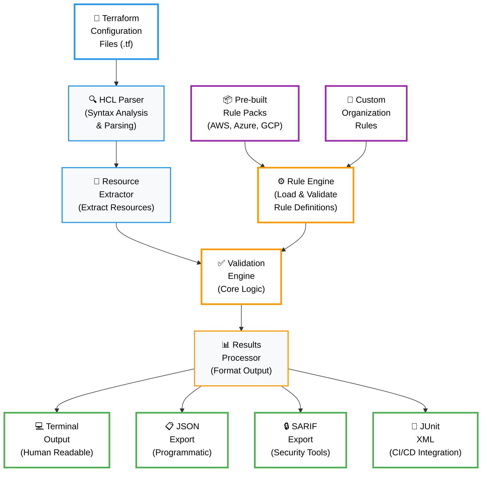
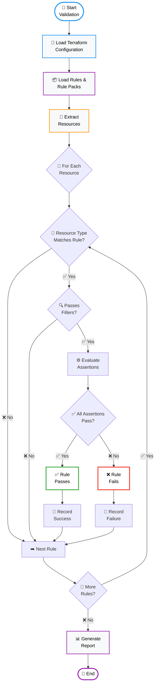
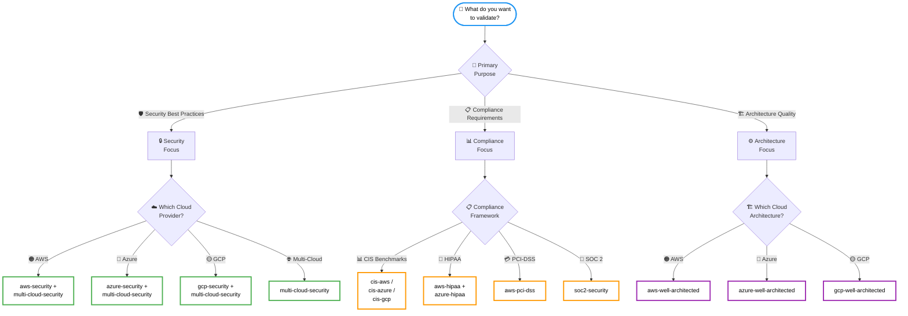
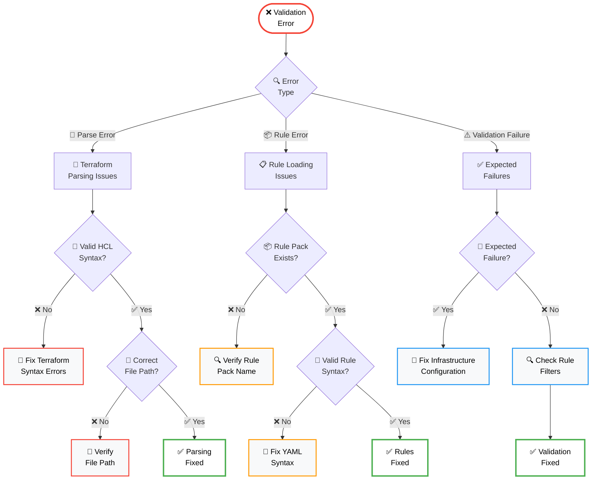
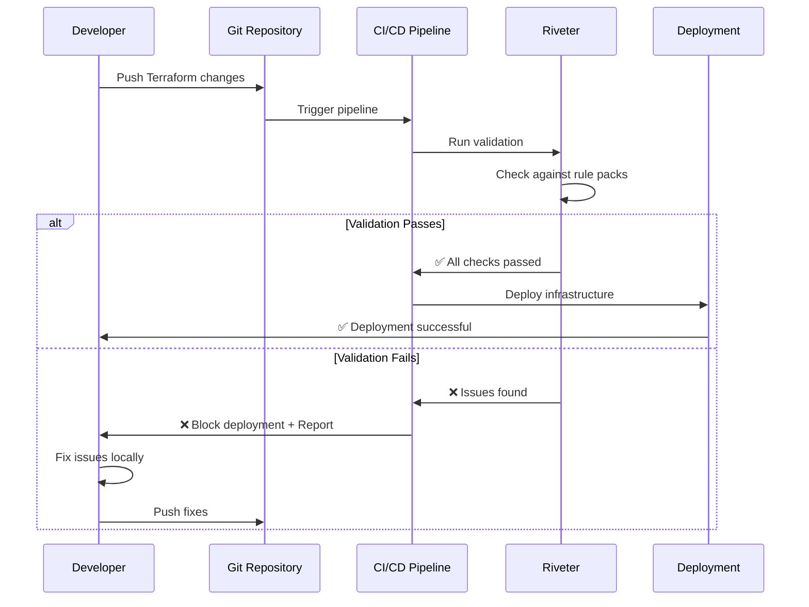

# Visual Guides

This page consolidates all visual documentation to help you understand how Riveter works, choose the right rule packs, and troubleshoot issues.

## 🏗️ How Riveter Works

### High-Level Flow


### Rule Evaluation Process


## 📊 Rule Pack Selection

### Choose by Use Case


### Rule Pack Coverage Matrix

| Service Category | AWS | Azure | GCP | Multi-Cloud | Kubernetes |
|------------------|-----|-------|-----|-------------|------------|
| **Compute** | ✅ EC2, Lambda | ✅ VMs, Functions | ✅ Compute Engine | ✅ Common patterns | ✅ Pods, Deployments |
| **Storage** | ✅ S3, EBS | ✅ Storage Accounts | ✅ Cloud Storage | ✅ Encryption, Access | ✅ Volumes |
| **Database** | ✅ RDS, DynamoDB | ✅ SQL Database | ✅ Cloud SQL | ✅ Encryption, Backup | ✅ StatefulSets |
| **Networking** | ✅ VPC, Security Groups | ✅ VNet, NSGs | ✅ VPC, Firewall | ✅ Network Security | ✅ Network Policies |
| **Identity** | ✅ IAM, Roles | ✅ Azure AD, RBAC | ✅ IAM, Service Accounts | ✅ Access Control | ✅ RBAC |
| **Security** | ✅ KMS, CloudTrail | ✅ Key Vault | ✅ KMS, Logging | ✅ Encryption | ✅ Pod Security |

## 🔧 Troubleshooting Guide

### Common Error Resolution


## 📈 Before/After Examples

### S3 Bucket Security Validation

#### Before Fixing Issues
```
┌─────────────────────────────────────────────────────────────────────────────┐
│ Riveter Validation Results - aws-security Rule Pack                         │
├─────────────────────────────────────────────────────────────────────────────┤
│ ❌ FAIL │ aws_s3_bucket.documents    │ S3 bucket must have encryption      │
│ ❌ FAIL │ aws_s3_bucket.documents    │ S3 bucket must block public access  │
│ ❌ FAIL │ aws_s3_bucket.documents    │ S3 bucket must have versioning      │
├─────────────────────────────────────────────────────────────────────────────┤
│ Summary: 3 failures, 0 passed                                              │
│ Success Rate: 0%                                                            │
└─────────────────────────────────────────────────────────────────────────────┘
```

#### After Fixing Issues
```
┌─────────────────────────────────────────────────────────────────────────────┐
│ Riveter Validation Results - aws-security Rule Pack                         │
├─────────────────────────────────────────────────────────────────────────────┤
│ ✅ PASS │ aws_s3_bucket.documents    │ S3 bucket encryption enabled        │
│ ✅ PASS │ aws_s3_bucket.documents    │ S3 bucket public access blocked     │
│ ✅ PASS │ aws_s3_bucket.documents    │ S3 bucket versioning enabled        │
├─────────────────────────────────────────────────────────────────────────────┤
│ Summary: 0 failures, 3 passed                                              │
│ Success Rate: 100%                                                          │
└─────────────────────────────────────────────────────────────────────────────┘
```

## 🚀 CI/CD Integration Flow



## 🎨 Visual Design Standards

All diagrams follow consistent design principles:
- **Blue** (#1976d2): Input/source elements
- **Orange** (#f57c00): Processing/intermediate steps
- **Green** (#388e3c): Success/output states
- **Red** (#d32f2f): Error/failure states
- **Purple** (#7b1fa2): Information/secondary elements

## 📚 More Detailed Visuals

For comprehensive visual documentation including detailed architecture diagrams, advanced troubleshooting flows, and compliance framework mappings, see:

- **[Architecture Diagrams](../ARCHITECTURE_DIAGRAMS.md)** - Detailed system architecture
- **[Rule Evaluation Flowcharts](../RULE_EVALUATION_FLOWCHARTS.md)** - Complete evaluation processes
- **[Rule Pack Comparisons](../RULE_PACK_COMPARISONS.md)** - Comprehensive coverage analysis
- **[Visual Design System](../VISUAL_DESIGN_SYSTEM.md)** - Design standards and templates

---

*These visual guides provide quick understanding of Riveter's core concepts and processes.*
