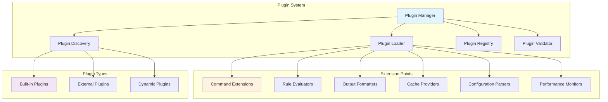

# Plugin System and Extension Points

This document provides comprehensive documentation for the Riveter plugin system, including how to create plugins, available extension points, and the plugin architecture.

## Overview

The modernized Riveter architecture includes a powerful plugin system that allows developers to extend functionality without modifying the core codebase. The plugin system supports:

- **Command Extensions**: Add new CLI commands
- **Rule Evaluators**: Custom rule evaluation logic
- **Output Formatters**: New output formats
- **Cache Providers**: Custom caching implementations
- **Configuration Parsers**: Support for new configuration formats
- **Performance Monitors**: Custom performance monitoring

## Plugin Architecture

### Core Plugin Components



## Plugin Development

### 1. Basic Plugin Structure

All plugins must implement the base `Plugin` protocol:

```python
from riveter.plugins.types import Plugin, PluginInfo, PluginMetadata
from typing import Any, Dict

class MyCustomPlugin(Plugin):
    """Example custom plugin implementation."""

    @property
    def info(self) -> PluginInfo:
        return PluginInfo(
            name="my-custom-plugin",
            version="1.0.0",
            description="Example custom plugin for Riveter",
            author="Your Name",
            license="MIT",
            dependencies=["riveter>=2.0.0"],
            entry_points={
                "commands": ["my_command"],
                "formatters": ["my_format"],
            }
        )

    def initialize(self, context: Dict[str, Any]) -> None:
        """Initialize the plugin with the given context."""
        self._context = context
        self._register_components()

    def shutdown(self) -> None:
        """Clean up plugin resources."""
        pass

    def _register_components(self) -> None:
        """Register plugin components with the system."""
        # Register custom command
        from .commands import MyCustomCommand
        self._context['command_registry'].register_command(
            "my-command",
            MyCustomCommand
        )

        # Register custom formatter
        from .formatters import MyCustomFormatter
        self._context['output_manager'].register_formatter(
            "my-format",
            MyCustomFormatter()
        )
```

### 2. Plugin Metadata

Plugin metadata is defined using the `PluginInfo` dataclass:

```python
@dataclass(frozen=True)
class PluginInfo:
    name: str
    version: str
    description: str
    author: str
    license: str
    dependencies: list[str] = field(default_factory=list)
    entry_points: dict[str, list[str]] = field(default_factory=dict)
    metadata: dict[str, Any] = field(default_factory=dict)

    @property
    def qualified_name(self) -> str:
        return f"{self.name}@{self.version}"
```

### 3. Plugin Discovery

Plugins can be discovered through multiple mechanisms:

#### Entry Points (Recommended)

Define plugins in `pyproject.toml`:

```toml
[project.entry-points."riveter.plugins"]
my_plugin = "my_package.plugins:MyPlugin"
```

#### File System Discovery

Place plugins in standard locations:

```
~/.riveter/plugins/
/usr/local/share/riveter/plugins/
./plugins/
```

#### Environment Variables

```bash
export RIVETER_PLUGINS="my_package.plugins:MyPlugin,another_package:AnotherPlugin"
```

## Extension Points

### 1. Command Extensions

Add new CLI commands by implementing the `Command` protocol:

```python
from riveter.cli.interface import BaseCommand, CommandResult
from riveter.models.config import CLIArgs

class MyCustomCommand(BaseCommand):
    """Custom command implementation."""

    def __init__(self):
        super().__init__(
            name="my-command",
            description="My custom command for special operations"
        )

    def execute(self, args: CLIArgs) -> CommandResult:
        """Execute the custom command."""
        try:
            # Custom command logic here
            result = self._perform_custom_operation(args)

            return CommandResult(
                exit_code=0,
                output=f"Custom operation completed: {result}"
            )
        except Exception as e:
            return CommandResult(
                exit_code=1,
                error=f"Custom command failed: {e}"
            )

    def validate_args(self, args: CLIArgs) -> list[str]:
        """Validate command arguments."""
        errors = []

        # Add custom validation logic
        if not args.terraform_file:
            errors.append("Terraform file is required for my-command")

        return errors

    def _perform_custom_operation(self, args: CLIArgs) -> str:
        """Perform the custom operation."""
        # Implementation details
        return "Operation result"

# Plugin registration
class MyCommandPlugin(Plugin):
    def initialize(self, context: Dict[str, Any]) -> None:
        context['command_registry'].register_command(
            "my-command",
            MyCustomCommand(),
            aliases=["mc", "custom"]
        )
```

### 2. Rule Evaluator Extensions

Create custom rule evaluation logic:

```python
from riveter.validation.protocols import RuleEvaluatorProtocol
from riveter.models.core import TerraformResource
from riveter.models.rules import Rule
from riveter.validation.result import RuleResult

class CustomRuleEvaluator(RuleEvaluatorProtocol):
    """Custom rule evaluator with specialized logic."""

    def evaluate_rule(self, rule: Rule, resource: TerraformResource) -> RuleResult:
        """Evaluate rule against resource with custom logic."""

        # Custom evaluation logic
        if rule.metadata.get("evaluator") == "custom":
            return self._evaluate_custom_rule(rule, resource)

        # Fallback to default evaluation
        from riveter.validation.evaluator import DefaultRuleEvaluator
        default_evaluator = DefaultRuleEvaluator()
        return default_evaluator.evaluate_rule(rule, resource)

    def _evaluate_custom_rule(self, rule: Rule, resource: TerraformResource) -> RuleResult:
        """Custom rule evaluation logic."""
        # Implement custom evaluation
        passed = self._check_custom_conditions(rule, resource)
        message = "Custom evaluation passed" if passed else "Custom evaluation failed"

        return RuleResult(
            rule=rule,
            resource=resource,
            passed=passed,
            message=message,
            metadata={"evaluator": "custom"}
        )

    def _check_custom_conditions(self, rule: Rule, resource: TerraformResource) -> bool:
        """Check custom conditions."""
        # Custom condition checking logic
        return True

# Plugin registration
class CustomEvaluatorPlugin(Plugin):
    def initialize(self, context: Dict[str, Any]) -> None:
        # Register as alternative evaluator
        context['validation_engine'].register_evaluator(
            "custom",
            CustomRuleEvaluator()
        )
```

### 3. Output Formatter Extensions

Add new output formats:

```python
from riveter.output.protocols import OutputFormatter
from riveter.models.core import ValidationResult
import xml.etree.ElementTree as ET

class XMLFormatter(OutputFormatter):
    """XML output formatter."""

    def format(self, result: ValidationResult) -> str:
        """Format validation result as XML."""
        root = ET.Element("validation-result")

        # Add summary
        summary_elem = ET.SubElement(root, "summary")
        summary_elem.set("total-rules", str(result.summary.total_rules))
        summary_elem.set("total-resources", str(result.summary.total_resources))
        summary_elem.set("passed", str(result.summary.passed))
        summary_elem.set("failed", str(result.summary.failed))

        # Add results
        results_elem = ET.SubElement(root, "results")
        for rule_result in result.results:
            result_elem = ET.SubElement(results_elem, "result")
            result_elem.set("rule-id", rule_result.rule_id)
            result_elem.set("resource-id", rule_result.resource.id)
            result_elem.set("passed", str(rule_result.passed).lower())
            result_elem.text = rule_result.message

        return ET.tostring(root, encoding='unicode', xml_declaration=True)

# Plugin registration
class XMLFormatterPlugin(Plugin):
    def initialize(self, context: Dict[str, Any]) -> None:
        context['output_manager'].register_formatter(
            "xml",
            XMLFormatter()
        )
```

### 4. Cache Provider Extensions

Implement custom caching strategies:

```python
from riveter.cache.types import CacheProvider
from typing import Any, Optional
import redis

class RedisCacheProvider(CacheProvider):
    """Redis-based cache provider."""

    def __init__(self, host: str = "localhost", port: int = 6379, db: int = 0):
        self._redis = redis.Redis(host=host, port=port, db=db)

    def get(self, key: str) -> Optional[Any]:
        """Get value from Redis cache."""
        try:
            value = self._redis.get(key)
            if value:
                import pickle
                return pickle.loads(value)
        except Exception as e:
            # Log error and return None
            return None
        return None

    def set(self, key: str, value: Any, ttl: Optional[int] = None) -> None:
        """Set value in Redis cache."""
        try:
            import pickle
            serialized_value = pickle.dumps(value)
            if ttl:
                self._redis.setex(key, ttl, serialized_value)
            else:
                self._redis.set(key, serialized_value)
        except Exception as e:
            # Log error but don't fail
            pass

    def delete(self, key: str) -> None:
        """Delete value from Redis cache."""
        try:
            self._redis.delete(key)
        except Exception:
            pass

    def clear(self) -> None:
        """Clear all cached values."""
        try:
            self._redis.flushdb()
        except Exception:
            pass

# Plugin registration
class RedisCachePlugin(Plugin):
    def initialize(self, context: Dict[str, Any]) -> None:
        # Register Redis cache provider
        redis_config = context.get('redis_config', {})
        cache_provider = RedisCacheProvider(**redis_config)

        context['cache_manager'].register_provider(
            "redis",
            cache_provider
        )
```

### 5. Configuration Parser Extensions

Support new configuration formats:

```python
from riveter.configuration.parser import ConfigurationParser
from riveter.models.core import TerraformConfig, TerraformResource, SourceLocation
from pathlib import Path
import json

class JSONConfigurationParser(ConfigurationParser):
    """Parser for JSON-based Terraform configurations."""

    def parse(self, file_path: Path) -> TerraformConfig:
        """Parse JSON configuration file."""
        with open(file_path, 'r') as f:
            config_data = json.load(f)

        resources = []
        for resource_type, type_resources in config_data.get('resource', {}).items():
            for resource_name, attributes in type_resources.items():
                resource = TerraformResource(
                    type=resource_type,
                    name=resource_name,
                    attributes=attributes,
                    source_location=SourceLocation(file_path, 0)  # JSON doesn't have line numbers
                )
                resources.append(resource)

        return TerraformConfig(
            resources=resources,
            variables=config_data.get('variable', {}),
            outputs=config_data.get('output', {}),
            source_file=file_path
        )

    def supports_file(self, file_path: Path) -> bool:
        """Check if this parser supports the given file."""
        return file_path.suffix.lower() == '.json'

# Plugin registration
class JSONParserPlugin(Plugin):
    def initialize(self, context: Dict[str, Any]) -> None:
        context['configuration_manager'].register_parser(
            "json",
            JSONConfigurationParser()
        )
```

### 6. Performance Monitor Extensions

Add custom performance monitoring:

```python
from riveter.validation.protocols import PerformanceMonitorProtocol
from typing import Dict, Any, Optional
import time
import psutil

class DetailedPerformanceMonitor(PerformanceMonitorProtocol):
    """Detailed performance monitor with system metrics."""

    def __init__(self):
        self._timers: Dict[str, float] = {}
        self._metrics: Dict[str, list] = {}
        self._process = psutil.Process()

    def start_timer(self, name: str) -> str:
        """Start a named timer."""
        timer_id = f"{name}_{int(time.time() * 1000000)}"
        self._timers[timer_id] = time.time()
        return timer_id

    def stop_timer(self, timer_id: str) -> float:
        """Stop a timer and return elapsed time."""
        if timer_id not in self._timers:
            return 0.0

        elapsed = time.time() - self._timers[timer_id]
        del self._timers[timer_id]
        return elapsed

    def record_metric(self, name: str, value: float, tags: Optional[Dict[str, str]] = None) -> None:
        """Record a performance metric."""
        if name not in self._metrics:
            self._metrics[name] = []

        metric_data = {
            'value': value,
            'timestamp': time.time(),
            'tags': tags or {},
            'memory_usage': self._process.memory_info().rss,
            'cpu_percent': self._process.cpu_percent()
        }

        self._metrics[name].append(metric_data)

    def get_metrics(self) -> Dict[str, Any]:
        """Get all recorded metrics."""
        return {
            'metrics': self._metrics.copy(),
            'system_info': {
                'memory_usage': self._process.memory_info().rss,
                'cpu_percent': self._process.cpu_percent(),
                'open_files': len(self._process.open_files()),
            }
        }

# Plugin registration
class DetailedMonitorPlugin(Plugin):
    def initialize(self, context: Dict[str, Any]) -> None:
        context['validation_engine'].set_performance_monitor(
            DetailedPerformanceMonitor()
        )
```

## Plugin Management

### Plugin Registry

The plugin registry manages all loaded plugins:

```python
from riveter.plugins.registry import PluginRegistry

# Get global registry
registry = PluginRegistry.get_global_registry()

# List all plugins
plugins = registry.list_plugins()

# Get specific plugin
plugin = registry.get_plugin("my-plugin")

# Check if plugin is loaded
is_loaded = registry.is_plugin_loaded("my-plugin")

# Unload plugin
registry.unload_plugin("my-plugin")
```

### Plugin Configuration

Plugins can be configured through various methods:

#### Configuration File

```yaml
# ~/.riveter/config.yml
plugins:
  enabled:
    - my-custom-plugin
    - xml-formatter
  disabled:
    - legacy-plugin

  config:
    my-custom-plugin:
      setting1: value1
      setting2: value2

    redis-cache:
      host: localhost
      port: 6379
      db: 0
```

#### Environment Variables

```bash
export RIVETER_PLUGINS_ENABLED="my-custom-plugin,xml-formatter"
export RIVETER_PLUGINS_DISABLED="legacy-plugin"
export RIVETER_PLUGIN_MY_CUSTOM_PLUGIN_SETTING1="value1"
```

#### Command Line Arguments

```bash
riveter scan --enable-plugin my-custom-plugin --disable-plugin legacy-plugin
```

## Plugin Development Best Practices

### 1. Plugin Structure

Organize plugins with a clear structure:

```
my_riveter_plugin/
├── __init__.py
├── plugin.py          # Main plugin class
├── commands/           # Custom commands
│   ├── __init__.py
│   └── my_command.py
├── formatters/         # Custom formatters
│   ├── __init__.py
│   └── my_formatter.py
├── evaluators/         # Custom evaluators
│   ├── __init__.py
│   └── my_evaluator.py
├── tests/              # Plugin tests
│   ├── __init__.py
│   ├── test_plugin.py
│   └── test_commands.py
├── pyproject.toml      # Plugin metadata
└── README.md           # Plugin documentation
```

### 2. Error Handling

Implement robust error handling:

```python
class MyPlugin(Plugin):
    def initialize(self, context: Dict[str, Any]) -> None:
        try:
            self._register_components(context)
        except Exception as e:
            # Log error but don't fail completely
            logger.error(f"Failed to initialize plugin {self.info.name}: {e}")
            # Register minimal functionality or skip registration

    def _register_components(self, context: Dict[str, Any]) -> None:
        # Component registration with individual error handling
        try:
            self._register_commands(context)
        except Exception as e:
            logger.warning(f"Failed to register commands: {e}")

        try:
            self._register_formatters(context)
        except Exception as e:
            logger.warning(f"Failed to register formatters: {e}")
```

### 3. Testing

Write comprehensive tests for plugins:

```python
import pytest
from riveter.plugins.manager import PluginManager
from my_plugin import MyPlugin

class TestMyPlugin:
    def test_plugin_initialization(self):
        plugin = MyPlugin()
        context = {'command_registry': MockCommandRegistry()}

        plugin.initialize(context)

        assert plugin.info.name == "my-plugin"
        assert context['command_registry'].has_command("my-command")

    def test_plugin_command_execution(self):
        plugin = MyPlugin()
        context = self._create_test_context()
        plugin.initialize(context)

        command = context['command_registry'].get_command("my-command")
        result = command.execute(self._create_test_args())

        assert result.exit_code == 0
        assert "success" in result.output.lower()
```

### 4. Documentation

Document plugins thoroughly:

```python
class MyPlugin(Plugin):
    """
    My Custom Plugin for Riveter

    This plugin provides:
    - Custom command for special operations
    - XML output formatter
    - Enhanced rule evaluation

    Configuration:
        setting1 (str): Description of setting1
        setting2 (int): Description of setting2

    Example:
        Enable the plugin in your configuration:

        plugins:
          enabled:
            - my-custom-plugin
          config:
            my-custom-plugin:
              setting1: "value"
              setting2: 42
    """
```

## Plugin Distribution

### 1. PyPI Distribution

Package plugins for PyPI distribution:

```toml
# pyproject.toml
[project]
name = "riveter-my-plugin"
version = "1.0.0"
description = "My custom plugin for Riveter"
dependencies = ["riveter>=2.0.0"]

[project.entry-points."riveter.plugins"]
my_plugin = "my_riveter_plugin:MyPlugin"
```

### 2. Git Distribution

Distribute plugins via Git repositories:

```bash
# Install from Git
pip install git+https://github.com/user/riveter-my-plugin.git

# Or add to requirements.txt
git+https://github.com/user/riveter-my-plugin.git@v1.0.0
```

### 3. Local Development

Install plugins in development mode:

```bash
# Install in editable mode
pip install -e /path/to/my-plugin

# Or use PYTHONPATH
export PYTHONPATH="/path/to/my-plugin:$PYTHONPATH"
```

This comprehensive plugin system documentation provides developers with everything needed to extend Riveter's functionality while maintaining compatibility and performance.
