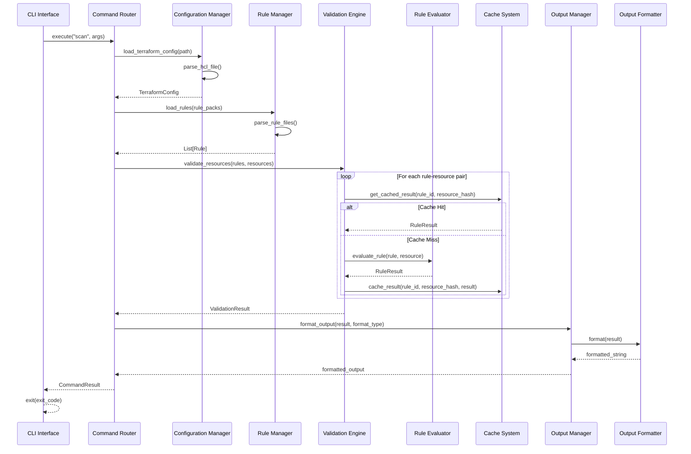
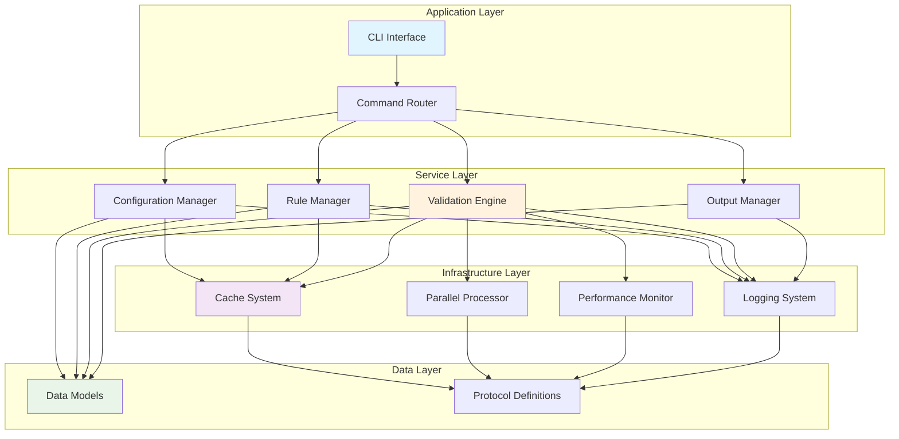
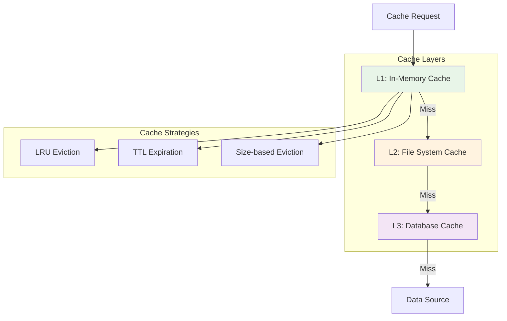
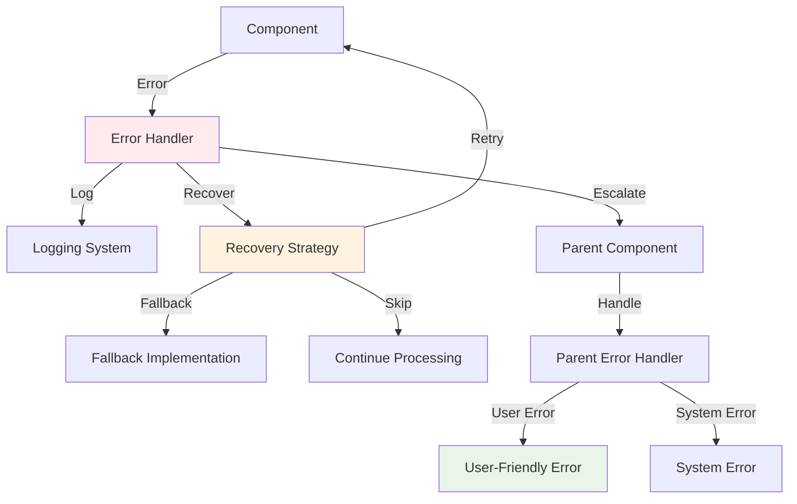
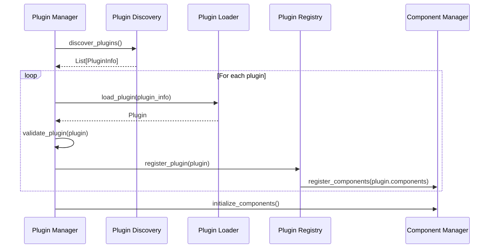
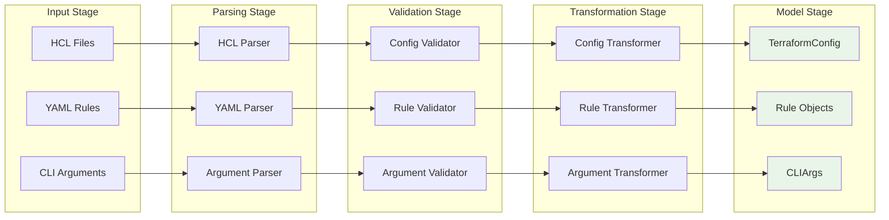

# Component Interactions and Data Flow

This document provides detailed documentation of how components interact in the modernized Riveter architecture, including data flow patterns, dependency injection, and communication protocols.

## Overview

The modernized Riveter architecture uses a layered approach with clear separation of concerns and protocol-based communication between components. This design enables:

- **Loose Coupling**: Components depend on interfaces, not implementations
- **Testability**: Easy mocking and testing of individual components
- **Extensibility**: New implementations can be plugged in without changing existing code
- **Performance**: Optimized data flow and minimal overhead

## Core Data Flow

### Primary Validation Flow



## Component Dependencies

### Dependency Injection Pattern

The modernized architecture uses dependency injection to manage component relationships:

```python
# Example: Validation Engine with injected dependencies
class ValidationEngine:
    def __init__(
        self,
        evaluator: RuleEvaluatorProtocol,
        cache_provider: CacheProviderProtocol,
        performance_monitor: PerformanceMonitorProtocol,
        config: ValidationEngineConfig,
    ):
        self._evaluator = evaluator
        self._cache_provider = cache_provider
        self._performance_monitor = performance_monitor
        self._config = config
```

### Component Dependency Graph



## Detailed Component Interactions

### 1. CLI Layer Interactions

#### Command Router → Command Implementations

```python
class CommandRouter:
    def route_command(self, command_name: str, args: CLIArgs) -> CommandResult:
        # Get command from registry (lazy loading)
        command = self.get_command(command_name)

        # Execute with performance monitoring
        if self._use_registry:
            return self._registry.execute_command(command_name, args)
        else:
            return command.execute(args)
```

#### Command Registry → Plugin System

```python
class CommandRegistry:
    def register_command(self, name: str, factory: Callable[[], Command]):
        # Register command factory for lazy loading
        self._command_factories[name] = factory

        # Enable plugin discovery
        if self._plugin_manager:
            self._plugin_manager.register_command_provider(name, factory)
```

### 2. Configuration Management Interactions

#### Configuration Manager → Parser → Cache

```python
class ConfigurationManager:
    def load_terraform_config(self, path: Path) -> TerraformConfig:
        # Check cache first
        cache_key = f"config:{path}:{path.stat().st_mtime}"
        cached_config = self._cache.get(cache_key)

        if cached_config:
            return cached_config

        # Parse configuration
        config = self._parser.parse(path)

        # Cache result
        self._cache.set(cache_key, config, ttl=self._cache_ttl)

        return config
```

#### Parser → HCL Library → Data Models

```python
class TerraformParser:
    def parse(self, file_path: Path) -> TerraformConfig:
        # Parse HCL using python-hcl2
        with open(file_path, 'r') as f:
            hcl_data = hcl2.load(f)

        # Convert to immutable data models
        resources = [
            TerraformResource(
                type=resource_type,
                name=resource_name,
                attributes=attributes,
                source_location=SourceLocation(file_path, line_number)
            )
            for resource_type, resources in hcl_data.get('resource', {}).items()
            for resource_name, attributes in resources.items()
        ]

        return TerraformConfig(
            resources=resources,
            variables=hcl_data.get('variable', {}),
            outputs=hcl_data.get('output', {}),
            source_file=file_path
        )
```

### 3. Rule Management Interactions

#### Rule Manager → Rule Repository → Cache

```python
class RuleManager:
    def load_rule_pack(self, pack_name: str) -> RulePack:
        # Check cache
        cached_pack = self._cache.get(f"rule_pack:{pack_name}")
        if cached_pack:
            return cached_pack

        # Load from repository
        pack = self._repository.load_pack(pack_name)

        # Validate rules
        validated_pack = self._validator.validate_pack(pack)

        # Cache result
        self._cache.set(f"rule_pack:{pack_name}", validated_pack)

        return validated_pack
```

#### Rule Repository → File System → YAML Parser

```python
class RuleRepository:
    def load_pack(self, pack_name: str) -> RulePack:
        pack_file = self._find_pack_file(pack_name)

        with open(pack_file, 'r') as f:
            pack_data = yaml.safe_load(f)

        # Convert to immutable Rule objects
        rules = [
            Rule(
                id=rule_data['id'],
                description=rule_data['description'],
                resource_type=rule_data['resource_type'],
                severity=Severity(rule_data.get('severity', 'error')),
                conditions=self._parse_conditions(rule_data.get('conditions', [])),
                metadata=rule_data.get('metadata', {})
            )
            for rule_data in pack_data.get('rules', [])
        ]

        return RulePack(
            name=pack_name,
            version=pack_data.get('version', '1.0.0'),
            rules=rules,
            metadata=pack_data.get('metadata', {})
        )
```

### 4. Validation Engine Interactions

#### Validation Engine → Rule Evaluator → Cache

```python
class ValidationEngine:
    def _evaluate_rule_with_cache(self, rule: Rule, resource: TerraformResource) -> RuleResult:
        # Generate cache key
        resource_hash = hash_resource_attributes(resource.attributes)
        cache_key = f"rule:{rule.id}:resource:{resource.id}:hash:{resource_hash}"

        # Try cache first
        cached_result = self._validation_cache.get(cache_key)
        if cached_result:
            self._cache_hits += 1
            return cached_result

        # Cache miss - evaluate
        self._cache_misses += 1
        result = self._evaluator.evaluate_rule(rule, resource)

        # Cache result
        self._validation_cache.set(cache_key, result, self._config.cache_ttl)

        return result
```

#### Parallel Processor → Worker Pool → Task Queue

```python
class ParallelProcessor:
    def process_batch(
        self,
        items: list[T],
        processor_func: Callable[[T], R],
        batch_size: int
    ) -> list[R]:
        # Split into batches
        batches = [items[i:i + batch_size] for i in range(0, len(items), batch_size)]

        # Process batches in parallel
        with ThreadPoolExecutor(max_workers=self._max_workers) as executor:
            # Submit batch processing tasks
            futures = [
                executor.submit(self._process_batch_items, batch, processor_func)
                for batch in batches
            ]

            # Collect results
            results = []
            for future in as_completed(futures):
                batch_results = future.result()
                results.extend(batch_results)

        return results
```

### 5. Output System Interactions

#### Output Manager → Formatter Registry → Formatters

```python
class OutputManager:
    def output(self, result: ValidationResult, format_type: str) -> str:
        # Get formatter from registry
        formatter = self._formatters.get(format_type)
        if not formatter:
            raise ValueError(f"Unknown output format: {format_type}")

        # Format result
        formatted_output = formatter.format(result)

        # Apply post-processing if needed
        if self._post_processors:
            for processor in self._post_processors:
                formatted_output = processor.process(formatted_output, format_type)

        return formatted_output
```

#### Formatter → Template Engine → Output

```python
class TableFormatter:
    def format(self, result: ValidationResult) -> str:
        # Create table using Rich library
        table = Table(title="Validation Results")

        # Add columns
        table.add_column("Rule ID", style="cyan")
        table.add_column("Resource", style="magenta")
        table.add_column("Status", style="green")
        table.add_column("Message", style="white")

        # Add rows
        for rule_result in result.results:
            status_style = "green" if rule_result.passed else "red"
            status_text = "PASS" if rule_result.passed else "FAIL"

            table.add_row(
                rule_result.rule_id,
                rule_result.resource.id,
                Text(status_text, style=status_style),
                rule_result.message
            )

        # Render to string
        console = Console(file=StringIO(), width=120)
        console.print(table)
        return console.file.getvalue()
```

## Performance Optimization Interactions

### 1. Lazy Loading Pattern

```python
class ComponentRegistry:
    def get_component(self, name: str) -> T:
        # Lazy loading with caching
        if name not in self._loaded_components:
            factory = self._component_factories.get(name)
            if not factory:
                raise ValueError(f"Unknown component: {name}")

            # Load and cache component
            self._loaded_components[name] = factory()

        return self._loaded_components[name]
```

### 2. Cache Hierarchy



### 3. Parallel Processing Coordination

```python
class ValidationEngine:
    def _coordinate_parallel_evaluation(
        self, evaluation_pairs: list[tuple[Rule, TerraformResource]]
    ) -> list[RuleResult]:
        # Partition work by resource type for better cache locality
        partitions = self._partition_by_resource_type(evaluation_pairs)

        # Process partitions in parallel
        partition_results = self._parallel_processor.process_partitions(
            partitions=partitions,
            processor_func=self._evaluate_partition,
            coordination_strategy="resource_type_affinity"
        )

        # Merge results maintaining order
        return self._merge_partition_results(partition_results)
```

## Error Handling and Recovery

### Error Propagation Pattern



### Circuit Breaker Pattern

```python
class CircuitBreaker:
    def __init__(self, failure_threshold: int = 5, recovery_timeout: int = 60):
        self._failure_count = 0
        self._failure_threshold = failure_threshold
        self._recovery_timeout = recovery_timeout
        self._last_failure_time = None
        self._state = "CLOSED"  # CLOSED, OPEN, HALF_OPEN

    def call(self, func: Callable[[], T]) -> T:
        if self._state == "OPEN":
            if self._should_attempt_reset():
                self._state = "HALF_OPEN"
            else:
                raise CircuitBreakerOpenError("Circuit breaker is open")

        try:
            result = func()
            self._on_success()
            return result
        except Exception as e:
            self._on_failure()
            raise
```

## Plugin System Interactions

### Plugin Discovery and Loading

```python
class PluginManager:
    def discover_and_load_plugins(self) -> None:
        # Discover plugins from multiple sources
        discovered_plugins = []

        # 1. Entry points (setuptools)
        discovered_plugins.extend(self._discover_entry_point_plugins())

        # 2. File system plugins
        discovered_plugins.extend(self._discover_file_system_plugins())

        # 3. Environment-specified plugins
        discovered_plugins.extend(self._discover_environment_plugins())

        # Load and validate plugins
        for plugin_info in discovered_plugins:
            try:
                plugin = self._load_plugin(plugin_info)
                self._validate_plugin(plugin)
                self._register_plugin(plugin)
            except Exception as e:
                self._logger.warning(f"Failed to load plugin {plugin_info.name}: {e}")
```

### Plugin Registration Flow



## Data Transformation Pipeline

### Configuration Processing Pipeline



This comprehensive documentation of component interactions provides developers with a clear understanding of how the modernized Riveter architecture coordinates between different layers and components while maintaining performance, extensibility, and backward compatibility.
