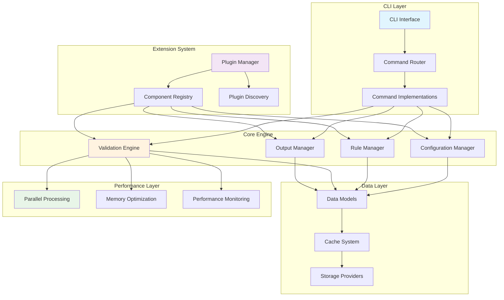

# Modernized Riveter Architecture

This document provides comprehensive documentation of the modernized Riveter architecture, including the new modular design, extension points, and plugin system implemented during the full overhaul.

## Overview

The modernized Riveter architecture follows modern Python best practices with a focus on:
- **Type Safety**: Complete type annotations throughout the codebase
- **Modularity**: Clear separation of concerns with protocol-based interfaces
- **Extensibility**: Plugin architecture and extension points
- **Performance**: Parallel processing, intelligent caching, and optimization
- **Maintainability**: Clean code patterns and comprehensive testing
- **Backward Compatibility**: 100% compatibility with existing CLI and behavior

## High-Level Architecture

### System Components



## Module Architecture

### 1. CLI Layer (`riveter.cli`)

The CLI layer provides a modern, extensible command-line interface with performance optimizations.

#### Key Components:

- **`interface.py`**: Protocol definitions and base classes
- **`commands.py`**: Command implementations
- **`registry.py`**: Advanced command registry with lazy loading
- **`performance.py`**: CLI-specific performance optimizations
- **`memory_optimizer.py`**: Memory usage optimization
- **`optimized_commands.py`**: Performance-optimized command variants

#### Architecture:

```python
# Protocol-based design for extensibility
class CLIInterface(Protocol):
    def execute(self, args: list[str]) -> int: ...

class Command(Protocol):
    def execute(self, args: CLIArgs) -> CommandResult: ...

# Command router with lazy loading
class CommandRouter:
    def __init__(self, use_registry: bool = True): ...
    def register_command(self, name: str, command: Command): ...
    def route_command(self, command_name: str, args: CLIArgs) -> CommandResult: ...
```

### 2. Configuration Management (`riveter.configuration`)

Modern configuration system with caching, validation, and type safety.

#### Key Components:

- **`manager.py`**: Configuration manager with dependency injection
- **`parser.py`**: Terraform configuration parsing
- **`cache.py`**: Configuration caching system
- **`settings.py`**: Application settings management

#### Architecture:

```python
@dataclass(frozen=True)
class TerraformConfig:
    resources: dict[str, Any]
    variables: dict[str, Any]
    outputs: dict[str, Any]
    source_file: Path

class ConfigurationManager:
    def __init__(self, parser: ConfigurationParser, cache: CacheProvider): ...
    def load_terraform_config(self, path: Path) -> TerraformConfig: ...
```

### 3. Data Models (`riveter.models`)

Immutable data structures with comprehensive type safety.

#### Key Components:

- **`core.py`**: Core data models (TerraformResource, ValidationResult, etc.)
- **`rules.py`**: Rule-related data models
- **`config.py`**: Configuration data models
- **`protocols.py`**: Protocol definitions
- **`types.py`**: Type aliases and custom types

#### Key Models:

```python
@dataclass(frozen=True)
class TerraformResource:
    type: str
    name: str
    attributes: dict[str, Any]
    source_location: SourceLocation | None = None

@dataclass(frozen=True)
class ValidationResult:
    summary: ValidationSummary
    results: list[RuleResult]
    metadata: dict[str, Any] = field(default_factory=dict)
```

### 4. Validation Engine (`riveter.validation`)

Modern validation engine with parallel processing and caching.

#### Key Components:

- **`engine.py`**: Main validation engine
- **`evaluator.py`**: Rule evaluation logic
- **`cache.py`**: Validation result caching
- **`performance.py`**: Performance optimizations
- **`protocols.py`**: Validation protocols

#### Architecture:

```python
class ValidationEngine:
    def __init__(
        self,
        evaluator: RuleEvaluatorProtocol,
        cache_provider: CacheProviderProtocol,
        performance_monitor: PerformanceMonitorProtocol,
        config: ValidationEngineConfig,
    ): ...

    def validate_resources(
        self, rules: list[Rule], resources: list[TerraformResource]
    ) -> ValidationResult: ...
```

### 5. Output System (`riveter.output`)

Pluggable output formatting system with protocol-based interfaces.

#### Key Components:

- **`manager.py`**: Output manager
- **`formatters.py`**: Output formatter implementations
- **`protocols.py`**: Output system protocols

#### Architecture:

```python
class OutputFormatter(Protocol):
    def format(self, result: ValidationResult) -> str: ...

class OutputManager:
    def __init__(self, formatters: dict[str, OutputFormatter]): ...
    def output(self, result: ValidationResult, format_type: str) -> None: ...
```

### 6. Plugin System (`riveter.plugins`)

Extensible plugin architecture for adding new functionality.

#### Key Components:

- **`manager.py`**: Plugin manager
- **`discovery.py`**: Plugin discovery system
- **`loader.py`**: Plugin loading and validation
- **`registry.py`**: Plugin registry
- **`types.py`**: Plugin type definitions

#### Architecture:

```python
class PluginManager:
    def discover_plugins(self, search_paths: list[Path]) -> list[PluginInfo]: ...
    def load_plugin(self, plugin_info: PluginInfo) -> Plugin: ...
    def register_plugin(self, plugin: Plugin) -> None: ...
```

### 7. Performance Layer (`riveter.parallel`, `riveter.cache`)

High-performance processing with parallel execution and intelligent caching.

#### Parallel Processing (`riveter.parallel`):

- **`executor.py`**: Parallel execution engine
- **`scheduler.py`**: Task scheduling
- **`pool.py`**: Worker pool management
- **`types.py`**: Parallel processing types

#### Caching System (`riveter.cache`):

- **`manager.py`**: Cache manager
- **`providers.py`**: Cache provider implementations
- **`strategies.py`**: Caching strategies
- **`types.py`**: Cache type definitions

## Extension Points

### 1. Command Extensions

Add new CLI commands through the plugin system:

```python
from riveter.cli.interface import BaseCommand
from riveter.plugins.types import Plugin

class CustomCommand(BaseCommand):
    def execute(self, args: CLIArgs) -> CommandResult:
        # Custom command implementation
        pass

class CustomCommandPlugin(Plugin):
    def initialize(self) -> None:
        self.register_command("custom", CustomCommand("custom", "Custom command"))
```

### 2. Rule Evaluator Extensions

Extend rule evaluation logic:

```python
from riveter.validation.protocols import RuleEvaluatorProtocol

class CustomRuleEvaluator(RuleEvaluatorProtocol):
    def evaluate_rule(self, rule: Rule, resource: TerraformResource) -> RuleResult:
        # Custom evaluation logic
        pass
```

### 3. Output Format Extensions

Add new output formats:

```python
from riveter.output.protocols import OutputFormatter

class CustomFormatter(OutputFormatter):
    def format(self, result: ValidationResult) -> str:
        # Custom formatting logic
        pass
```

### 4. Cache Provider Extensions

Implement custom cache providers:

```python
from riveter.cache.types import CacheProvider

class CustomCacheProvider(CacheProvider):
    def get(self, key: str) -> Any | None:
        # Custom cache retrieval
        pass

    def set(self, key: str, value: Any, ttl: int | None = None) -> None:
        # Custom cache storage
        pass
```

## Performance Optimizations

### 1. Lazy Loading

Components are loaded only when needed:

```python
# CLI commands are loaded lazily
class CommandRegistry:
    def get_command(self, name: str) -> Command:
        if name not in self._loaded_commands:
            self._loaded_commands[name] = self._command_factories[name]()
        return self._loaded_commands[name]
```

### 2. Parallel Processing

Rule evaluation can be parallelized:

```python
class ValidationEngine:
    def _evaluate_parallel_optimized(
        self, evaluation_pairs: list[tuple[Rule, TerraformResource]]
    ) -> list[RuleResult]:
        return self._parallel_processor.process_batch(
            items=evaluation_pairs,
            processor_func=lambda pair: self._evaluate_rule_with_cache(pair[0], pair[1]),
            batch_size=self._config.batch_size,
        )
```

### 3. Intelligent Caching

Multi-level caching system:

```python
class ValidationResultCache:
    def get_rule_result(
        self, rule_id: str, resource_id: str, resource_hash: str
    ) -> RuleResult | None:
        cache_key = f"rule:{rule_id}:resource:{resource_id}:hash:{resource_hash}"
        return self._cache_provider.get(cache_key)
```

### 4. Memory Optimization

Memory usage is optimized through:

- Immutable data structures to prevent accidental mutations
- Efficient data serialization for caching
- Memory-mapped file operations for large configurations
- Garbage collection optimization

## Type Safety

The modernized architecture uses comprehensive type annotations:

```python
# Protocol definitions with type safety
class RuleEvaluatorProtocol(Protocol):
    def evaluate_rule(self, rule: Rule, resource: TerraformResource) -> RuleResult: ...

# Generic types for extensibility
T = TypeVar('T')
class CacheProvider(Protocol, Generic[T]):
    def get(self, key: str) -> T | None: ...
    def set(self, key: str, value: T, ttl: int | None = None) -> None: ...
```

## Error Handling

Structured exception hierarchy with context:

```python
class RiveterError(Exception):
    """Base exception for all Riveter errors."""
    pass

class ValidationError(RiveterError):
    """Errors during validation process."""
    def __init__(self, message: str, rule_id: str | None = None, resource_id: str | None = None):
        super().__init__(message)
        self.rule_id = rule_id
        self.resource_id = resource_id
```

## Backward Compatibility

The modernized architecture maintains 100% backward compatibility:

1. **CLI Interface**: All existing commands and flags work identically
2. **Output Formats**: All output formats produce identical results
3. **Configuration**: All existing configuration files are supported
4. **Rule Packs**: All existing rule packs work without modification
5. **Exit Codes**: All exit codes remain consistent

## Testing Architecture

Comprehensive testing with multiple levels:

```
tests/
├── unit/                    # Unit tests for individual components
│   ├── cli/                # CLI component tests
│   ├── models/             # Data model tests
│   ├── validation/         # Validation engine tests
│   └── output/             # Output system tests
├── integration/            # Integration tests
│   ├── cli_integration/    # End-to-end CLI tests
│   ├── component_integration/ # Component interaction tests
│   └── backward_compatibility/ # Compatibility validation
├── performance/            # Performance tests
│   ├── cli_benchmarks/     # CLI performance tests
│   └── component_benchmarks/ # Component performance tests
└── property/               # Property-based tests
    ├── rule_validation/    # Rule validation property tests
    └── data_model_properties/ # Data model property tests
```

## Migration from Legacy Architecture

The modernization process followed these principles:

1. **Incremental Migration**: Components were modernized one at a time
2. **Interface Preservation**: All public interfaces remained unchanged
3. **Gradual Adoption**: New patterns were introduced alongside legacy code
4. **Comprehensive Testing**: Each modernized component was thoroughly tested
5. **Performance Validation**: Performance was maintained or improved

## Development Guidelines

### Adding New Features

1. **Follow Protocols**: Use protocol-based interfaces for extensibility
2. **Type Safety**: Include comprehensive type annotations
3. **Testing**: Add unit, integration, and property-based tests
4. **Documentation**: Update architecture and API documentation
5. **Performance**: Consider performance implications and add benchmarks

### Plugin Development

1. **Plugin Interface**: Implement the `Plugin` protocol
2. **Registration**: Register components with appropriate managers
3. **Dependencies**: Declare plugin dependencies clearly
4. **Testing**: Include plugin-specific tests
5. **Documentation**: Provide plugin usage documentation

This modernized architecture provides a solid foundation for future development while maintaining complete backward compatibility with existing Riveter functionality.
