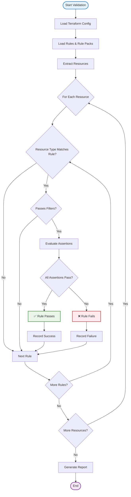
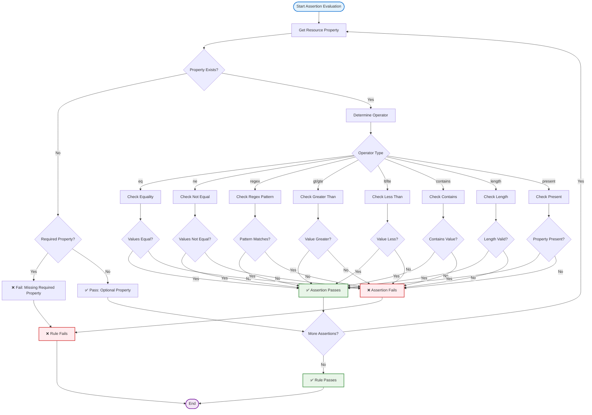
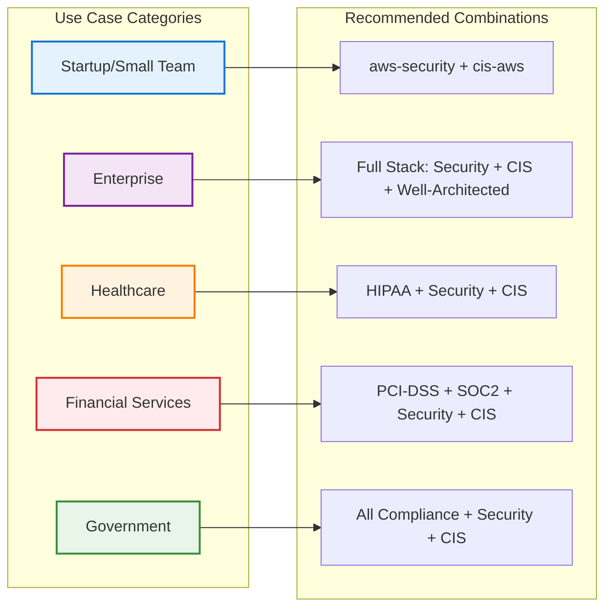
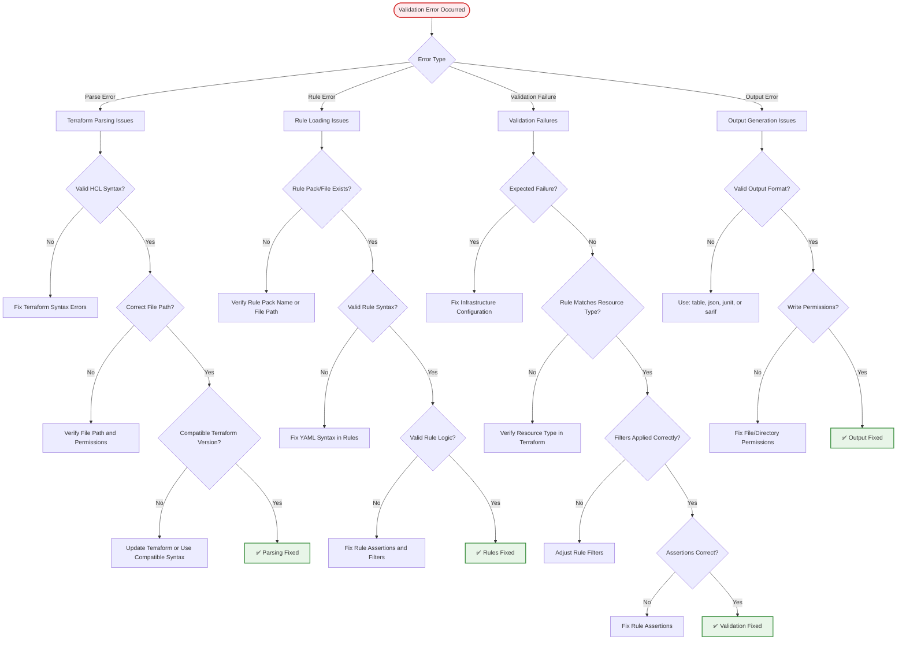
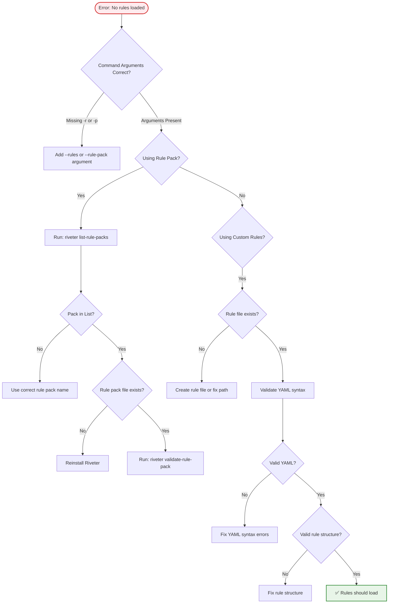
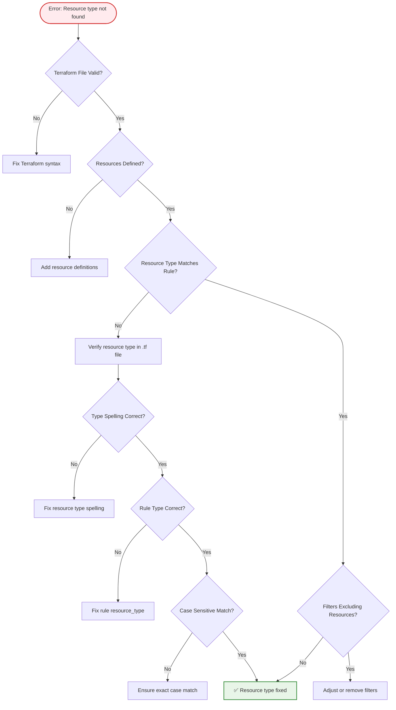
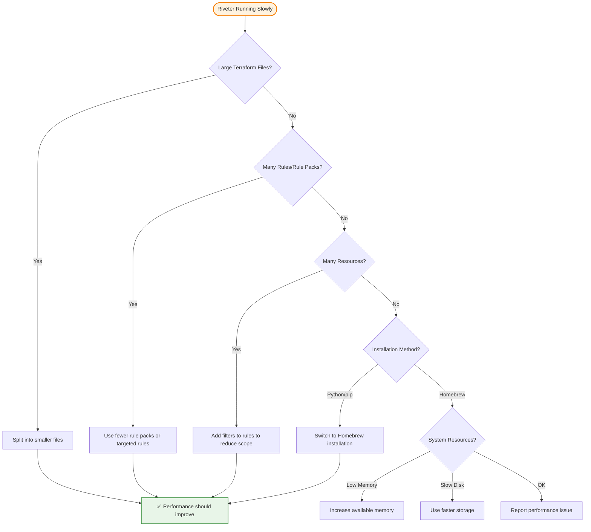
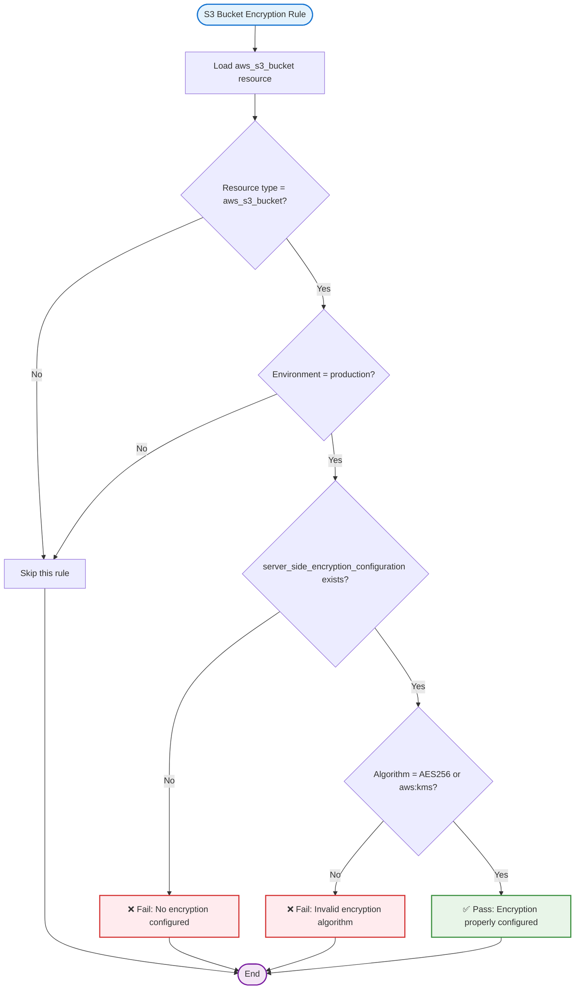
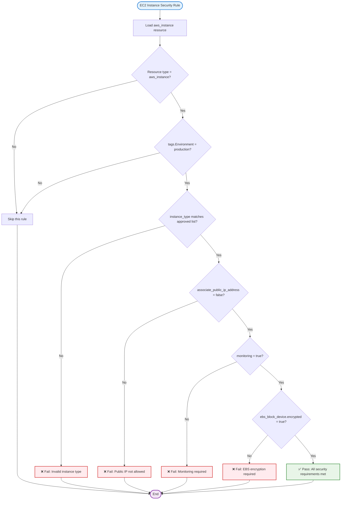

# Rule Evaluation Flowcharts

This document provides visual flowcharts for understanding how Riveter evaluates rules, selects rule packs, and troubleshoots common validation failures.

## Rule Matching and Evaluation Process

### Core Rule Evaluation Flow

### Detailed Assertion Evaluation

## Rule Pack Selection Decision Tree

### Choosing the Right Rule Pack Combination

```mermaid
flowchart TD
    START([What do you want to validate?]) --> PURPOSE{Primary Purpose}

    PURPOSE -->|Security Best Practices| SECURITY_PATH[Security Focus]
    PURPOSE -->|Compliance Requirements| COMPLIANCE_PATH[Compliance Focus]
    PURPOSE -->|Architecture Quality| ARCHITECTURE_PATH[Architecture Focus]
    PURPOSE -->|Custom Policies| CUSTOM_PATH[Custom Rules Focus]

    SECURITY_PATH --> CLOUD_SEC{Which Cloud Provider?}
    CLOUD_SEC -->|AWS| AWS_SEC[aws-security + multi-cloud-security]
    CLOUD_SEC -->|Azure| AZURE_SEC[azure-security + multi-cloud-security]
    CLOUD_SEC -->|GCP| GCP_SEC[gcp-security + multi-cloud-security]
    CLOUD_SEC -->|Multi-Cloud| MULTI_SEC[multi-cloud-security]
    CLOUD_SEC -->|Kubernetes| K8S_SEC[kubernetes-security]

    COMPLIANCE_PATH --> FRAMEWORK{Compliance Framework}
    FRAMEWORK -->|CIS Benchmarks| CIS_PATH[CIS Focus]
    FRAMEWORK -->|HIPAA| HIPAA_RULES[aws-hipaa + azure-hipaa]
    FRAMEWORK -->|PCI-DSS| PCI_RULES[aws-pci-dss]
    FRAMEWORK -->|SOC 2| SOC2_RULES[soc2-security]
    FRAMEWORK -->|Multiple| MULTI_COMPLIANCE[Multiple Compliance Packs]

    CIS_PATH --> CIS_CLOUD{Which Cloud for CIS?}
    CIS_CLOUD -->|AWS| CIS_AWS[cis-aws]
    CIS_CLOUD -->|Azure| CIS_AZURE[cis-azure]
    CIS_CLOUD -->|GCP| CIS_GCP[cis-gcp]
    CIS_CLOUD -->|All| CIS_ALL[cis-aws + cis-azure + cis-gcp]

    ARCHITECTURE_PATH --> ARCH_CLOUD{Which Cloud Architecture?}
    ARCH_CLOUD -->|AWS| AWS_ARCH[aws-well-architected]
    ARCH_CLOUD -->|Azure| AZURE_ARCH[azure-well-architected]
    ARCH_CLOUD -->|GCP| GCP_ARCH[gcp-well-architected]
    ARCH_CLOUD -->|All| ALL_ARCH[All Well-Architected Packs]

    CUSTOM_PATH --> CUSTOM_COMBO{Combine with Standards?}
    CUSTOM_COMBO -->|Yes| CUSTOM_PLUS[Custom Rules + Rule Packs]
    CUSTOM_COMBO -->|No| CUSTOM_ONLY[Custom Rules Only]

    AWS_SEC --> COMBINE_AWS{Add Compliance?}
    AZURE_SEC --> COMBINE_AZURE{Add Compliance?}
    GCP_SEC --> COMBINE_GCP{Add Compliance?}

    COMBINE_AWS -->|Yes| AWS_FULL[aws-security + cis-aws + aws-well-architected]
    COMBINE_AWS -->|No| AWS_SEC_ONLY[aws-security only]

    COMBINE_AZURE -->|Yes| AZURE_FULL[azure-security + cis-azure + azure-well-architected]
    COMBINE_AZURE -->|No| AZURE_SEC_ONLY[azure-security only]

    COMBINE_GCP -->|Yes| GCP_FULL[gcp-security + cis-gcp + gcp-well-architected]
    COMBINE_GCP -->|No| GCP_SEC_ONLY[gcp-security only]

    style START fill:#e3f2fd,stroke:#1976d2,stroke-width:2px
    style AWS_FULL fill:#e8f5e8,stroke:#388e3c,stroke-width:2px
    style AZURE_FULL fill:#e8f5e8,stroke:#388e3c,stroke-width:2px
    style GCP_FULL fill:#e8f5e8,stroke:#388e3c,stroke-width:2px
    style MULTI_COMPLIANCE fill:#fff3e0,stroke:#f57c00,stroke-width:2px
```

### Rule Pack Recommendation Matrix

## Troubleshooting Flowchart for Common Validation Failures

### General Troubleshooting Process

### Specific Error Resolution Paths

#### "No Rules Loaded" Error

#### "Resource Type Not Found" Error

#### Performance Issues Troubleshooting

## Rule Evaluation Examples

### Example: S3 Bucket Encryption Rule

### Example: Multi-Condition Rule Evaluation

---

*These flowcharts provide step-by-step visual guidance for understanding rule evaluation, selecting appropriate rule packs, and troubleshooting common issues with Riveter.*
