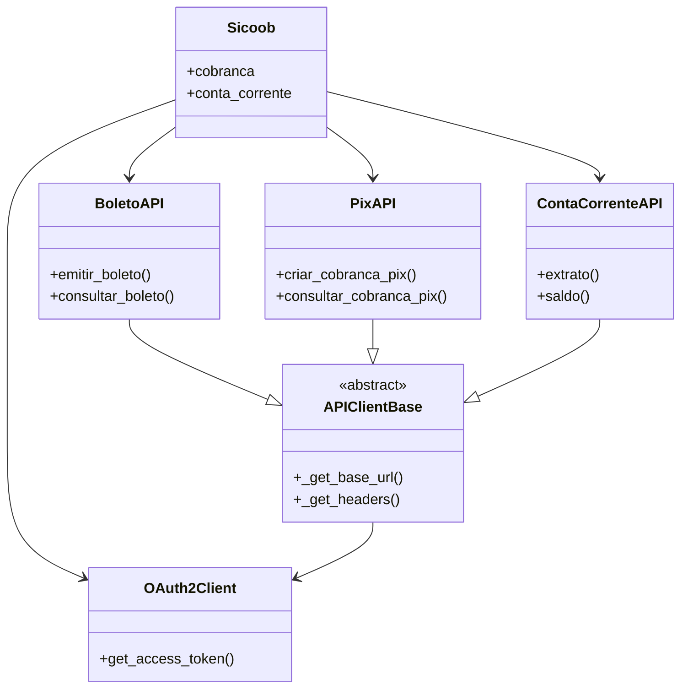

# Sicoob SDK Python

SDK Python para integração com a API do Banco Sicoob

## Instalação

```bash
pip install -r requirements.txt
# ou
pip install -e .
```

## Configuração

Crie um arquivo `.env` na raiz do projeto com as seguintes variáveis:

```ini
SICOOB_CLIENT_ID=seu_client_id
SICOOB_CERTIFICADO=caminho/para/certificado.pem
SICOOB_CHAVE_PRIVADA=caminho/para/chave_privada.key
```

## Uso Básico

```python
from sicoob import Sicoob

# Inicializa o cliente (usando certificado PEM)
# É obrigatório fornecer ou certificado+chave ou PFX+senha em ambiente de produção, mas opcional em ambiente de testes
cliente = Sicoob(
    client_id="seu_client_id",  # Obrigatório
    certificado="caminho/para/certificado.pem",  # Obrigatório se não usar PFX [E em produção]
    chave_privada="caminho/para/chave_privada.key",  # Obrigatório se não usar PFX [E em produção]
    sandbox_mode=False  # Opcional, default False
)

# Alternativa usando certificado PFX
cliente_pfx = Sicoob(
    client_id="seu_client_id",  # Obrigatório
    certificado_pfx="caminho/para/certificado.pfx",  # Obrigatório (pode ser path, bytes ou arquivo aberto) [E em produção]
    senha_pfx="senha_do_pfx",  # Obrigatório se usar PFX [E em produção]
    sandbox_mode=True  # Opcional para ambiente de testes
)

# Exemplo: consulta de extratos
extrato = cliente.conta_corrente.extrato(
    mes=1,  # Obrigatório (1-12)
    ano=2023,  # Obrigatório
    dia_inicial=1,  # Obrigatório (1-31)
    dia_final=31,  # Obrigatório (1-31)
    numero_conta_corrente="12345",  # Obrigatório
    agrupar_cnab=False  # Opcional
)
```

## API de Cobrança

### Boletos Bancários

A classe `BoletoAPI` oferece operações completas para gerenciamento de boletos:

```python
from sicoob import Sicoob
from sicoob.exceptions import BoletoError, BoletoNaoEncontradoError

# Inicializa o cliente
cliente = Sicoob(
    client_id="seu_client_id",
    certificado="caminho/para/certificado.pem",
    chave_privada="caminho/para/chave_privada.key"
)

# Operações com boletos
boleto_api = cliente.cobranca.boleto()

try:
    # Emissão
    boleto = boleto_api.emitir_boleto({
        "numeroCliente": 123456,
        "codigoModalidade": 1,
        "numeroContaCorrente": 12345,
        "codigoEspecieDocumento": "DM",
        "dataEmissao": "2024-01-01",
        "nossoNumero": 123456789,
        "seuNumero": "1235512",
        "identificacaoBoletoEmpresa": "4562",
        "identificacaoEmissaoBoleto": 1,
        "identificacaoDistribuicaoBoleto": 1,
        "valor": 156.23,
        "dataVencimento": "2024-12-31",
        "dataLimitePagamento": "2024-12-31",
        "valorAbatimento": 1.0,
        "tipoDesconto": 1,
        "dataPrimeiroDesconto": "2024-06-01",
        "valorPrimeiroDesconto": 1.0,
        "dataSegundoDesconto": "2024-06-15",
        "valorSegundoDesconto": 0.0,
        "dataTerceiroDesconto": "2024-06-30",
        "valorTerceiroDesconto": 0.0,
        "tipoMulta": 1,
        "dataMulta": "2025-01-01",
        "valorMulta": 5.0,
        "tipoJurosMora": 1,
        "dataJurosMora": "2025-01-01",
        "valorJurosMora": 4.0,
        "numeroParcela": 1,
        "aceite": True,
        "codigoNegativacao": 2,
        "numeroDiasNegativacao": 60,
        "codigoProtesto": 1,
        "numeroDiasProtesto": 30,
        "pagador": {
            "numeroCpfCnpj": "98765432185",
            "nome": "Marcelo dos Santos",
            "endereco": "Rua 87 Quadra 1 Lote 1 casa 1",
            "bairro": "Santa Rosa",
            "cidade": "Luziânia",
            "cep": "72320000",
            "uf": "DF",
            "email": "pagador@dominio.com.br"
        },
        "beneficiarioFinal": {
            "numeroCpfCnpj": "98784978699",
            "nome": "Lucas de Lima"
        },
        "mensagensInstrucao": [
            "Descrição da Instrução 1",
            "Descrição da Instrução 2",
            "Descrição da Instrução 3",
            "Descrição da Instrução 4",
            "Descrição da Instrução 5"
        ],
        "gerarPdf": False,
        "rateioCreditos": [
            {
                "numeroBanco": 756,
                "numeroAgencia": 4027,
                "numeroContaCorrente": "987654",
                "contaPrincipal": true,
                "codigoTipoValorRateio": 1,
                "valorRateio": 100,
                "codigoTipoCalculoRateio": 1,
                "numeroCpfCnpjTitular": "98765432185",
                "nomeTitular": "Marcelo dos Santos",
                "codigoFinalidadeTed": 10,
                "codigoTipoContaDestinoTed": "CC",
                "quantidadeDiasFloat": 1,
                "dataFloatCredito": "2020-12-30"
            }
        ],
        "codigoCadastrarPIX": 1,
        "numeroContratoCobranca": 1
    })

    # Consultas
    boleto_consultado = boleto_api.consultar_boleto(
        numero_cliente=123456,  # Obrigatório
        codigo_modalidade=1,  # Obrigatório
        nosso_numero="123456789"  # Obrigatório (ou linha_digitavel ou codigo_barras)
    )
    
    boletos_pagador = boleto_api.consultar_boletos_por_pagador(
        numero_cpf_cnpj="12345678901",  # Obrigatório
        numero_cliente=123456,  # Obrigatório
        client_id="seu_client_id"  # Obrigatório
    )
    
    faixas = boleto_api.consultar_faixas_nosso_numero(
        numero_cliente=123456,  # Obrigatório
        codigo_modalidade=1,  # Obrigatório
        quantidade=10,  # Obrigatório
        client_id="seu_client_id"  # Obrigatório
    )

    # Webhooks
    boleto_api.cadastrar_webhook(
        webhook={
            "url": "https://meusite.com/webhook",  # Obrigatório
            "codigoTipoMovimento": 7,  # Obrigatório (7-Pagamento)
            "codigoPeriodoMovimento": 1  # Obrigatório
        },
        client_id="seu_client_id"  # Obrigatório
    )
    
    webhook = boleto_api.consultar_webhook(
        id_webhook=1,  # Obrigatório
        codigo_tipo_movimento=7,  # Obrigatório
        client_id="seu_client_id"  # Obrigatório
    )

except BoletoNaoEncontradoError:
    print("Boleto não encontrado")
except BoletoError as e:
    print(f"Erro na API de boletos: {e}")
```

### PIX

A classe `PixAPI` implementa todas as operações PIX disponíveis:

```python
from sicoob.exceptions import (
    CobrancaPixError, CobrancaPixNaoEncontradaError,
    CobrancaPixVencimentoError, WebhookPixError,
    LoteCobrancaPixError, QrCodePixError
)

# Operações PIX
pix_api = cliente.cobranca.pix()

try:
    # Cobranças imediatas
    cobranca = pix_api.criar_cobranca_pix(
        txid="tx123",  # Obrigatório (máx 35 caracteres)
        dados_cobranca={  # Obrigatório
            "valor": {"original": "100.50"},  # Obrigatório
            "chave": "123e4567-e89b-12d3-a456-426614174000",  # Obrigatório
            "solicitacaoPagador": "Pagamento do pedido 123"  # Opcional
        }
    )

    # Cobranças com vencimento
    cobranca_venc = pix_api.criar_cobranca_pix_com_vencimento(
        txid="tx456",  # Obrigatório
        dados_cobranca={  # Obrigatório
            "valor": {"original": "200.00"},  # Obrigatório
            "calendario": {"dataDeVencimento": "2025-12-31"},  # Obrigatório
            "chave": "123e4567-e89b-12d3-a456-426614174000"  # Obrigatório
        }
    )

    # Consulta cobrança
    cobranca_consultada = pix_api.consultar_cobranca_pix(txid="tx123")
    
    # Cancelamento
    pix_api.cancelar_cobranca_pix(txid="tx123")
    
    # QR Code
    qrcode = pix_api.obter_qrcode_pix(txid="tx123")

    # Webhooks PIX
    pix_api.configurar_webhook_pix(
        chave="123e4567-e89b-12d3-a456-426614174000",  # Obrigatório
        webhook_url="https://meusite.com/pix-webhook"  # Obrigatório
    )
    
    # Consulta webhook
    webhook = pix_api.consultar_webhook_pix(
        chave="123e4567-e89b-12d3-a456-426614174000"
    )
    
    # Exclusão webhook
    pix_api.excluir_webhook_pix(
        chave="123e4567-e89b-12d3-a456-426614174000"
    )

    # Lotes de cobrança
    lote = pix_api.criar_lote_cobranca_pix_com_vencimento(
        id_lote="lote001",
        cobrancas=[{
            "txid": "tx789",
            "valor": {"original": "300.00"},
            "calendario": {"dataDeVencimento": "2025-12-31"},
            "chave": "123e4567-e89b-12d3-a456-426614174000"
        }]
    )
    
    lote_consultado = pix_api.consultar_lote_cobranca_pix_com_vencimento("lote001")

except CobrancaPixNaoEncontradaError:
    print("Cobrança PIX não encontrada")
except CobrancaPixVencimentoError:
    print("Erro em cobrança PIX com vencimento")
except WebhookPixError:
    print("Erro em operação de webhook PIX")
except LoteCobrancaPixError:
    print("Erro em operação com lote de cobranças PIX")
except QrCodePixError:
    print("Erro em operação com QR Code PIX")
except CobrancaPixError as e:
    print(f"Erro na API PIX: {e}")
```

### Tratamento de Erros

O SDK possui exceções específicas para cada tipo de operação:

```python
from sicoob.exceptions import (
    BoletoError, BoletoNaoEncontradoError,
    PixError, CobrancaPixNaoEncontradaError,
    CobrancaPixVencimentoError, WebhookPixError,
    LoteCobrancaPixError, QrCodePixError,
    ContaCorrenteError, TransferenciaError
)

try:
    boleto = boleto_api.consultar_boleto("123456")
except BoletoNaoEncontradoError:
    print("Boleto não encontrado")
except BoletoError as e:
    print(f"Erro na API de boletos: {e}")

try:
    pix_api.criar_cobranca_pix("tx123", dados)
except CobrancaPixError as e:
    print(f"Erro na API PIX: {e}")
```

## Serviços de Conta Corrente

A classe `ContaCorrenteAPI` oferece operações bancárias:

```python
conta_api = cliente.conta_corrente()

# Consultas
extrato = conta_api.extrato(
    mes=6, 
    ano=2025,
    dia_inicial=1,
    dia_final=30,
    numero_conta_corrente="123456"
)

saldo = conta_api.saldo("123456")

# Transferências
transferencia = conta_api.transferencia(
    valor=1000.00,  # Obrigatório
    conta_destino="654321",  # Obrigatório
    tipo_transferencia="TED",  # Opcional (TED/DOC/PIX)
    descricao="Transferência entre contas",  # Opcional
    numero_conta="123456"  # Opcional se já configurado no cliente
)
```

## Versionamento e Deploy

O projeto segue [Semantic Versioning](https://semver.org/). Para criar um novo release:

1. Atualize a versão em:
   - `setup.py`
   - `pyproject.toml`
   - `sicoob/__init__.py`

2. Execute os testes:
```bash
make test
```

3. Crie um novo release no GitHub:
   - Acesse "Releases" no repositório
   - Clique em "Draft a new release"
   - Defina a tag no formato `vX.Y.Z` (ex: `v0.1.3`)
   - O GitHub Actions irá automaticamente:
     - Construir o pacote (`make build`)
     - Publicar no PyPI (`make publish`)

### Comandos Úteis
```bash
# Construir pacote
make build

# Executar testes
make test

# Publicar no PyPI (requer TWINE_USERNAME e TWINE_PASSWORD)
make publish

# Incrementar versão (patch, minor ou major)
make bump-patch   # Incrementa patch version (0.1.2 → 0.1.3)
make bump-minor   # Incrementa minor version (0.1.2 → 0.2.0)
make bump-major   # Incrementa major version (0.1.2 → 1.0.0)
```

### Como Incrementar a Versão
1. Execute o comando apropriado:
```bash
make bump-patch   # Para correções de bugs
make bump-minor   # Para novas funcionalidades compatíveis
make bump-major   # Para mudanças incompatíveis
```

2. Execute os testes para garantir a qualidade:
```bash
make test
```

3. Verifique as alterações nos arquivos:
```bash
git diff
```

4. Commit e push das alterações:
```bash
git add .
git commit -m "Bump version to X.Y.Z"
git push
```

5. Crie um novo release no GitHub para disparar a publicação automática no PyPI

## Links Úteis

- [Documentação API Sicoob](https://developers.sicoob.com.br)
- [Portal de Desenvolvedores](https://developers.sicoob.com.br/portal)

## Documentação Técnica

### Visão Geral
Biblioteca Python para integração com a API do Banco Sicoob, incluindo:
- Autenticação OAuth2
- Cobrança (Boletos e PIX)
- Conta Corrente
- Operações bancárias

### Índice
1. [Classe Principal](#classe-sicoob)
2. [Autenticação](#autenticação-oauth2)
3. [Serviços](#serviços)
   - [Cobrança](#api-de-cobrança)
     - [Boletos](#boletos-bancários)
     - [PIX](#pix)
   - [Conta Corrente](#serviços-de-conta-corrente)
4. [Classe Base](#classe-base)
5. [Tratamento de Erros](#tratamento-de-erros)
6. [Diagrama de Relacionamentos](#diagrama-de-relacionamentos)
7. [Exemplos de Uso](#exemplos-de-uso)

---

### Classe Sicoob
Cliente principal que fornece acesso a todos os serviços.

**Arquivo:** `sicoob/client.py`

#### Métodos:
- `__init__(client_id=None, certificado=None, chave_privada=None, certificado_pfx=None, senha_pfx=None, sandbox_mode=False)`
  - Inicializa o cliente com credenciais
  - Parâmetros:
    - `client_id`: Client ID fornecido pelo Sicoob
    - `certificado`: Caminho para o certificado .pem
    - `chave_privada`: Caminho para a chave privada .key
    - `certificado_pfx`: Caminho (str), bytes ou arquivo aberto (BinaryIO) do certificado PFX (opcional)
    - `sandbox_mode`: Se True, usa ambiente sandbox (default: False)

#### Propriedades:
- `cobranca`: Acesso às APIs de Cobrança (Boleto e PIX)
- `conta_corrente`: Acesso à API de Conta Corrente

---

### Autenticação OAuth2
**Arquivo:** `sicoob/auth/oauth.py`

#### Classe: OAuth2Client
Gerencia tokens de acesso com escopos específicos.

#### Métodos:
- `get_access_token(scope=None)`: Obtém token para o escopo especificado
- `_is_token_expired(scope)`: Verifica se token expirou (método interno)

#### Escopos Comuns:
- **Boletos**: `"boletos_inclusao boletos_consulta..."`
- **Conta Corrente**: `"cco_consulta cco_transferencias..."`
- **PIX**: `"cob.write cob.read..."`

---

### Serviços

#### API de Boletos
**Arquivo:** `sicoob/boleto.py`

#### Classe: BoletoAPI
Operações com boletos bancários.

#### Métodos:
- `emitir_boleto(dados_boleto)`: Emite novo boleto
- `emitir_segunda_via()`: Emite segunda via de um boleto existente
- `consultar_boleto(nosso_numero)`: Consulta boleto existente
- `consultar_boletos_por_pagador()`: Consulta lista de boletos por pagador
- `consultar_faixas_nosso_numero()`: Consulta faixas de nosso número disponíveis
- `alterar_boleto()`: Altera dados de um boleto existente
- `alterar_pagador()`: Altera informações do cadastro do pagador
- `baixar_boleto()`: Comanda a baixa de um boleto existente
- `cadastrar_webhook()`: Cadastra um webhook para receber notificações
- `consultar_webhook()`: Consulta os detalhes de um webhook cadastrado
- `atualizar_webhook()`: Atualiza um webhook cadastrado
- `excluir_webhook()`: Remove permanentemente um webhook cadastrado
- `consultar_solicitacoes_webhook()`: Consulta as solicitações de notificação

#### API de PIX
**Arquivo:** `sicoob/pix.py`

#### Classe: PixAPI
Operações com PIX.

#### Métodos Principais:
- `criar_cobranca_pix(txid, dados)`: Cria cobrança imediata
- `consultar_cobranca_pix(txid)`: Consulta cobrança
- `configurar_webhook(chave, url)`: Configura webhook

#### API de Conta Corrente
**Arquivo:** `sicoob/conta_corrente.py`

#### Classe: ContaCorrenteAPI
Operações bancárias.

#### Métodos:
- `extrato()`: Obtém extrato por período
- `saldo()`: Consulta saldo
- `transferencia()`: Realiza transferência

---

### Classe Base
**Arquivo:** `sicoob/api_client.py`

#### Classe: APIClientBase
Fornece funcionalidades comuns a todas as APIs.

#### Métodos:
- `_get_base_url()`: Retorna URL conforme sandbox/produção
- `_get_headers(scope)`: Retorna headers com autenticação

---

### Diagrama de Relacionamentos



---

### Exemplos de Uso

```python
from sicoob import Sicoob
from sicoob.auth import OAuth2Client
import requests

# Configuração
oauth = OAuth2Client(client_id, certificado, chave)
session = requests.Session()
sicoob = Sicoob(oauth_client=oauth, session=session)

# Uso dos serviços
extrato = sicoob.conta_corrente.extrato(
    mes=6, ano=2025, dia_inicial=1, dia_final=30, 
    numero_conta_corrente=123456
)

boleto = sicoob.cobranca.boleto.emitir_boleto({
    "numeroCliente": 123456,
    "codigoModalidade": 1,
    "numeroContaCorrente": 12345,
    "codigoEspecieDocumento": "DM",
    "dataEmissao": "2024-01-01",
    "dataVencimento": "2024-12-31",
    "valor": 100.50,
    "seuNumero": "123456789",
    "identificacaoEmissaoBoleto": 1,
    "identificacaoDistribuicaoBoleto": 1,
    "tipoDesconto": 0,
    "tipoMulta": 0,
    "tipoJurosMora": 3,
    "numeroParcela": 1,
    "pagador": {
        "numeroCpfCnpj": "11122233300",
        "nome": "João Silva",
        "endereco": "Rua Teste, 123",
        "bairro": "Centro",
        "cidade": "São Paulo",
        "cep": "01001000",
        "uf": "SP"
    }
})

pix = sicoob.cobranca.pix.criar_cobranca_pix(
    "tx123", 
    {"valor": {"original": "100.50"}}
)
