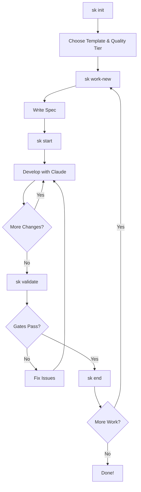

# Solokit

[](https://pypi.org/project/solokit/)
[](https://github.com/ankushdixit/solokit/actions?query=workflow%3ATests)
[](https://www.python.org/downloads/)
[](LICENSE)
[](https://github.com/ankushdixit/solokit)

**Build production software alone with team-level sophistication.**

> Structured Solo Development with AI and Quality Automation for Claude Code

## What is Solokit?

**Solokit is a complete development framework for solo developers building production software with AI assistants like Claude Code.** It combines production-ready project templates, automated quality gates, intelligent session management, and AI-powered knowledge capture into a cohesive workflow that enables you to build alone with the sophistication of a 10-person engineering team.

### The Core Problem

Solo developers using AI assistants face critical challenges:
- **Setup Time Waste** - Spending hours configuring frameworks, linters, tests, CI/CD
- **Context Loss** - AI forgets previous work between sessions
- **Quality Entropy** - Standards slip without enforcement
- **Knowledge Fragmentation** - Learnings and decisions get lost
- **Lack of Process** - No systematic workflow for complex projects

### The Solokit Solution

**🚀 Production-Ready in <1 Minute**
- 4 validated project templates (T3 Stack, FastAPI, Refine, Next.js)
- 4 quality tiers (Essential → Production-Ready)
- All dependencies version-pinned and compatibility-tested
- CI/CD, Docker, pre-commit hooks included

**✨ Perfect Context Continuity**
- Comprehensive AI briefings restore full project state
- Spec-first architecture with complete implementation details
- Previous work context for multi-session features
- Dependency-aware workflow recommendations

**🛡️ Zero-Compromise Quality**
- Automated gates: tests, linting, formatting, security
- Coverage thresholds, mutation testing, E2E tests
- Performance monitoring, error tracking (tier 4)
- Spec validation before and after sessions

**🧠 Knowledge That Grows**
- AI-powered learning categorization (6 categories)
- Automatic extraction from commits and code comments
- Smart deduplication and similarity detection
- Searchable, filterable knowledge base

## Quick Start

### 1. Install Solokit

```bash
pip install solokit
```

### 2. Initialize Your Project

```bash
sk init
```

Choose from **4 production-ready stacks**:
- **SaaS T3 Stack** - Next.js + tRPC + Prisma (full-stack SaaS)
- **ML/AI FastAPI** - FastAPI + Python ML libraries (model serving, data pipelines)
- **Dashboard Refine** - Refine + shadcn/ui (admin panels, internal tools)
- **Full-Stack Next.js** - Next.js + Prisma (general purpose web apps)

Select your **quality tier**:
- **Essential** (60-80% coverage) - Prototypes, MVPs
- **Standard** (80% coverage + security) - Production apps
- **Comprehensive** (90% coverage + E2E + mutation) - Mission-critical
- **Production-Ready** (+ monitoring + observability) - Enterprise-grade

Options: CI/CD workflows, Docker support, pre-commit hooks, environment templates

### 3. Start Building

```bash
# Create your first work item
sk work-new

# Start a development session
sk start

# Claude receives a comprehensive briefing with:
# - Complete work item specification
# - Project documentation and context
# - Technology stack and file structure
# - Related learnings from past sessions
# - Dependency information

# Work with Claude...

# End session with automated quality gates
sk end
```

**That's it!** You now have:
- ✅ Production-ready project setup
- ✅ Automated quality enforcement
- ✅ Perfect AI context continuity
- ✅ Growing knowledge base

## Key Features

### 🎯 Production-Ready Templates

Initialize projects with battle-tested configurations:

**SaaS T3 Stack** (`saas_t3`)
- Next.js 16.0.1, React 19.2.0, tRPC 11.7.1, Prisma 6.19.0
- End-to-end type safety from database to UI
- Perfect for: SaaS products, B2B apps, complex data models

**ML/AI FastAPI** (`ml_ai_fastapi`)
- FastAPI 0.115.6, Python 3.11+, SQLModel, Pydantic 2.12.4
- Async request handling, automatic OpenAPI docs
- Perfect for: ML model serving, data pipelines, Python microservices

**Dashboard Refine** (`dashboard_refine`)
- Refine 5.0.5, Next.js 16.0.1, shadcn/ui
- Out-of-the-box CRUD operations and admin UI
- Perfect for: Admin panels, internal dashboards, data management

**Full-Stack Next.js** (`fullstack_nextjs`)
- Next.js 16.0.1, React 19.2.0, Prisma 6.19.0
- General purpose with REST APIs
- Perfect for: Marketing sites, content platforms, e-commerce

**All templates include:**
- Exact version pinning (all tested for compatibility)
- Framework-specific ESLint/Prettier configurations
- Testing setup with framework utilities
- TypeScript/Python type checking
- Security scanning configured
- Docker Compose for local development
- CI/CD workflows (GitHub Actions)
- Environment variable templates

### 🛡️ Quality Gates

Automated validation prevents technical debt:

**Available Checkers:**
- **Tests** - Unit, integration, E2E with coverage thresholds
- **Linting** - Code quality (ESLint/Ruff) with auto-fix
- **Formatting** - Code style (Prettier/Ruff) with auto-format
- **Security** - Vulnerability scanning (bandit, safety, npm audit)
- **Type Checking** - Static analysis (TypeScript/mypy)
- **Documentation** - CHANGELOG, README, docstring validation
- **Spec Completeness** - Work item specification validation
- **Performance** - Benchmarks and regression detection

**Quality Tiers:**

| Tier | Use Case | What's Included |
|------|----------|-----------------|
| **Essential** | Prototypes, MVPs | Linting, formatting, type-check, basic tests (60-80% coverage) |
| **Standard** | Production apps | Essential + Pre-commit hooks, security scanning, dependency auditing |
| **Comprehensive** | Mission-critical | Standard + Mutation testing (75%+), E2E tests, integration tests |
| **Production-Ready** | Enterprise | Comprehensive + Sentry, OpenTelemetry, performance monitoring, health checks |

Configure in `.session/config.json`:
```json
{
  "quality_gates": {
    "tests": {"enabled": true, "required": true, "coverage_threshold": 80},
    "linting": {"enabled": true, "required": false, "auto_fix": true},
    "security": {"enabled": true, "required": true, "fail_on": "high"}
  }
}
```

### 📋 Session Management

**Perfect context continuity** across all AI interactions:

```bash
sk start feature_xyz
```

Claude receives:
1. **Complete Work Item Spec** - Full implementation details from `.session/specs/feature_xyz.md`
2. **Project Documentation** - Vision, architecture, PRD
3. **Technology Stack** - Auto-detected frameworks and versions
4. **Project Structure** - Current file tree
5. **Git Context** - Branch status, recent commits
6. **Related Learnings** - Past insights relevant to this work
7. **Dependency Context** - What this depends on and what depends on it
8. **Milestone Progress** - Where this fits in the roadmap
9. **Previous Work Context** - For in-progress items: commits made, files changed, quality results

**Session completion** enforces quality:

```bash
sk end
```

Automatically:
- ✅ Runs all enabled quality gates
- ✅ Updates stack/tree tracking
- ✅ Extracts learnings from work
- ✅ Commits with standardized message
- ✅ Pushes to remote
- ✅ Updates work item status
- ✅ Generates session summary

### 🎯 Work Item Management

**Dependency-driven, spec-first workflow:**

```bash
# Create work items interactively
sk work-new

# List with filters
sk work-list
sk work-list --status not_started
sk work-list --milestone "v1.0"

# Get smart recommendations
sk work-next  # Returns ready items (dependencies completed)

# Visualize dependencies
sk work-graph --critical-path    # Show longest dependency chain
sk work-graph --bottlenecks      # Identify blockers
sk work-graph --format svg       # Export visual graph

# Update work items
sk work-update feature_xyz --status in_progress
sk work-update feature_xyz --priority high
```

**Spec-First Architecture:**

Work item specifications are the single source of truth:

```
.session/
├── specs/
│   ├── feature_xyz.md         # Complete implementation guide
│   └── deployment_abc.md
└── tracking/
    └── work_items.json         # Metadata only (status, deps)
```

**6 work item types** with structured templates:
- **Feature** - New functionality
- **Bug** - Issue fixes with root cause analysis
- **Refactor** - Code improvements
- **Security** - Security enhancements
- **Integration Test** - Test suites
- **Deployment** - Deployment procedures

Each template includes:
- Required sections enforced via validation
- Implementation details, acceptance criteria
- Testing strategy, validation rules
- Type-specific guidelines

### 🧠 Learning System

**AI-powered knowledge capture and curation:**

```bash
# Capture learnings during development
sk learn

# Browse all learnings
sk learn-show
sk learn-show --category gotchas --tag fastapi

# Search by keyword
sk learn-search "CORS"

# Auto-curate (categorize, deduplicate, merge)
sk learn-curate
```

**6 Learning Categories** (auto-categorized):
- **Architecture** - Design decisions, patterns
- **Gotchas** - Edge cases, pitfalls
- **Best Practices** - Effective approaches
- **Technical Debt** - Areas needing improvement
- **Performance** - Optimization insights
- **Security** - Security discoveries

**3 Extraction Sources:**
1. Session summaries ("Learnings Captured" section)
2. Git commits (`LEARNING:` annotations)
3. Code comments (`# LEARNING:` in changed files)

**Smart Deduplication:**
- Jaccard + containment similarity detection
- Automatic merging of similar learnings
- Configurable similarity threshold (default: 0.7)

## Commands Reference

### Session Commands

```bash
sk init               # Initialize project with template selection
sk start [item_id]    # Start session with comprehensive briefing
sk end                # Complete session with quality gates
sk status             # Quick session overview
sk validate           # Pre-flight check (run gates without ending)
```

### Work Item Commands

```bash
sk work-new           # Create work item interactively
sk work-list          # List all work items
sk work-show <id>     # Show work item details
sk work-update <id>   # Update work item fields
sk work-next          # Get next recommended work item
sk work-graph         # Visualize dependency graph
sk work-delete <id>   # Delete work item (with safety checks)
```

### Learning Commands

```bash
sk learn              # Capture learning interactively
sk learn-show         # Browse all learnings
sk learn-search <q>   # Search learnings by keyword
sk learn-curate       # Run curation (categorize, deduplicate)
```

### Claude Code Slash Commands

For use within Claude Code conversations:

```bash
/sk:init              # Initialize project
/sk:start [item_id]   # Start session
/sk:end               # Complete session
/sk:status            # Session status
/sk:validate          # Validate readiness

/sk:work-new          # Create work item
/sk:work-list         # List work items
/sk:work-show <id>    # Show work item
/sk:work-update <id>  # Update work item
/sk:work-next         # Get recommendation
/sk:work-graph        # Visualize dependencies
/sk:work-delete <id>  # Delete work item

/sk:learn             # Capture learning
/sk:learn-show        # Browse learnings
/sk:learn-search <q>  # Search learnings
/sk:learn-curate      # Run curation
```

## Typical Workflow



## Installation

### Option 1: PyPI (Recommended)

```bash
pip install solokit
```

### Option 2: From Source

```bash
git clone https://github.com/ankushdixit/solokit.git
cd solokit
pip install -e .
```

### Verify Installation

```bash
sk status
```

### Prerequisites

- **Claude Code** - Required for slash command integration
- **Python 3.9+** - Core framework
- **Git** - Version control integration

**Optional Tools** (for quality gates):
- Testing: `pytest` (Python), `jest` (JS/TS)
- Linting: `ruff` (Python), `eslint` (JS/TS)
- Formatting: `prettier` (JS/TS)
- Security: `bandit`, `safety` (Python), `npm audit` (JS)
- Visualization: `graphviz` (dependency graphs)

Quality gates gracefully skip when tools aren't available.

## Configuration

Configure Solokit via `.session/config.json` (created during `sk init`):

```json
{
  "quality_gates": {
    "tests": {
      "enabled": true,
      "required": true,
      "coverage_threshold": 80
    },
    "linting": {
      "enabled": true,
      "required": false,
      "auto_fix": true
    },
    "formatting": {
      "enabled": true,
      "required": false,
      "auto_fix": true
    },
    "security": {
      "enabled": true,
      "required": true,
      "fail_on": "high"
    },
    "documentation": {
      "enabled": true,
      "required": false
    }
  },
  "learning_curation": {
    "auto_curate": true,
    "frequency": 5
  },
  "git": {
    "auto_push": true,
    "auto_merge": false
  }
}
```

**Quality Gate Options:**
- `enabled` - Run this gate
- `required` - Block `sk end` if fails
- `auto_fix` - Automatically fix issues (linting/formatting)
- `coverage_threshold` - Minimum test coverage percentage
- `fail_on` - Security threshold (critical, high, medium, low)

**Learning Curation:**
- `auto_curate` - Automatically run curation
- `frequency` - Run every N sessions

**Git Integration:**
- `auto_push` - Automatically push after `sk end`
- `auto_merge` - Automatically merge branch if work complete

## Documentation

- **[Documentation Index](docs/README.md)** - Complete documentation navigation
- **[Architecture Overview](docs/ARCHITECTURE.md)** - System architecture
- **[Solokit Methodology](docs/architecture/solokit-methodology.md)** - Complete framework specification
- **[AI-Augmented Solo Framework](docs/architecture/ai-augmented-solo-framework.md)** - Philosophical context
- **[Learning System Guide](docs/reference/learning-system.md)** - Knowledge capture details
- **[Configuration Guide](docs/guides/configuration.md)** - Configuration options
- **[Writing Specs](docs/guides/writing-specs.md)** - Spec-first best practices
- **[Troubleshooting](docs/guides/troubleshooting.md)** - Common issues

## Project Structure

```
solokit/
├── .claude/                  # Claude Code integration
│   └── commands/             # 16 slash commands (/sk:init, /sk:start, etc.)
├── src/solokit/              # Python package (standard src/ layout)
│   ├── cli.py                # CLI entry point (sk command)
│   ├── core/                 # Core functionality
│   ├── session/              # Session management
│   ├── work_items/           # Work item CRUD and specs
│   ├── learning/             # Learning capture & curation
│   ├── quality/              # Quality gates
│   ├── visualization/        # Dependency graphs
│   ├── git/                  # Git integration
│   ├── testing/              # Testing utilities
│   ├── deployment/           # Deployment execution
│   ├── project/              # Project initialization
│   └── templates/            # Project templates & work item specs
├── docs/                     # Comprehensive documentation
├── tests/                    # 2,391 tests (100% passing)
│   ├── unit/                 # Unit tests
│   ├── integration/          # Integration tests
│   └── e2e/                  # End-to-end tests
├── README.md                 # This file
├── CHANGELOG.md              # Version history
├── CONTRIBUTING.md           # Contribution guidelines
└── pyproject.toml            # Package configuration (PEP 517/518)
```

## Why Solokit?

### vs. Project Management Tools (Linear, Jira)
- ✅ **AI-native design** - Built for Claude Code, not bolted on
- ✅ **Context continuity** - Perfect AI briefings, not manual updates
- ✅ **Quality enforcement** - Automated gates, not manual reviews
- ✅ **Knowledge capture** - AI-powered, not manual documentation

### vs. AI Coding Tools (Cursor, Copilot)
- ✅ **Complete framework** - Templates + workflow + quality + learning
- ✅ **Production-ready** - Not just code completion
- ✅ **Process rigor** - Systematic workflow, not ad-hoc
- ✅ **Knowledge accumulation** - Learnings persist and grow

### vs. Project Templates (Cookiecutter)
- ✅ **Ongoing workflow** - Not just initial setup
- ✅ **Quality enforcement** - Automated validation throughout
- ✅ **Session management** - Perfect context across all work
- ✅ **4 quality tiers** - From MVP to enterprise

**Solokit is the only tool that combines:**
- Production-ready templates with validated dependencies
- AI-native session management with perfect context
- Automated quality enforcement throughout development
- AI-powered knowledge capture and curation
- Dependency-driven, spec-first workflow

## Development Status

**Current Version:** v0.1.0 (Production-Ready)

**Test Coverage:** 2,391 tests passing (100%)

### Completed Features

| Feature | Status |
|---------|--------|
| Core Session Management | ✅ Complete |
| Work Item System | ✅ Complete |
| Dependency Visualization | ✅ Complete |
| Learning Management | ✅ Complete |
| Quality Gates | ✅ Complete |
| Spec-First Architecture | ✅ Complete |
| Production Templates (4 stacks) | ✅ Complete |
| Quality Tiers (4 levels) | ✅ Complete |
| Claude Code Integration | ✅ Complete |

See [CHANGELOG.md](./CHANGELOG.md) for detailed release history.

## Contributing

Contributions welcome! See [CONTRIBUTING.md](./CONTRIBUTING.md) for guidelines.

```bash
# Clone and install
git clone https://github.com/ankushdixit/solokit.git
cd solokit
pip install -e ".[dev]"

# Run tests
pytest tests/ -v

# Run quality checks
ruff check src/solokit/ tests/
ruff format src/solokit/ tests/
mypy src/solokit
```

## License

MIT License - See [LICENSE](./LICENSE) for details.

## Credits

Built for solo developers building production software with AI assistance.

Inspired by professional software development practices adapted for AI-augmented solo development.

---

**Solo doesn't mean shortcuts. Build with team-level sophistication.**

🌐 [getsolokit.com](https://getsolokit.com) | 📦 [PyPI](https://pypi.org/project/solokit/) | 🐙 [GitHub](https://github.com/ankushdixit/solokit)
