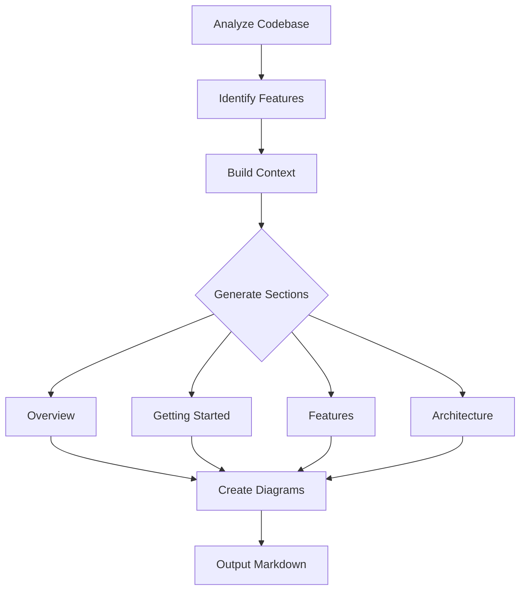
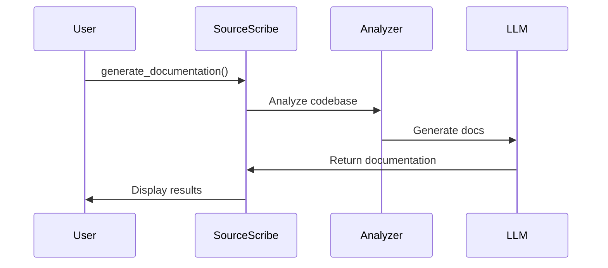
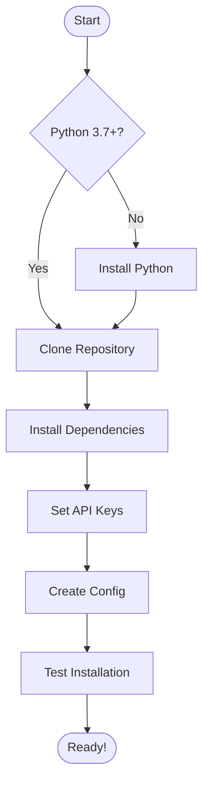

# SourceScribe

[](https://www.python.org/downloads/)
[](https://opensource.org/licenses/MIT)
[](./website/docs/)

> An intelligent auto-documentation engine that generates **feature-based, process-oriented documentation** with extensive visual diagrams.

Powered by LLMs (Claude, OpenAI, Ollama) and designed for developers who want documentation that explains **how to USE** the system, not just browse source files.

**🎯 Different from other doc tools:** SourceScribe organizes docs by **features & workflows** with **10+ diagrams**, not by individual source files.

---

## 📑 Table of Contents

- [Key Features](#-key-features)
- [Installation](#installation)
- [Quick Start](#quick-start)
- [Configuration](#configuration)
- [Usage Examples](#-usage-examples)
- [Documentation Philosophy](#-documentation-philosophy)
- [Architecture](#️-architecture)
- [How It Works](#-how-it-works)
- [Example Output](#-example-output)
- [Docusaurus Integration](#-integration-with-docusaurus)
- [Development](#development)
- [Why SourceScribe?](#-why-sourcescribe)
- [Roadmap](#️-roadmap)

---

## ✨ Key Features

- 🎯 **Feature-Based Documentation**: Organizes by capabilities and workflows, not file structure
- 📊 **Diagram-Rich**: Generates 10+ Mermaid diagrams (sequence, flowchart, architecture, class)
- 🔄 **Process-Oriented**: Explains "How it Works" with visual workflows
- 🚀 **User-Centric**: Written for developers who want to USE the system
- 🔗 **GitHub Permalinks**: Automatically links to actual code with line-level precision
- ✨ **Auto-Sidebar Generation**: Automatically generates Docusaurus `sidebars.ts` - no manual config!
- 🤖 **Multi-LLM Support**: Claude (Anthropic), OpenAI (GPT-4), and Ollama
- 👁️ **Real-time Watching**: Monitors code changes and auto-regenerates docs
- 🌐 **Multi-language**: Supports Python, TypeScript, Java, Go, Rust, and more
- ⚙️ **Configurable**: Flexible YAML-based configuration with Pydantic models
- 🔄 **Cross-platform**: Works on macOS, Linux, and Windows
- 🚢 **GitHub Actions Ready**: Works seamlessly in any project's CI/CD pipeline

## Installation

```bash
# Clone the repository
git clone https://github.com/source-scribe/sourcescribe-core.git
cd sourcescribe-core

# Install dependencies
pip install -r requirements.txt

# Or install in development mode
pip install -e .
```

## Quick Start

### 1. Configure API Keys

Set up your LLM API keys as environment variables:

```bash
export ANTHROPIC_API_KEY="your-anthropic-key"
export OPENAI_API_KEY="your-openai-key"
# Ollama runs locally, no key needed
```

### 2. Initialize a Project

```bash
sourcescribe init /path/to/your/project
```

This creates a `.sourcescribe.yaml` configuration file.

### 3. Generate Documentation

```bash
# Generate feature-based documentation
sourcescribe generate .

# Specify output directory
sourcescribe generate . --output ./docs/api-reference

# Use specific LLM provider
sourcescribe generate . --provider anthropic --model claude-3-haiku-20240307

# Watch mode (auto-regenerate on changes)
sourcescribe watch .
```

### 4. View Your Documentation

SourceScribe generates a feature-based documentation structure:

```
docs/
├── README.md                    # Navigation hub
├── overview/
│   ├── index.md                 # Project overview
│   ├── architecture.md          # System design + diagrams
│   └── technology-stack.md      # Tech stack
├── getting-started/
│   ├── installation.md          # Setup guide + flowchart
│   ├── quick-start.md           # Tutorial + sequence diagram
│   └── configuration.md         # Config options
├── features/
│   └── index.md                 # Feature documentation + diagrams
└── architecture/
    └── components.md            # Deep dive + multiple diagrams
```

## Configuration

Example `.sourcescribe.yaml`:

```yaml
# LLM Provider Configuration
llm:
  provider: "anthropic"  # anthropic, openai, or ollama
  model: "claude-3-5-sonnet-20241022"
  temperature: 0.3
  max_tokens: 4000

# Repository Settings
repository:
  path: "."
  exclude_patterns:
    - "*.pyc"
    - "__pycache__"
    - "node_modules"
    - ".git"
  include_patterns:
    - "*.py"
    - "*.js"
    - "*.ts"
    - "*.java"
    - "*.go"

# Documentation Output
output:
  path: "./docs/generated"
  format: "markdown"
  include_diagrams: true
  diagram_format: "mermaid"

# Watch Mode Settings
watch:
  enabled: true
  debounce_seconds: 2.0
  batch_changes: true

# Documentation Style
style:
  include_examples: true
  include_architecture: true
  include_api_docs: true
  verbosity: "detailed"  # minimal, normal, detailed
```

## 📖 Usage Examples

### Generate Documentation with Anthropic Claude

```bash
# Using Claude 3 Haiku (fast and economical)
export ANTHROPIC_API_KEY="your-key-here"
sourcescribe generate . --provider anthropic --model claude-3-haiku-20240307
```

### Generate for Docusaurus Site

```bash
# Output directly to Docusaurus docs folder
sourcescribe generate . --output ./website/docs/api-reference
```

### Watch Mode with Custom Config

```bash
sourcescribe watch --config .sourcescribe.yaml
```

### Use Local Ollama (No API Key Required)

```bash
# Install Ollama from https://ollama.ai
ollama serve
ollama pull llama2

sourcescribe generate . --provider ollama --model llama2
```

## 📚 Documentation Philosophy

### Feature-Based, Not File-Based

SourceScribe generates documentation organized by **features and workflows**, not individual source files.

**Before (File-Based):**
```
❌ docs/files/sourcescribe_cli.md
❌ docs/files/sourcescribe_engine_generator.md
❌ docs/files/sourcescribe_api_anthropic_provider.md
... (100+ files)
```

**After (Feature-Based):**
```
✅ Overview → Architecture Overview → Technology Stack
✅ Getting Started → Installation → Quick Start → Configuration
✅ Features → Documentation Generation → LLM Integration
✅ Architecture → Component Architecture (deep dive)
```

### Diagram-First Approach

Every major section includes visual diagrams:
- **Sequence Diagrams**: Show workflows and interactions
- **Flowcharts**: Explain decision trees and processes
- **Architecture Diagrams**: Visualize system structure
- **Class Diagrams**: Document data models

## 🏗️ Architecture

SourceScribe consists of several key components:

- **Engine**: Core documentation generation with feature-based orchestration
- **Feature Generator**: Creates process-oriented docs with extensive diagrams
- **Watch**: File system monitoring and change detection
- **API**: LLM provider integrations (Anthropic, OpenAI, Ollama)
- **Config**: Pydantic-based configuration management
- **Diagram Generator**: Creates Mermaid.js visualizations
- **Utils**: Code analysis, parsing, and file handling

## 🔄 How It Works



1. **Code Analysis**: Analyzes source files to extract structure, dependencies, and patterns
2. **Feature Identification**: Groups functionality by features/capabilities
3. **Context Building**: Builds rich context for each documentation section
4. **LLM Processing**: Generates process-oriented documentation with diagram prompts
5. **Diagram Generation**: Creates 10+ Mermaid.js diagrams throughout docs
6. **Section Organization**: Structures docs by user journey (Overview → Install → Features)
7. **Output**: Writes feature-based markdown with embedded diagrams

## 📸 Example Output

### Generated Documentation Structure

When you run `sourcescribe generate`, you get a complete documentation site:

```
api-reference/
├── README.md                           # 🏠 Navigation hub with quick links
│
├── overview/
│   ├── index.md                        # Project purpose, users, value props
│   ├── architecture.md                 # 📊 System design + arch diagram + sequence diagram  
│   └── technology-stack.md             # Languages, frameworks, tools
│
├── getting-started/
│   ├── installation.md                 # 📋 Prerequisites + installation flowchart
│   ├── quick-start.md                  # 🚀 Tutorial + "what happened" sequence diagram
│   └── configuration.md                # ⚙️ All config options in tables
│
├── features/
│   └── index.md                        # 🎯 Feature docs with process diagrams
│
└── architecture/
    └── components.md                   # 🏗️ Deep dive + multiple diagrams
```

### Diagram Examples

Every section includes rich visual diagrams:

**Quick Start (Sequence Diagram):**


**Installation (Flowchart):**


**Architecture (Component Diagram):**
Shows the full system architecture with module dependencies and data flow.

## 🎨 Integration with Docusaurus

SourceScribe works seamlessly with Docusaurus and **automatically generates** the sidebar configuration!

```bash
# Generate docs for Docusaurus
sourcescribe generate . --output ./website/docs/api-reference

# Sidebar is auto-generated! Just build and start
cd website && npm start
```

### ✨ Auto-Generated Configuration

SourceScribe automatically configures Docusaurus based on your GitHub repository:

**1. Sidebar Generation** - Creates `sidebars.ts` matching your docs structure
**2. Config Update** - Updates `docusaurus.config.ts` with your GitHub org/repo

**What Gets Updated:**
```typescript
// docusaurus.config.ts
organizationName: 'Source-Scribe',  // Auto-detected from GitHub URL
projectName: 'sourcescribe-core',    // Auto-detected from GitHub URL
```

**Your Docusaurus sidebar will show:**
```
Documentation Home
├─ Overview
│  ├─ Project Overview  
│  ├─ Architecture Overview
│  └─ Technology Stack
├─ Getting Started
│  ├─ Installation
│  ├─ Quick Start
│  └─ Configuration
├─ Features
│  └─ All Features
└─ Architecture
   └─ Component Architecture
```

All Mermaid diagrams render beautifully with zoom support!

### 🚀 Use in Other Projects

SourceScribe works in **any project's GitHub Actions**! See [GITHUB_ACTIONS_SETUP.md](./GITHUB_ACTIONS_SETUP.md) for complete setup guide.

**Quick Example:**
```yaml
# .github/workflows/docs.yml
- name: Install SourceScribe
  run: pip install sourcescribe

- name: Generate Documentation
  env:
    ANTHROPIC_API_KEY: ${{ secrets.ANTHROPIC_API_KEY }}
  run: |
    sourcescribe generate . \
      --output ./website/docs/api-reference \
      --provider anthropic \
      --model claude-3-haiku-20240307
```

**What Gets Auto-Generated:**
- ✅ Feature-based documentation structure
- ✅ 10+ Mermaid diagrams
- ✅ Docusaurus `sidebars.ts` (automatic!)
- ✅ Docusaurus config updated (organizationName, projectName)
- ✅ GitHub permalinks to actual code
- ✅ Navigation README

### GitHub Pages Deployment

To deploy your documentation to GitHub Pages:

1. **Enable GitHub Pages** in your repository settings:
   - Go to Settings → Pages
   - Source: Deploy from a branch
   - Branch: `gh-pages` / `(root)`

2. **Repository Requirements**:
   - ✅ **Public repositories**: GitHub Pages is available by default
   - ⚠️ **Private repositories**: Requires GitHub Pro, Team, or Enterprise plan
   
   > **Note:** If your repository is private and you're on the Free plan, you'll need to either:
   > - Make your repository public, OR
   > - Upgrade to GitHub Pro/Team/Enterprise to enable Pages for private repos

3. **Automatic Deployment**:
   - Once enabled, the `.github/workflows/build-docs.yml` workflow will automatically deploy on every push to `main`
   - Your site will be available at: `https://[username].github.io/[repo-name]/`

## Development

```bash
# Install development dependencies
pip install -r requirements-dev.txt

# Run tests
pytest tests/

# Format code
black sourcescribe/

# Type checking
mypy sourcescribe/

# Linting
ruff check sourcescribe/
```

## Contributing

Contributions are welcome! Please feel free to submit a Pull Request.

## License

MIT License - see LICENSE file for details.

## 🌟 Why SourceScribe?

### vs Manual Documentation
- ✅ **Always up-to-date**: Regenerate docs with one command
- ✅ **Consistent**: LLM ensures uniform style and structure
- ✅ **Comprehensive**: Never miss documenting a feature
- ✅ **Visual**: Auto-generates diagrams you'd never draw manually

### vs File-Based Tools (JSDoc, Sphinx, etc.)
- ✅ **Feature-focused**: Organized by what users want to do
- ✅ **Process-oriented**: Explains workflows, not just APIs
- ✅ **User-centric**: Written for developers using the system
- ✅ **Rich diagrams**: 10+ visual explanations per project

### vs README-only Projects
- ✅ **Structured**: Clear sections with progressive disclosure
- ✅ **Complete**: Installation, features, architecture all covered
- ✅ **Navigable**: Easy to find specific information
- ✅ **Scalable**: Works for projects of any size

## 🚦 Supported LLM Providers

| Provider | Models | API Key Required | Cost |
|----------|--------|------------------|------|
| **Anthropic** | Claude 3 Haiku, Sonnet, Opus | ✅ Yes | $$ |
| **OpenAI** | GPT-4, GPT-4 Turbo | ✅ Yes | $$$ |
| **Ollama** | Llama 2, Mistral, CodeLlama | ❌ No (local) | Free |

**Recommended:** Use **Claude 3 Haiku** for best balance of speed, quality, and cost.

## 🗺️ Roadmap

- [ ] Support for more diagram types (state, entity-relationship)
- [ ] Custom feature templates
- [ ] Multi-language documentation output
- [ ] GitHub Actions integration
- [ ] VS Code extension
- [ ] API documentation from OpenAPI specs
- [ ] Incremental regeneration (only changed features)

## Acknowledgments

- Inspired by [CodeWiki](https://github.com/FSoft-AI4Code/CodeWiki)
- Research paper: [arXiv:2510.24428v2](https://arxiv.org/html/2510.24428v2)
- Documentation philosophy inspired by [Devin.ai](https://devin.ai) and [Stripe Docs](https://stripe.com/docs)
