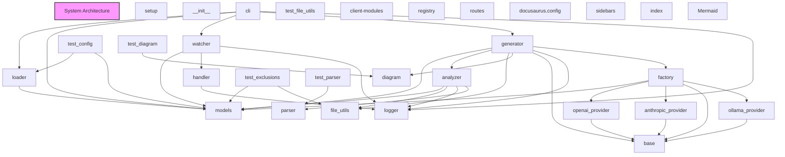

# Architecture Documentation

# System Architecture Documentation

## 1. Overall System Architecture

This codebase is a modular Python application that provides a framework for analyzing and generating documentation for software projects. The main components of the system are:

1. **Providers**: Modules that handle integration with different documentation generation services, such as OpenAI and Anthropic.
2. **Models**: Data models that represent various entities in the system, such as project files, analysis results, and configuration settings.
3. **Analyzer**: Responsible for analyzing the structure and content of a software project, generating insights and metadata.
4. **Generator**: Generates documentation based on the analysis results and user-provided templates or configurations.
5. **CLI**: A command-line interface for interacting with the system and running various tasks.
6. **Utilities**: Modules that provide common functionality, such as file handling, logging, and parsing.

The overall architecture follows a modular design, with each component responsible for a specific set of tasks and communicating with others through well-defined interfaces. This allows for easy extensibility, maintainability, and flexibility in the system.

## 2. Component Organization

The codebase is organized into the following modules:

- `setup.py`: Handles package setup and dependencies.
- `__init__.py`: Empty file to mark the directory as a Python package.
- `anthropic_provider.py`: Implements the Anthropic provider for generating documentation.
- `base.py`: Defines the base classes and interfaces for the various components of the system.
- `factory.py`: Responsible for creating instances of the different provider and model classes.
- `ollama_provider.py`: Implements the Ollama provider for generating documentation.
- `openai_provider.py`: Implements the OpenAI provider for generating documentation.
- `cli.py`: Provides the command-line interface for interacting with the system.
- `loader.py`: Handles loading configuration and project data from various sources.
- `models.py`: Defines the data models used throughout the system.
- `analyzer.py`: Responsible for analyzing the structure and content of a software project.
- `diagram.py`: Generates visual diagrams based on the analysis results.
- `generator.py`: Generates the final documentation based on the analysis and user-provided templates.
- `file_utils.py`: Provides utility functions for working with files and directories.
- `logger.py`: Handles logging and error reporting.
- `parser.py`: Responsible for parsing the source code and extracting relevant information.
- `handler.py`: Manages the processing of files and directories.
- `watcher.py`: Monitors the file system for changes and triggers the analysis and documentation generation process.
- `test_config.py`: Contains unit tests for the configuration loading and validation.
- `test_diagram.py`: Contains unit tests for the diagram generation functionality.

## 3. Module Relationships and Dependencies

The modules in this codebase are organized in a way that minimizes circular dependencies and promotes modularity. The key dependencies between modules are:

- `factory.py` depends on `models.py`, `openai_provider.py`, `anthropic_provider.py`, `ollama_provider.py`, and `base.py`.
- `cli.py` depends on `loader.py`, `logging`, `sys`, `models.py`, and `watcher.py`.
- `loader.py` depends on `yaml`, `models.py`, `os`, `typing`, and `pathlib`.
- `analyzer.py` depends on `models.py`, `file_utils.py`, `logger.py`, `parser.py`, and `pathlib`.
- `generator.py` depends on `models.py`, `analyzer.py`, `fnmatch`, `file_utils.py`, and `datetime`.
- `watcher.py` depends on `time`, `models.py`, `handler.py`, `logger.py`, and `pathlib`.

This organization helps maintain a clear separation of concerns and makes it easier to understand the role and responsibilities of each module.

## 4. Design Patterns Used

The codebase makes use of several design patterns to achieve modularity, extensibility, and maintainability:

1. **Factory Pattern**: The `factory.py` module uses the Factory pattern to create instances of the different provider and model classes, decoupling the creation logic from the rest of the system.
2. **Adapter Pattern**: The provider modules (`openai_provider.py`, `anthropic_provider.py`, `ollama_provider.py`) act as adapters, providing a consistent interface for interacting with different documentation generation services.
3. **Observer Pattern**: The `watcher.py` module uses the Observer pattern to monitor the file system and trigger the analysis and documentation generation process when changes are detected.
4. **Dependency Injection**: The use of the Factory pattern and the clear separation of concerns between modules allows for easy dependency injection, making the system more testable and maintainable.

## 5. Key Architectural Decisions

1. **Modular Design**: The codebase is organized into a set of loosely coupled modules, each with a specific responsibility. This promotes maintainability, extensibility, and testability.
2. **Provider-based Architecture**: The integration with different documentation generation services is handled through provider modules, which can be easily added or replaced as needed. This allows the system to support a variety of documentation generation tools.
3. **Configuration-driven Approach**: The system relies on configuration files and data models to define the project structure, analysis settings, and documentation generation templates. This makes the system more flexible and adaptable to different project requirements.
4. **Command-line Interface**: The CLI module provides a user-friendly way to interact with the system, allowing developers to run various tasks and commands from the terminal.
5. **Separation of Concerns**: The clear separation of concerns between the different modules (e.g., analysis, generation, file handling, logging) makes the codebase easier to understand, maintain, and extend.
6. **Testability**: The modular design and use of design patterns, such as Dependency Injection, make the system more testable, with each module having a well-defined set of responsibilities and dependencies.

Overall, the architectural decisions made in this codebase prioritize modularity, extensibility, maintainability, and testability, ensuring that the system can adapt to changing requirements and new documentation generation tools over time.

## Architecture Diagram

