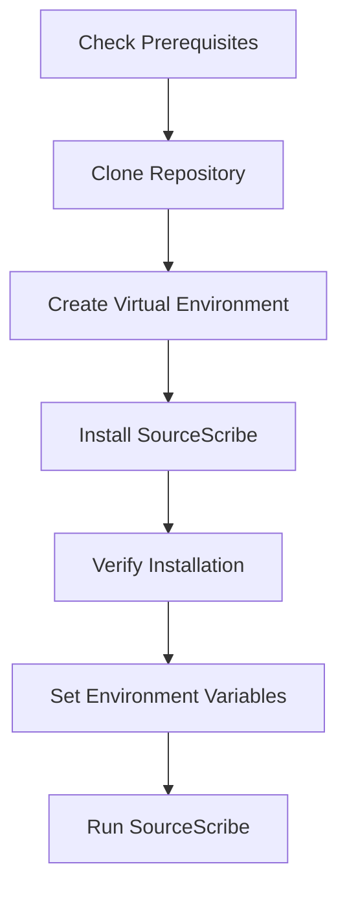

# Installation

# SourceScribe Installation Guide

## Prerequisites

Before installing SourceScribe, ensure your system meets the following requirements:

- Python 3.7 or higher
- pip package manager
- Git (optional, for cloning the repository)

SourceScribe has the following dependencies:

- `mermaid-cli` (for generating diagrams)
- `openai` (for the OpenAI provider)
- `anthropic` (for the Anthropic provider)
- `ollama` (for the Ollama provider)

These dependencies will be automatically installed during the setup process.

## Installation Steps

1. **Clone the Repository (optional):**
   If you have Git installed, you can clone the SourceScribe repository:
   ```bash
   git clone https://github.com/your-username/sourcescribe.git
   cd sourcescribe
   ```
   Otherwise, you can download the source code as a ZIP file from the GitHub repository.

2. **Create a Virtual Environment (recommended):**
   It's recommended to create a virtual environment to isolate the SourceScribe dependencies:
   ```bash
   python -m venv venv
   source venv/bin/activate  # On Windows, use `venv\Scripts\activate`
   ```

3. **Install SourceScribe:**
   Install SourceScribe using pip:
   ```bash
   pip install .
   ```
   This will install SourceScribe and its dependencies.

4. **Verify the Installation:**
   After the installation is complete, you can verify that SourceScribe is working correctly by running the following command:
   ```bash
   sourcescribe --version
   ```
   This should display the current version of SourceScribe.

## Environment Setup

SourceScribe uses environment variables for configuration. You can set these variables in your shell or in a `.env` file.

1. **API Provider Configuration:**
   SourceScribe supports multiple AI providers, such as OpenAI, Anthropic, and Ollama. You'll need to set the appropriate environment variables for the provider you want to use.

   For example, to configure the OpenAI provider:
   ```
   SOURCESCRIBE_PROVIDER=openai
   OPENAI_API_KEY=your_openai_api_key
   ```

   Refer to the [Configuration Guide](https://github.com/your-username/sourcescribe/blob/main/docs/configuration.md) for more details on setting up the different providers.

2. **Other Configuration:**
   SourceScribe has additional configuration options, such as output directories, exclusions, and more. You can customize these settings by setting the corresponding environment variables.
   Refer to the [Configuration Guide](https://github.com/your-username/sourcescribe/blob/main/docs/configuration.md) for a complete list of available options.

## Verification

To verify that SourceScribe is installed and configured correctly, you can run the following command:

```bash
sourcescribe --help
```

This should display the SourceScribe command-line interface help, which includes information about the available commands and options.

## Troubleshooting

Here are some common installation issues and their solutions:

**Issue: Missing dependencies**
- Ensure you have Python 3.7 or higher installed.
- Check that you have the necessary dependencies installed. If not, try running `pip install -r requirements.txt`.

**Issue: API provider configuration error**
- Verify that you have set the correct environment variables for your chosen API provider.
- Check the [Configuration Guide](https://github.com/your-username/sourcescribe/blob/main/docs/configuration.md) for more details on the required configuration.

**Issue: Command not found**
- If the `sourcescribe` command is not recognized, ensure that the Python binary directory is in your system's PATH.
- Try running the script directly: `python -m sourcescribe --help`.

If you encounter any other issues, please refer to the [SourceScribe documentation](https://github.com/your-username/sourcescribe/blob/main/docs/) or reach out to the project maintainers for assistance.

## Installation Process Flowchart

Here's a mermaid flowchart that illustrates the SourceScribe installation process:



This flowchart shows the key steps in the installation process, including cloning the repository, creating a virtual environment, installing SourceScribe, verifying the installation, setting up the environment, and running SourceScribe.