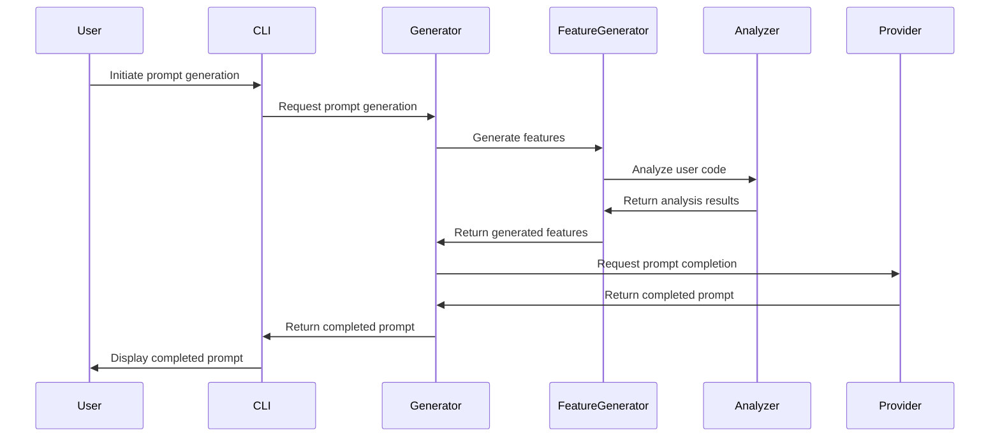
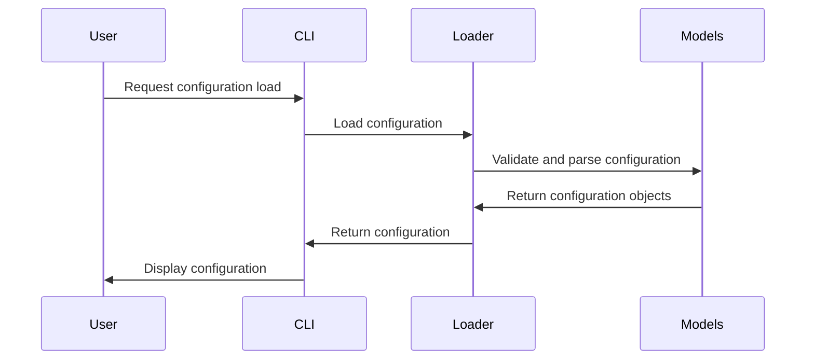
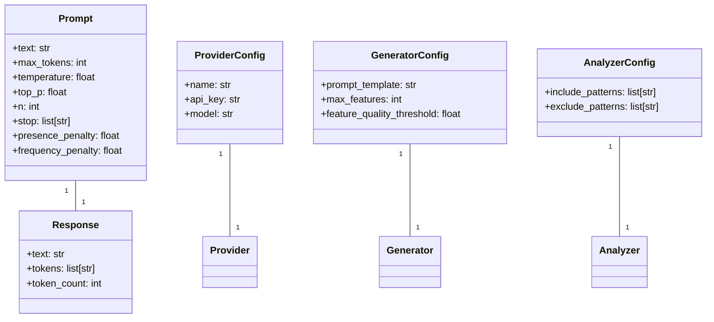
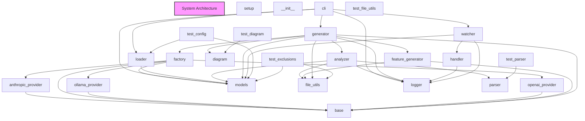

# Component Architecture

# Component Architecture Documentation

## 1. Component Breakdown

The system is composed of the following key components:

### setup
This module handles the package setup and installation process, leveraging the `setuptools` library.

### `anthropic_provider`, `ollama_provider`, `openai_provider`
These modules encapsulate the integration with different language model providers, abstracting away the provider-specific details behind a common interface defined in the `base` module.

### `factory`
The `factory` module is responsible for creating instances of the appropriate language model provider based on the user's configuration.

### `base`
The `base` module defines the common interface and base classes for language model providers, ensuring a consistent API across different providers.

### `models`
The `models` module defines the core data structures used throughout the system, such as prompts, responses, and configuration settings.

### `cli`
The `cli` module provides the command-line interface, allowing users to interact with the system through the terminal.

### `loader`
The `loader` module is responsible for loading configuration settings from YAML files.

### `analyzer`
The `analyzer` module analyzes the user's code and extracts relevant information, such as function signatures and docstrings.

### `diagram`
The `diagram` module generates visual diagrams, such as class diagrams and sequence diagrams, to help users understand the system's architecture and behavior.

### `feature_generator`
The `feature_generator` module generates new features based on the user's code and configuration.

### `generator`
The `generator` module is responsible for orchestrating the overall feature generation process, coordinating the various components.

### `file_utils`, `logger`, `parser`, `handler`, `watcher`
These modules provide supporting functionality, such as file management, logging, parsing, and file system monitoring.

### `test_config`
The `test_config` module contains utility functions for testing the system's configuration and data models.

## 2. Communication Patterns

The key communication patterns in the system are as follows:

### Prompt Generation Workflow

### Configuration Loading Workflow

## 3. Data Models

The system's core data models are defined in the `models` module:

## 4. Design Patterns

The system employs the following design patterns:

1. **Factory Pattern**: The `factory` module uses the Factory pattern to create instances of the appropriate language model provider based on the user's configuration.
2. **Strategy Pattern**: The `base`, `anthropic_provider`, `ollama_provider`, and `openai_provider` modules use the Strategy pattern to provide a common interface for interacting with different language model providers.
3. **Observer Pattern**: The `watcher` module uses the Observer pattern to monitor file system changes and notify the `handler` module.
4. **Singleton Pattern**: The `logger` module uses the Singleton pattern to ensure a single, global logger instance.

These patterns help to improve the system's modularity, flexibility, and maintainability.

## 5. Extension Points

The system provides the following extension points:

1. **Language Model Providers**: New language model providers can be added by implementing the `LanguageModelProvider` interface defined in the `base` module and registering them with the `factory` module.
2. **Configuration Loaders**: New configuration loaders can be added by implementing the `ConfigLoader` interface defined in the `loader` module.
3. **Feature Generators**: New feature generators can be added by implementing the `FeatureGenerator` interface defined in the `feature_generator` module.
4. **Diagram Generators**: New diagram generators can be added by implementing the `DiagramGenerator` interface defined in the `diagram` module.

These extension points allow the system to be easily expanded and customized to meet new requirements or integrate with additional language models and tools.

## System Architecture Diagram

