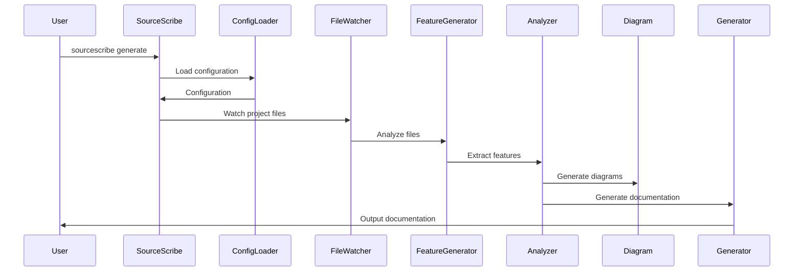

# Quick Start

# SourceScribe Quick Start Guide

## First Steps

To get started with SourceScribe, you'll need to install the package and set up your configuration.

1. **Install SourceScribe**:
   ```
   pip install sourcescribe
   ```

2. **Create a configuration file**:
   Create a new file named `sourcescribe.yml` in your project directory with the following contents:

   ```yaml
   providers:
     openai:
       api_key: your_openai_api_key
     anthropic:
       api_key: your_anthropic_api_key
   ```

   Replace `your_openai_api_key` and `your_anthropic_api_key` with your actual API keys.

3. **Run SourceScribe**:
   ```
   sourcescribe generate
   ```

   This will generate documentation for your project based on the configuration.

## Hello World Example

Let's walk through a simple example of using SourceScribe to generate documentation for a Python project.

1. **Create a sample Python file**:
   Create a new file named `example.py` with the following content:

   ```python
   """
   This is a simple example module.
   """

   def greet(name):
       """
       Greets the given name.

       Args:
           name (str): The name to greet.

       Returns:
           str: The greeting message.
       """
       return f"Hello, {name}!"

   if __name__ == "__main__":
       print(greet("World"))
   ```

2. **Run SourceScribe**:
   ```
   sourcescribe generate
   ```

   This will generate the documentation for your project, including the `example.py` file.

## What Just Happened?

When you ran `sourcescribe generate`, SourceScribe performed the following steps:



1. The `ConfigLoader` loaded the `sourcescribe.yml` configuration file, which specifies the API keys for the AI providers.
2. The `FileWatcher` monitored the project files for changes.
3. The `FeatureGenerator` analyzed the project files and extracted relevant information.
4. The `Analyzer` used the extracted features to generate diagrams and documentation content.
5. The `Generator` combined the diagrams and documentation content and output the final documentation.

## Next Steps

Now that you've seen a simple example, here are some next steps you can take:

1. **Customize the Configuration**: Explore the available configuration options to tailor SourceScribe to your project's needs, such as excluding certain files or directories, or specifying additional providers.
2. **Explore the Generated Documentation**: Review the generated documentation to see how SourceScribe has documented your project. Provide feedback and suggestions for improvement.
3. **Integrate SourceScribe into Your Workflow**: Consider adding SourceScribe to your project's build or deployment process to automatically generate up-to-date documentation.
4. **Contribute to SourceScribe**: If you encounter any issues or have ideas for new features, consider contributing to the SourceScribe project on GitHub.

By following these steps, you can get the most out of SourceScribe and streamline the documentation process for your Python projects.