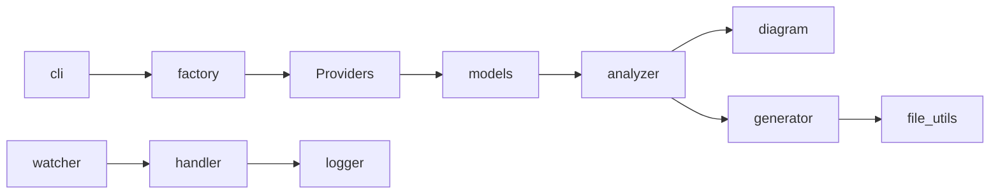
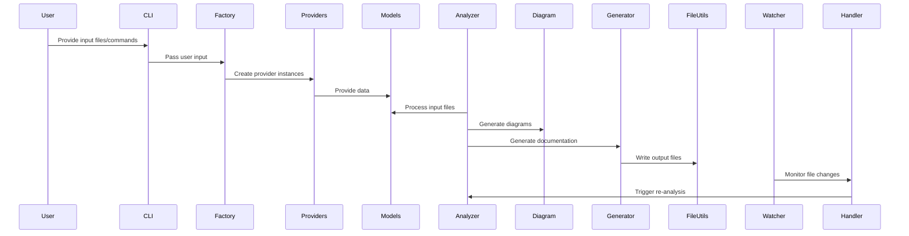
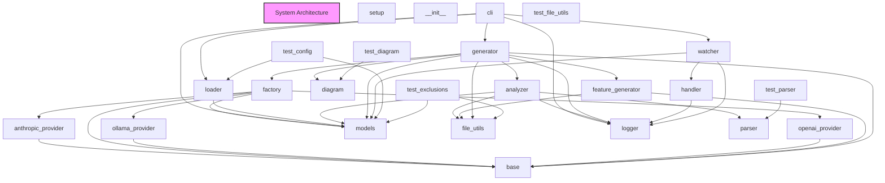

# Architecture Overview

# System Architecture Documentation

## High-Level Architecture

The system is composed of several key modules that work together to provide a comprehensive solution. The high-level architecture can be visualized as follows:

The main components and their roles are:

- **CLI**: Provides the command-line interface for users to interact with the system.
- **Factory**: Responsible for creating and managing the different provider instances (Anthropic, OpenAI, OLLama).
- **Providers**: Implement the logic to communicate with the various AI language models (Anthropic, OpenAI, OLLama).
- **Models**: Define the data structures and schemas used throughout the system.
- **Analyzer**: Analyzes the input files and extracts relevant information.
- **Diagram**: Generates visual diagrams (e.g., sequence diagrams, flowcharts) based on the analyzed data.
- **Generator**: Generates the final output files based on the analyzed data.
- **File Utils**: Provides utility functions for file and directory operations.
- **Watcher**: Monitors the file system for changes and triggers the appropriate actions.
- **Handler**: Handles file-related events and coordinates the processing of changes.
- **Logger**: Provides logging functionality for the system.

## Data Flow

The typical data flow in the system is as follows:

1. The user interacts with the CLI, providing input files or commands.
2. The CLI module passes the user's input to the Factory, which creates the appropriate provider instances.
3. The provider instances communicate with the external AI language models to obtain the necessary information.
4. The provider responses are then passed to the Models module, which handles the data structures.
5. The Analyzer module processes the input files and extracts relevant information, such as code structure, dependencies, and documentation.
6. The extracted data is then used by the Diagram and Generator modules to generate the final output, which may include visual diagrams and documentation.
7. The Watcher and Handler modules monitor the file system for changes and trigger the appropriate processing steps.

## Design Principles

The system architecture follows several key design principles:

1. **Modularity**: The system is divided into well-defined, loosely coupled modules, each with a specific responsibility. This promotes maintainability, testability, and flexibility.
2. **Abstraction**: The use of abstract base classes and interfaces in the `base` module allows for easy substitution of different provider implementations, following the Dependency Inversion Principle.
3. **Separation of Concerns**: The clear separation of concerns, such as data modeling, file processing, and output generation, helps to keep the codebase organized and easier to understand.
4. **Extensibility**: The system is designed to be easily extensible, allowing for the addition of new providers, data models, and processing capabilities without requiring significant changes to the existing codebase.
5. **Configuration-Driven**: The use of configuration files and the `loader` module allows for easy customization of the system's behavior, making it more adaptable to different use cases.

These design principles contribute to the overall robustness, maintainability, and scalability of the system architecture.

## System Architecture Diagram

