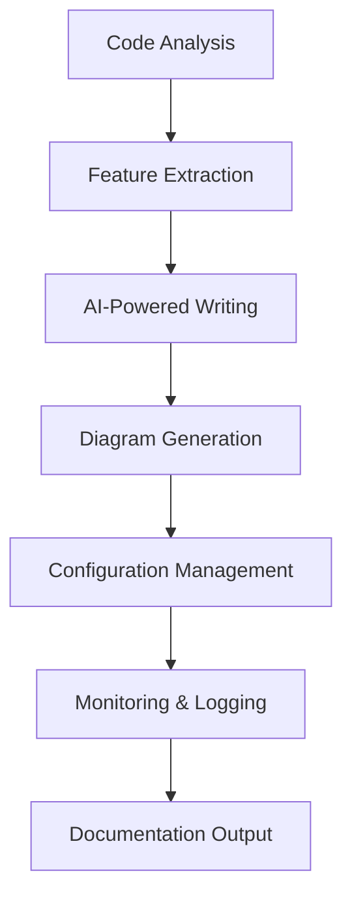
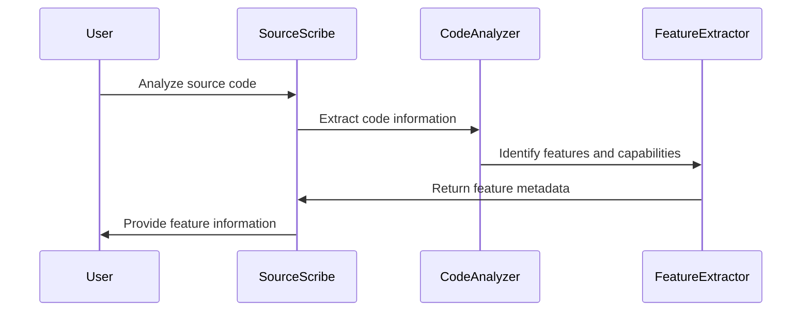
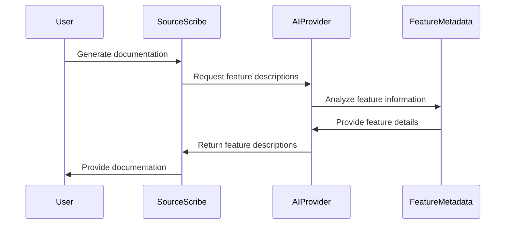
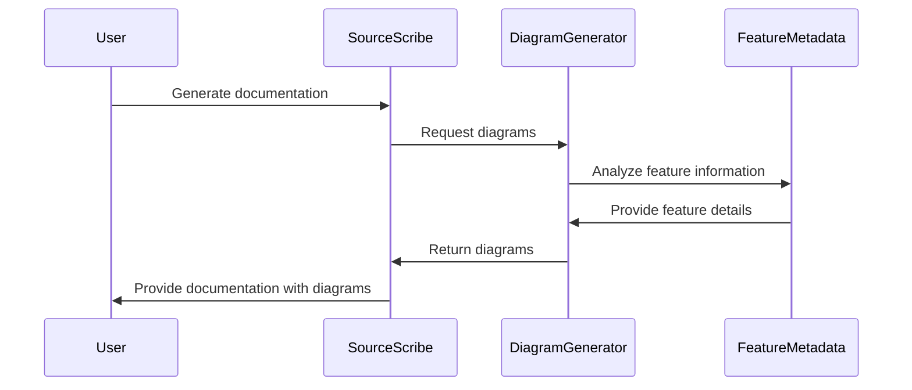
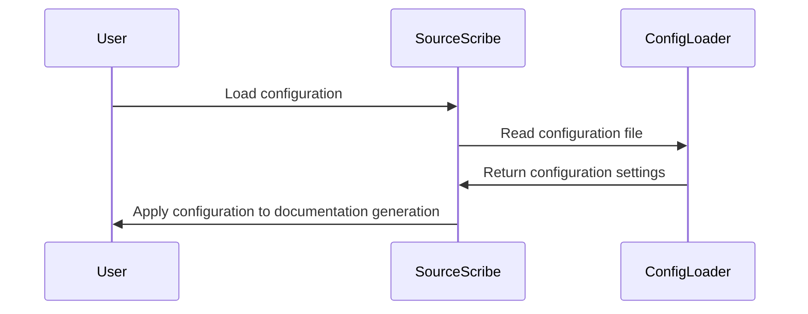
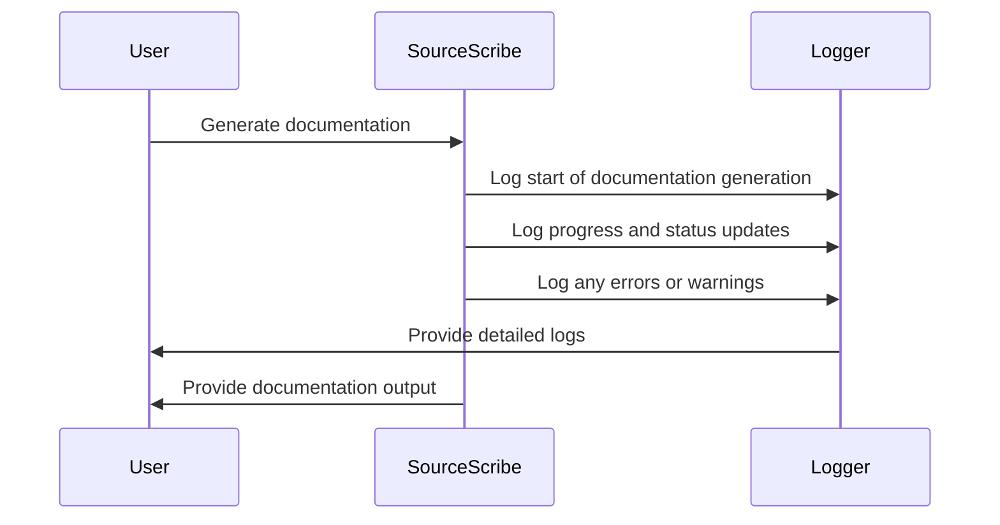

# Features

# SourceScribe Documentation

SourceScribe is a powerful documentation generation tool that automatically creates user-friendly technical documentation from source code. It supports a variety of programming languages and integrates with popular AI-powered writing assistants to generate high-quality, process-oriented documentation.

## Features

SourceScribe provides the following key features:

1. **Code Analysis**: Analyze source code to extract relevant information for documentation.
2. **AI-Powered Writing**: Leverage AI-based writing assistants to generate natural language descriptions.
3. **Diagram Generation**: Automatically create visual diagrams to illustrate system architecture and workflows.
4. **Configuration Management**: Flexible configuration options to customize the documentation output.
5. **Monitoring & Logging**: Track the documentation generation process and handle errors.
6. **Extensibility**: Plug-in support for additional AI providers and customization.

## How It Works

SourceScribe follows a multi-step process to generate comprehensive technical documentation:



1. **Code Analysis**: SourceScribe analyzes the source code to extract relevant information, such as function signatures, class definitions, and data models.
2. **Feature Extraction**: The extracted information is used to identify the key features and capabilities of the system.
3. **AI-Powered Writing**: SourceScribe leverages AI-based writing assistants to generate natural language descriptions for each feature, explaining its purpose and usage.
4. **Diagram Generation**: Automatic diagrams, such as sequence diagrams and flowcharts, are created to illustrate the workflows and interactions within the system.
5. **Configuration Management**: Users can customize the documentation output through a flexible configuration system, including settings for AI providers, exclusions, and more.
6. **Monitoring & Logging**: SourceScribe tracks the documentation generation process and provides detailed logs to help identify and resolve any issues.
7. **Documentation Output**: The final documentation is generated in a user-friendly format, such as Markdown, for easy consumption by developers and stakeholders.

## Features

### Code Analysis & Feature Extraction

SourceScribe analyzes the source code to identify the key features and capabilities of the system. It extracts relevant information, such as function signatures, class definitions, and data models, and uses this data to generate a comprehensive understanding of the system's functionality.

**How It Works**:



**Usage Example**:

```python
from sourcescribe.engine.analyzer import CodeAnalyzer
from sourcescribe.engine.feature_generator import FeatureExtractor

# Analyze the source code
code_analyzer = CodeAnalyzer(source_dir='path/to/source/code')
features = FeatureExtractor(code_analyzer).extract_features()

# Print the extracted features
for feature in features:
    print(feature.name)
    print(feature.description)
```

**Configuration**:

- `source_dir`: The path to the source code directory to be analyzed.
- `excluded_files`: A list of files or directories to exclude from the analysis.
- `language_specific_config`: Language-specific configuration options for the code analysis.

**Common Use Cases**:

1. Generating documentation for a new software project.
2. Updating documentation when the codebase changes.
3. Providing a high-level overview of the system's functionality.

### AI-Powered Writing

SourceScribe leverages AI-based writing assistants to generate natural language descriptions for the identified features and capabilities. This ensures that the documentation is written in a clear, user-centric manner, focusing on how the system can be used rather than just the underlying implementation details.

**How It Works**:



**Usage Example**:

```python
from sourcescribe.api.factory import AIProviderFactory

# Create an AI provider instance
ai_provider = AIProviderFactory.create('openai')

# Generate descriptions for the extracted features
for feature in features:
    feature.description = ai_provider.generate_description(feature)
```

**Configuration**:

- `ai_provider`: The AI provider to use for generating the feature descriptions (e.g., OpenAI, Anthropic, Ollama).
- `ai_provider_config`: Provider-specific configuration options, such as API keys and model parameters.

**Common Use Cases**:

1. Generating high-quality, user-friendly documentation for complex software systems.
2. Automating the documentation process to keep it up-to-date with the codebase.
3. Providing consistent and coherent descriptions across the entire documentation.

### Diagram Generation

SourceScribe automatically generates visual diagrams to illustrate the system's architecture, workflows, and data models. These diagrams help users understand how the different components of the system interact and work together.

**How It Works**:



**Usage Example**:

```python
from sourcescribe.engine.diagram import DiagramGenerator

# Generate diagrams for the extracted features
diagram_generator = DiagramGenerator(features)
diagrams = diagram_generator.generate_all()

# Include the diagrams in the documentation
for feature, diagram in zip(features, diagrams):
    feature.diagram = diagram
```

**Configuration**:

- `diagram_types`: The types of diagrams to generate (e.g., sequence diagrams, flowcharts, class diagrams).
- `diagram_style`: The visual style and formatting of the generated diagrams.

**Common Use Cases**:

1. Providing visual aids to help users understand the system's architecture and workflows.
2. Generating diagrams for specific features or components of the system.
3. Incorporating diagrams into the documentation to enhance the user experience.

### Configuration Management

SourceScribe provides a flexible configuration system that allows users to customize the documentation generation process. This includes settings for AI providers, exclusions, and other feature-specific options.

**How It Works**:



**Usage Example**:

```python
from sourcescribe.config.loader import ConfigLoader

# Load the configuration
config = ConfigLoader.load('path/to/config.yaml')

# Use the configuration settings
ai_provider = config.ai_provider
excluded_files = config.excluded_files
```

**Configuration Options**:

- `ai_provider`: The AI provider to use for generating feature descriptions.
- `ai_provider_config`: Provider-specific configuration options, such as API keys and model parameters.
- `excluded_files`: A list of files or directories to exclude from the analysis.
- `diagram_types`: The types of diagrams to generate.
- `diagram_style`: The visual style and formatting of the generated diagrams.

**Common Use Cases**:

1. Customizing the documentation output to match the organization's branding and style guidelines.
2. Excluding specific files or directories from the analysis to focus on the most relevant parts of the codebase.
3. Experimenting with different AI providers and diagram types to find the optimal configuration.

### Monitoring & Logging

SourceScribe provides comprehensive monitoring and logging capabilities to help users track the documentation generation process and identify and resolve any issues that may arise.

**How It Works**:



**Usage Example**:

```python
from sourcescribe.utils.logger import Logger

# Set the log level
Logger.set_level('DEBUG')

# Generate the documentation
try:
    SourceScribe.generate_documentation()
except Exception as e:
    Logger.error(f'Error generating documentation: {e}')
```

**Configuration**:

- `log_level`: The level of detail to include in the logs (e.g., DEBUG, INFO, WARNING, ERROR).
- `log_file`: The path to the log file, if logging to a file is desired.

**Common Use Cases**:

1. Troubleshooting issues during the documentation generation process.
2. Monitoring the progress and status of the documentation generation.
3. Providing detailed logs to support teams or developers for further investigation.

## Usage Examples

Here are some examples of how to use SourceScribe to generate documentation for your project:

### Basic Usage

```python
from sourcescribe.cli import SourceScribe

# Generate documentation for the current project
SourceScribe.generate_documentation()
```

### Customizing the Configuration

```python
from sourcescribe.config.loader import ConfigLoader

# Load a custom configuration file
config = ConfigLoader.load('path/to/config.yaml')

# Generate documentation with the custom configuration
SourceScribe.generate_documentation(config)
```

### Integrating with a Continuous Integration (CI) Pipeline

```yaml
# .gitlab-ci.yml
image: python:3.9

stages:
  - generate-docs

generate-docs:
  stage: generate-docs
  script:
    - pip install sourcescribe
    - sourcescribe generate-docs
  artifacts:
    paths:
      - docs/
```

## Conclusion

SourceScribe is a powerful documentation generation tool that helps you create user-centric, process-oriented technical documentation for your software projects. By leveraging AI-powered writing, automatic diagram generation, and a flexible configuration system, SourceScribe streamlines the documentation process and ensures that your documentation remains up-to-date and relevant.

Whether you're working on a new project or maintaining an existing codebase, SourceScribe can help you provide clear, comprehensive, and visually appealing documentation to your users and stakeholders.