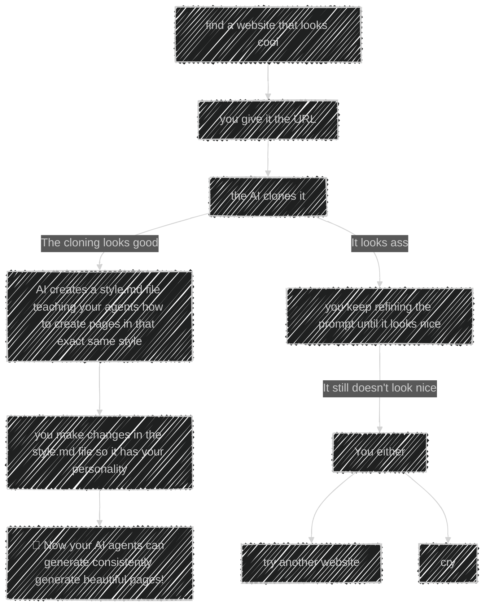

# Ui Setup

> Create UI's that actually look beautiful.

## Requirements

- Python version 3.7 or higher
- pip
- minimum knowledge with programming OR vibe coding tools.

## Usage

Well, the idea here is quite simple:

### You:

