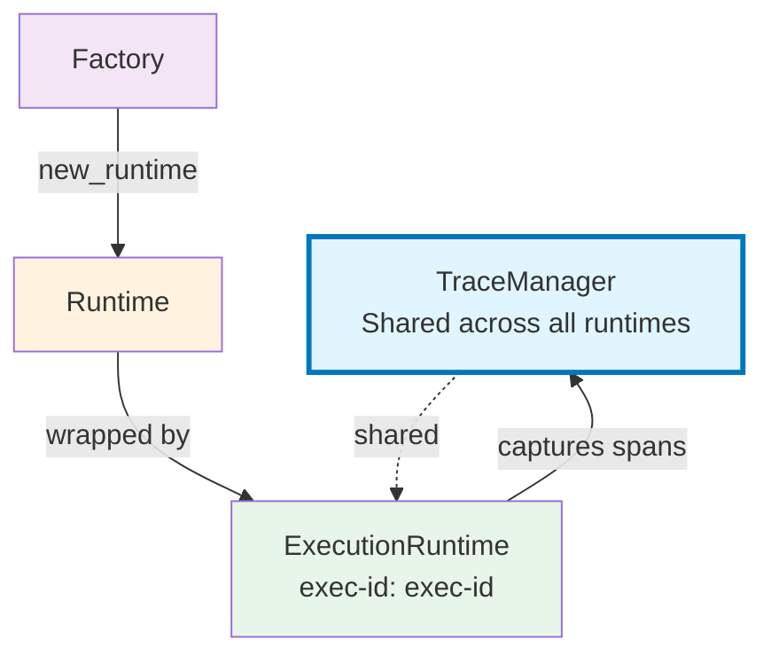

# UiPath Runtime

[](https://pypi.org/project/uipath-runtime/)
[](https://pypi.org/project/uipath-runtime/)

Runtime abstractions and contracts for the UiPath Python SDK.

## Overview

`uipath-runtime` provides the foundational interfaces and base classes for building agent runtimes in the UiPath ecosystem.
It defines the contracts that all runtime implementations must follow and provides utilities for execution context, event streaming, tracing, and structured error handling.

This package is typically used as a dependency by higher-level SDKs such as:
- [`uipath-langchain`](https://pypi.org/project/uipath-langchain)
- [`uipath-llamaindex`](https://pypi.org/project/uipath-llamaindex)
- [`uipath-mcp`](https://pypi.org/project/uipath-mcp)
- the main [`uipath`](https://pypi.org/project/uipath) SDK.

You would use this directly only if you're building custom runtime implementations.

## Installation

```bash
uv add uipath-runtime
```

## Runtime Base Class

All runtimes inherit from `UiPathBaseRuntime` and implement these core methods:

- `get_schema()` — defines input and output JSON schemas.
- `execute(input, options)` — executes the runtime logic and returns a `UiPathRuntimeResult`.
- `stream(input, options)` — optionally streams runtime events for real-time monitoring.
- `cleanup()` — releases resources.

```python
from typing import Any, AsyncGenerator, Optional
from uipath.runtime import (
    UiPathBaseRuntime,
    UiPathRuntimeContext,
    UiPathRuntimeResult,
    UiPathRuntimeStatus,
    UiPathRuntimeSchema,
    UiPathRuntimeEvent,
    UiPathExecuteOptions,
    UiPathStreamOptions,
)
from uipath.runtime.events import UiPathRuntimeStateEvent
from uipath.runtime.errors import UiPathRuntimeError, UiPathErrorCode, UiPathErrorCategory


class MyCustomRuntime(UiPathBaseRuntime):
    """Example runtime demonstrating the base runtime interface."""

    async def get_schema(self) -> UiPathRuntimeSchema:
        return UiPathRuntimeSchema(
            input={
                "type": "object",
                "properties": {"message": {"type": "string"}},
                "required": ["message"],
            },
            output={
                "type": "object",
                "properties": {"result": {"type": "string"}},
                "required": ["result"],
            },
        )

    async def execute(
        self,
        input: Optional[dict[str, Any]] = None,
        options: Optional[UiPathExecuteOptions] = None,
    ) -> UiPathRuntimeResult:
        message = (input or {}).get("message", "")
        return UiPathRuntimeResult(
            output={"result": f"Echo: {message}"},
            status=UiPathRuntimeStatus.SUCCESSFUL,
        )

    async def stream(
        self,
        input: Optional[dict[str, Any]] = None,
        options: Optional[UiPathStreamOptions] = None,
    ) -> AsyncGenerator[UiPathRuntimeEvent, None]:
        yield UiPathRuntimeStateEvent(payload={"status": "starting"})
        yield UiPathRuntimeResult(
            output={"completed": True},
            status=UiPathRuntimeStatus.SUCCESSFUL,
        )

    async def cleanup(self) -> None:
        pass
```


## Event Streaming

Runtimes can optionally emit real-time events during execution:

```python
async for event in runtime.stream({"query": "hello"}):
    if isinstance(event, UiPathRuntimeStateEvent):
        print(f"State update: {event.payload}")
    elif isinstance(event, UiPathRuntimeMessageEvent):
        print(f"Message received: {event.payload}")
    elif isinstance(event, UiPathRuntimeResult):
        print(f"Completed: {event.output}")
```

If a runtime doesn’t support streaming, it raises a `UiPathStreamNotSupportedError`.


## Structured Error Handling

Runtime errors use a consistent, structured model:

```python
from uipath.runtime.errors import UiPathRuntimeError, UiPathErrorCode, UiPathErrorCategory

raise UiPathRuntimeError(
    UiPathErrorCode.EXECUTION_ERROR,
    "Agent failed",
    "Failed to call external service",
    UiPathErrorCategory.USER,
)
```

Resulting JSON contract:

```json
{
  "code": "Python.EXECUTION_ERROR",
  "title": "Agent failed",
  "detail": "Failed to call external service",
  "category": "User"
}
```

## Runtime Factory

`UiPathRuntimeFactory` provides a consistent way to create and manage runtime instances.

Factories decouple runtime construction (configuration, dependencies) from runtime execution, allowing orchestration, discovery, reuse, and tracing across multiple types of runtimes.

```python
from uipath.runtime import UiPathBaseRuntime, UiPathRuntimeFactory

class MyRuntime(UiPathBaseRuntime):
    async def execute(self):
        return {"message": f"Hello from {self.__class__.__name__}"}

class MyRuntimeFactory(UiPathRuntimeFactory[MyRuntime]):
    def new_runtime(self, entrypoint: str) -> MyRuntime:
        return MyRuntime()

    def discover_runtimes(self) -> list[MyRuntime]:
        return []

# Usage
factory = MyRuntimeFactory()
runtime = factory.new_runtime("example")

result = await runtime.execute()
print(result)  # {'message': 'Hello from MyRuntime'}

```
## Execution Context

`UiPathRuntimeContext` manages configuration, file I/O, and logs across runtime execution.
It can read JSON input files, capture all stdout/stderr logs, and automatically write output and result files when execution completes.

```python
from uipath.runtime import UiPathRuntimeContext, UiPathRuntimeResult, UiPathRuntimeStatus

with UiPathRuntimeContext(input_file="input.json", result_file="result.json", logs_file="execution.log") as ctx:
    ctx.result = await runtime.execute(ctx.input)
# On exit: the result and logs are written automatically to the configured files
```

When execution fails, the context:
- Writes a structured error contract to the result file.
- Re-raises the original exception.


## Execution Runtime

`UiPathExecutionRuntime` wraps any runtime with tracing, telemetry, and log collection capabilities. When running multiple runtimes in the same process, this wrapper ensures each execution's spans and logs are properly isolated and captured.



```python
from uipath.core import UiPathTraceManager
from uipath.runtime import UiPathExecutionRuntime

trace_manager = UiPathTraceManager()
runtime = MyCustomRuntime()
executor = UiPathExecutionRuntime(
    runtime,
    trace_manager,
    root_span="my-runtime",
    execution_id="exec-123",
)

result = await executor.execute({"message": "hello"})
spans = trace_manager.get_execution_spans("exec-123") # captured spans
logs = executor.log_handler.buffer # captured logs
print(result.output)  # {'result': 'Echo: hello'}
```

## Example: Runtime Orchestration

This example demonstrates an **orchestrator runtime** that receives a `UiPathRuntimeFactory`, creates child runtimes through it, and executes each one via `UiPathExecutionRuntime`, all within a single shared `UiPathTraceManager` and `UiPathRuntimeContext`.

<details>
 <summary>Orchestrator Runtime</summary>

```python
from typing import Any, Optional, TypeVar, Generic

from uipath.core import UiPathTraceManager
from uipath.runtime import (
    UiPathRuntimeContext,
    UiPathBaseRuntime,
    UiPathExecutionRuntime,
    UiPathRuntimeResult,
    UiPathRuntimeStatus,
    UiPathExecuteOptions,
    UiPathRuntimeFactory,
)


class ChildRuntime(UiPathBaseRuntime):
    """A simple child runtime that echoes its name and input."""

    def __init__(
        self,
        name: str,
    ):
        super().__init__()
        self.name = name

    async def get_schema(self):
        return None

    async def execute(
        self,
        input: Optional[dict[str, Any]] = None,
        options: Optional[UiPathExecuteOptions] = None,
    ) -> UiPathRuntimeResult:
        payload = input or {}
        return UiPathRuntimeResult(
            output={
                "runtime": self.name,
                "input": payload,
            },
            status=UiPathRuntimeStatus.SUCCESSFUL,
        )

    async def cleanup(self) -> None:
        pass


class ChildRuntimeFactory(UiPathRuntimeFactory[ChildRuntime]):
    """Factory that creates ChildRuntime instances."""

    def new_runtime(self, entrypoint: str) -> ChildRuntime:
        return ChildRuntime(name=entrypoint)

    def discover_runtimes(self) -> list[ChildRuntime]:
        return []


class OrchestratorRuntime(UiPathBaseRuntime):
    """A runtime that orchestrates multiple child runtimes via a factory."""

    def __init__(
        self,
        factory: UiPathRuntimeFactory[ChildRuntime],
        trace_manager: UiPathTraceManager,
    ):
        super().__init__()
        self.factory = factory
        self.trace_manager = trace_manager

    async def get_schema(self):
        return None

    async def execute(
        self,
        input: Optional[dict[str, Any]] = None,
        options: Optional[UiPathExecuteOptions] = None,
    ) -> UiPathRuntimeResult:
        payload = input or {}
        child_inputs: list[dict[str, Any]] = payload.get("children", [])
        child_results: list[dict[str, Any]] = []

        for i, child_input in enumerate(child_inputs):
            # Use the factory to create a new child runtime
            child_runtime = self.factory.new_runtime(entrypoint=f"child-{i}")

            # Wrap child runtime with tracing + logs
            execution_id = f"{self.context.job_id}-child-{i}" if self.context else f"child-{i}"
            executor = UiPathExecutionRuntime(
                delegate=child_runtime,
                trace_manager=self.trace_manager,
                root_span=f"child-span-{i}",
                execution_id=execution_id,
            )

            # Execute child runtime
            result = await executor.execute(child_input, options=options)

            child_results.append(result.output or {})
            child_spans = trace_manager.get_execution_spans(execution_id)

            await child_runtime.cleanup()

        return UiPathRuntimeResult(
            output={
                "main": True,
                "children": child_results,
            },
            status=UiPathRuntimeStatus.SUCCESSFUL,
        )

    async def cleanup(self) -> None:
        pass


# Example usage
async def main() -> None:
    trace_manager = UiPathTraceManager()
    factory = ChildRuntimeFactory()
    options = UiPathExecuteOptions()

    with UiPathRuntimeContext(job_id="main-job-001") as ctx:
        runtime = OrchestratorRuntime(factory=factory, trace_manager=trace_manager, context=ctx)

        input_data = {
            "children": [
                {"message": "hello from child 1"},
                {"message": "hello from child 2"},
            ]
        }

        ctx.result = await runtime.execute(input=input_data, options=options)
        print(ctx.result.output)

# Output:
# {
#   "main": True,
#   "children": [
#       {"runtime": "child-0", "input": {"message": "hello from child 1"}},
#       {"runtime": "child-1", "input": {"message": "hello from child 2"}}
#   ]
# }
```

</details>

