# 🐦 Vogel Model Trainer

**Sprachen:** [🇬🇧 English](README.md) | [🇩🇪 Deutsch](README.de.md) | [🇯🇵 日本語](README.ja.md)

<p align="left">
  <a href="https://pypi.org/project/vogel-model-trainer/"></a>
  <a href="https://pypi.org/project/vogel-model-trainer/"></a>
  <a href="https://opensource.org/licenses/MIT"></a>
  <a href="https://pypi.org/project/vogel-model-trainer/"></a>
  <a href="https://pepy.tech/project/vogel-model-trainer"></a>
</p>

**Trainiere eigene Vogelarten-Klassifizierer aus deinen eigenen Video-Aufnahmen mit YOLOv8 und EfficientNet.**

Ein spezialisiertes Toolkit zum Erstellen von hochgenauen Vogelarten-Klassifizierern, die auf dein spezifisches Monitoring-Setup zugeschnitten sind. Extrahiere Trainingsdaten aus Videos, organisiere Datasets und trainiere eigene Modelle mit >96% Genauigkeit.

---

## ✨ Features

- 🎯 **YOLO-basierte Vogelerkennung** - Automatisches Cropping von Vögeln aus Videos mit YOLOv8
- 🤖 **Drei Extraktions-Modi** - Manuelle Beschriftung, Auto-Sortierung oder Standard-Extraktion
- 📁 **Wildcard-Unterstützung** - Batch-Verarbeitung mehrerer Videos mit Glob-Patterns
- 🖼️ **Auto-Resize auf 224x224** - Optimale Bildgröße fürs Training
- 🧠 **EfficientNet-B0 Training** - Leichtgewichtiges aber leistungsstarkes Klassifizierungsmodell
- 🎨 **Erweiterte Data Augmentation** - Rotation, Affine-Transformationen, Color Jitter, Gaussian Blur
- 📊 **Optimiertes Training** - Cosine LR Scheduling, Label Smoothing, Early Stopping
- ⏸️ **Graceful Shutdown** - Modellzustand bei Strg+C-Unterbrechung speichern
- 🔄 **Iteratives Training** - Nutze trainierte Modelle zum Erweitern deines Datasets
- 📈 **Pro-Art-Metriken** - Detaillierte Genauigkeits-Aufschlüsselung pro Vogelart

---

## 🚀 Schnellstart

### Installation

#### Empfohlen: Virtuelle Umgebung verwenden

```bash
# Virtuelle Umgebung erstellen
python3 -m venv venv

# Virtuelle Umgebung aktivieren
source venv/bin/activate  # Auf Linux/Mac
# oder
venv\Scripts\activate     # Auf Windows

# vogel-model-trainer installieren
pip install vogel-model-trainer
```

#### Schnell-Installation

```bash
# Installation von PyPI
pip install vogel-model-trainer

# Oder Installation aus Quellcode
git clone https://github.com/kamera-linux/vogel-model-trainer.git
cd vogel-model-trainer
pip install -e .
```

### Grundlegender Workflow

```bash
# 1. Vogelbilder aus Videos extrahieren
vogel-trainer extract video.mp4 --folder ~/training-data/ --bird kohlmeise

# 2. In Train/Validation Split organisieren
vogel-trainer organize ~/training-data/ -o ~/organized-data/

# 3. Eigenen Klassifizierer trainieren
vogel-trainer train ~/organized-data/ -o ~/models/mein-classifier/

# 4. Das trainierte Modell testen
vogel-trainer test ~/models/mein-classifier/ -d ~/organized-data/
```

---

## 📖 Nutzungsanleitung

### Als Library nutzen (Neu in v0.1.2)

Alle Core-Funktionen können jetzt programmatisch in deinem Python-Code verwendet werden:

```python
from vogel_model_trainer.core import extractor, organizer, trainer, tester

# Vögel aus Video extrahieren
extractor.extract_birds_from_video(
    video_path="video.mp4",
    output_dir="output/",
    bird_species="kohlmeise",
    detection_model="yolov8n.pt",
    species_model=None,
    threshold=0.5,
    sample_rate=3,
    resize_to_target=True
)

# In Train/Val Splits organisieren
organizer.organize_dataset(
    source_dir="output/",
    output_dir="dataset/",
    train_ratio=0.8
)

# Modell trainieren
trainer.train_model(
    data_dir="dataset/",
    output_dir="models/",
    model_name="google/efficientnet-b0",
    batch_size=16,
    num_epochs=50,
    learning_rate=3e-4
)

# Modell testen
results = tester.test_model(
    model_path="models/bird_classifier/",
    data_dir="dataset/"
)
print(f"Genauigkeit: {results['accuracy']:.2%}")
```

### 1. Trainingsbilder extrahieren

#### Manueller Modus (Empfohlen für erste Sammlung)

Wenn du die Art in deinem Video kennst:

```bash
vogel-trainer extract ~/Videos/kohlmeise.mp4 \
  --folder ~/training-data/ \
  --bird kohlmeise \
  --threshold 0.5 \
  --sample-rate 3
```

#### Auto-Sort Modus (Für iteratives Training)

Nutze ein bestehendes Modell zum automatischen Klassifizieren und Sortieren:

```bash
vogel-trainer extract ~/Videos/gemischt.mp4 \
  --folder ~/training-data/ \
  --species-model ~/models/classifier/final/ \
  --threshold 0.5
```

#### Batch-Verarbeitung mit Wildcards

```bash
# Alle Videos in einem Verzeichnis verarbeiten
vogel-trainer extract "~/Videos/*.mp4" --folder ~/data/ --bird blaumeise

# Rekursive Verzeichnis-Suche
vogel-trainer extract ~/Videos/ \
  --folder ~/data/ \
  --bird amsel \
  --recursive
```

**Parameter:**
- `--folder`: Basis-Verzeichnis für extrahierte Bilder (erforderlich)
- `--bird`: Manuelle Arten-Beschriftung (erstellt Unterverzeichnis)
- `--species-model`: Pfad zu trainiertem Modell für Auto-Klassifizierung
- `--threshold`: YOLO Confidence-Schwellwert (Standard: 0.5)
- `--sample-rate`: Verarbeite jeden N-ten Frame (Standard: 3)
- `--detection-model`: YOLO Modell-Pfad (Standard: yolov8n.pt)
- `--no-resize`: Originalgröße beibehalten (Standard: Resize auf 224x224)
- `--recursive, -r`: Verzeichnisse rekursiv durchsuchen

### 2. Dataset organisieren

```bash
vogel-trainer organize ~/training-data/ -o ~/organized-data/
```

Erstellt einen 80/20 Train/Validation Split:
```
organized/
├── train/
│   ├── kohlmeise/
│   ├── blaumeise/
│   └── rotkehlchen/
└── val/
    ├── kohlmeise/
    ├── blaumeise/
    └── rotkehlchen/
```

### 3. Klassifizierer trainieren

```bash
vogel-trainer train \
  --data ~/training-data/organized/ \
  --output ~/models/ \
  --epochs 50 \
  --batch-size 16
```

**Training-Konfiguration:**
- Basis-Modell: `google/efficientnet-b0` (8.5M Parameter)
- Optimizer: AdamW mit Cosine LR Schedule
- Augmentation: Rotation, Affine, Color Jitter, Gaussian Blur
- Regularisierung: Weight Decay 0.01, Label Smoothing 0.1
- Early Stopping: Patience von 7 Epochen

**Output:**
```
~/models/bird-classifier-20251108_143000/
├── checkpoints/     # Zwischencheckpoints
├── logs/           # TensorBoard Logs
└── final/          # Finales trainiertes Modell
    ├── config.json
    ├── model.safetensors
    └── preprocessor_config.json
```

### 4. Modell testen

```bash
# Test auf einzelnem Bild
vogel-trainer test ~/models/final/ image.jpg

# Output:
# 🖼️  Testing: image.jpg
#    🐦 Predicted: kohlmeise (98.5% confidence)
```

---

## 🔄 Iterativer Training-Workflow

Verbessere deine Modell-Genauigkeit durch iterative Verfeinerung mit Auto-Klassifizierung:

```mermaid
flowchart TD
    Start([📋 Phase 1: Initiales Modell<br/>Manuelle Beschriftung]) --> Extract1[1️⃣ Extraktion mit manuellen Labels<br/><code>vogel-trainer extract video.mp4<br/>--folder data/ --bird kohlmeise</code>]
    
    Extract1 --> Organize1[2️⃣ Dataset organisieren 80/20 Split<br/><code>vogel-trainer organize data/<br/>-o organized/</code>]
    
    Organize1 --> Train1[3️⃣ Initiales Modell trainieren<br/><code>vogel-trainer train organized/<br/>-o models/v1/</code><br/>✅ <b>Ergebnis: 92% Genauigkeit</b>]
    
    Train1 --> Phase2([🔄 Phase 2: Modell-Verbesserung<br/>Auto-Klassifizierung])
    
    Phase2 --> Extract2[4️⃣ Auto-Extraktion mit trainiertem Modell<br/><code>vogel-trainer extract neue-videos/<br/>--folder data-v2/<br/>--species-model models/v1/final/<br/>--species-threshold 0.85</code><br/>🎯 <b>Automatisch nach Arten sortiert!</b>]
    
    Extract2 --> Review[5️⃣ Manuelle Überprüfung & Korrekturen<br/>• Auto-Klassifizierungen prüfen<br/>• Falsch klassifizierte Bilder verschieben<br/>• Mit vorherigem Dataset zusammenführen]
    
    Review --> Train2[6️⃣ Neutraining mit erweitertem Dataset<br/><code>vogel-trainer organize data-v2/<br/>-o organized-v2/<br/>vogel-trainer train organized-v2/<br/>-o models/v2/</code><br/>🎉 <b>Ergebnis: 96% Genauigkeit!</b>]
    
    Train2 --> Repeat{♻️ Weiter<br/>verbessern?}
    Repeat -->|Ja| Extract2
    Repeat -->|Nein| End([✅ Finales Modell])
    
    style Start fill:#e1f5ff,stroke:#0066cc,stroke-width:3px
    style Phase2 fill:#e1f5ff,stroke:#0066cc,stroke-width:3px
    style Train1 fill:#d4edda,stroke:#28a745,stroke-width:2px
    style Train2 fill:#d4edda,stroke:#28a745,stroke-width:2px
    style End fill:#d4edda,stroke:#28a745,stroke-width:3px
    style Extract2 fill:#fff3cd,stroke:#ffc107,stroke-width:2px
    style Review fill:#f8d7da,stroke:#dc3545,stroke-width:2px
```



**Hauptvorteile:**
- 🚀 **Schnellere Beschriftung**: Auto-Klassifizierung spart manuelle Arbeit
- 📈 **Bessere Genauigkeit**: Mehr Trainingsdaten = besseres Modell
- 🎯 **Qualitätskontrolle**: `--species-threshold` filtert unsichere Vorhersagen
- 🔄 **Kontinuierliche Verbesserung**: Jede Iteration verbessert das Modell

**Beispiel-Befehle:**

```bash
# Phase 1: Manuelles Training (initiales Dataset)
vogel-trainer extract ~/Videos/batch1/*.mp4 --folder ~/data/ --bird kohlmeise
vogel-trainer organize ~/data/ -o ~/data/organized/
vogel-trainer train ~/data/organized/ -o ~/models/v1/

# Phase 2: Auto-Klassifizierung mit trainiertem Modell
vogel-trainer extract ~/Videos/batch2/*.mp4 \
  --folder ~/data-v2/ \
  --species-model ~/models/v1/final/ \
  --species-threshold 0.85

# Klassifizierungen in ~/data-v2/<art>/ Ordnern überprüfen
# Falsch klassifizierte Bilder in korrekte Arten-Ordner verschieben

# Datasets zusammenführen und neu trainieren
cp -r ~/data-v2/* ~/data/
vogel-trainer organize ~/data/ -o ~/data/organized-v2/
vogel-trainer train ~/data/organized-v2/ -o ~/models/v2/
```

---

## 📊 Performance & Best Practices

### Empfehlungen zur Dataset-Größe

| Qualität | Bilder pro Art | Erwartete Genauigkeit |
|----------|----------------|----------------------|
| Minimum  | 20-30         | ~85-90%             |
| Gut      | 50-100        | ~92-96%             |
| Optimal  | 100+          | >96%                |

### Tipps für bessere Ergebnisse

1. **Dataset-Diversität**
   - Verschiedene Lichtverhältnisse einbeziehen
   - Verschiedene Posen erfassen (Seite, Vorne, Hinten)
   - Verschiedene Jahreszeiten abdecken (Federkleid ändert sich)

2. **Klassen-Balance**
   - Ähnliche Bildzahl pro Art anstreben
   - Vermeide eine dominierende Klasse

3. **Qualität vor Quantität**
   - Nutze Threshold 0.5-0.6 für klare Detektionen
   - Manuelle Review von auto-sortierten Bildern verbessert Qualität

4. **Training monitoren**
   - Prüfe Pro-Klassen-Genauigkeit für schwache Arten
   - Nutze Confusion Matrix um ähnliche Arten zu identifizieren
   - Füge mehr Daten für schlecht performende Klassen hinzu

---

## 🔗 Integration mit vogel-video-analyzer

Nutze dein trainiertes Modell zur Artenerkennung:

```bash
vogel-analyze --identify-species \
  --species-model ~/models/final/ \
  --species-threshold 0.3 \
  video.mp4
```

---

## 🛠️ Entwicklung

```bash
# Repository klonen
git clone https://github.com/kamera-linux/vogel-model-trainer.git
cd vogel-model-trainer

# Im Entwicklungsmodus installieren
pip install -e ".[dev]"

# Tests ausführen
pytest tests/
```

---

## 📝 Lizenz

MIT License - siehe [LICENSE](LICENSE) für Details.

---

## 🙏 Credits

- **YOLO** von [Ultralytics](https://github.com/ultralytics/ultralytics)
- **EfficientNet** von [Google Research](https://github.com/google/automl)
- **Transformers** von [Hugging Face](https://huggingface.co/transformers)

---

## 📮 Support & Contributing

- **Issues**: [GitHub Issues](https://github.com/kamera-linux/vogel-model-trainer/issues)
- **Discussions**: [GitHub Discussions](https://github.com/kamera-linux/vogel-model-trainer/discussions)
- **Pull Requests**: Contributions willkommen!

---

Made with ❤️ for bird watching enthusiasts 🐦
