# 🐦 Vogel Model Trainer

**Languages:** [🇬🇧 English](README.md) | [🇩🇪 Deutsch](README.de.md) | [🇯🇵 日本語](README.ja.md)

<p align="left">
  <a href="https://pypi.org/project/vogel-model-trainer/"></a>
  <a href="https://pypi.org/project/vogel-model-trainer/"></a>
  <a href="https://opensource.org/licenses/MIT"></a>
  <a href="https://pypi.org/project/vogel-model-trainer/"></a>
  <a href="https://pepy.tech/project/vogel-model-trainer"></a>
</p>

**Train custom bird species classifiers from your own video footage using YOLOv8 and EfficientNet.**

A specialized toolkit for creating high-accuracy bird species classifiers tailored to your specific monitoring setup. Extract training data from videos, organize datasets, and train custom models with >96% accuracy.

---

## ✨ Features

- 🎯 **YOLO-based Bird Detection** - Automated bird cropping from videos using YOLOv8
- 🤖 **Three Extraction Modes** - Manual labeling, auto-sorting, or standard extraction
- 📁 **Wildcard Support** - Batch process multiple videos with glob patterns
- 🖼️ **Auto-Resize to 224x224** - Optimal image size for training
- 🧠 **EfficientNet-B0 Training** - Lightweight yet powerful classification model
- 🎨 **Enhanced Data Augmentation** - Rotation, affine transforms, color jitter, gaussian blur
- 📊 **Optimized Training** - Cosine LR scheduling, label smoothing, early stopping
- ⏸️ **Graceful Shutdown** - Save model state on Ctrl+C interruption
- 🔄 **Iterative Training** - Use trained models to expand your dataset
- 📈 **Per-Species Metrics** - Detailed accuracy breakdown by species

---

## 🚀 Quick Start

### Installation

#### Recommended: Using Virtual Environment

```bash
# Create virtual environment
python3 -m venv venv

# Activate virtual environment
source venv/bin/activate  # On Linux/Mac
# or
venv\Scripts\activate     # On Windows

# Install vogel-model-trainer
pip install vogel-model-trainer
```

#### Quick Install

```bash
# Install from PyPI
pip install vogel-model-trainer

# Or install from source
git clone https://github.com/kamera-linux/vogel-model-trainer.git
cd vogel-model-trainer
pip install -e .
```

### Basic Workflow

```bash
# 1. Extract bird images from videos
vogel-trainer extract video.mp4 --folder ~/training-data/ --bird kohlmeise

# 2. Organize into train/validation split
vogel-trainer organize ~/training-data/ -o ~/organized-data/

# 3. Train custom classifier
vogel-trainer train ~/organized-data/ -o ~/models/my-classifier/

# 4. Test the trained model
vogel-trainer test ~/models/my-classifier/ -d ~/organized-data/
```

---

## 📖 Usage Guide

### Using as a Library (New in v0.1.2)

All core functions can now be used programmatically in your Python code:

```python
from vogel_model_trainer.core import extractor, organizer, trainer, tester

# Extract birds from video
extractor.extract_birds_from_video(
    video_path="video.mp4",
    output_dir="output/",
    bird_species="great-tit",
    detection_model="yolov8n.pt",
    species_model=None,
    threshold=0.5,
    sample_rate=3,
    resize_to_target=True
)

# Organize into train/val splits
organizer.organize_dataset(
    source_dir="output/",
    output_dir="dataset/",
    train_ratio=0.8
)

# Train model
trainer.train_model(
    data_dir="dataset/",
    output_dir="models/",
    model_name="google/efficientnet-b0",
    batch_size=16,
    num_epochs=50,
    learning_rate=3e-4
)

# Test model
results = tester.test_model(
    model_path="models/bird_classifier/",
    data_dir="dataset/"
)
print(f"Accuracy: {results['accuracy']:.2%}")
```

### 1. Extract Training Images

#### Manual Mode (Recommended for Initial Collection)

When you know the species in your video:

```bash
vogel-trainer extract ~/Videos/great-tit.mp4 \
  --folder ~/training-data/ \
  --bird great-tit \
  --threshold 0.5 \
  --sample-rate 3
```

#### Auto-Sort Mode (For Iterative Training)

Use an existing model to automatically classify and sort:

```bash
vogel-trainer extract ~/Videos/mixed.mp4 \
  --folder ~/training-data/ \
  --species-model ~/models/classifier/final/ \
  --threshold 0.5
```

#### Batch Processing with Wildcards

```bash
# Process all videos in a directory
vogel-trainer extract "~/Videos/*.mp4" --folder ~/data/ --bird blue-tit

# Recursive directory search
vogel-trainer extract ~/Videos/ \
  --folder ~/data/ \
  --bird amsel \
  --recursive
```

**Parameters:**
- `--folder`: Base directory for extracted images (required)
- `--bird`: Manual species label (creates subdirectory)
- `--species-model`: Path to trained model for auto-classification
- `--threshold`: YOLO confidence threshold (default: 0.5)
- `--sample-rate`: Process every Nth frame (default: 3)
- `--detection-model`: YOLO model path (default: yolov8n.pt)
- `--no-resize`: Keep original image size (default: resize to 224x224)
- `--recursive, -r`: Search directories recursively

### 2. Organize Dataset

```bash
vogel-trainer organize ~/training-data/ -o ~/organized-data/
```

Creates an 80/20 train/validation split:
```
organized/
├── train/
│   ├── great-tit/
│   ├── blue-tit/
│   └── robin/
└── val/
    ├── great-tit/
    ├── blue-tit/
    └── robin/
```

### 3. Train Classifier

```bash
vogel-trainer train ~/organized-data/ -o ~/models/my-classifier/
```

**Training Configuration:**
- Base Model: `google/efficientnet-b0` (8.5M parameters)
- Optimizer: AdamW with cosine LR schedule
- Augmentation: Rotation, affine, color jitter, gaussian blur
- Regularization: Weight decay 0.01, label smoothing 0.1
- Early Stopping: Patience of 7 epochs

**Output:**
```
~/models/my-classifier/
├── checkpoints/     # Intermediate checkpoints
├── logs/           # TensorBoard logs
└── final/          # Final trained model
    ├── config.json
    ├── model.safetensors
    └── preprocessor_config.json
```

### 4. Test Model

```bash
# Test on validation dataset
vogel-trainer test ~/models/my-classifier/ -d ~/organized-data/

# Output:
# 🧪 Testing model on validation set...
#    🐦 Predicted: great-tit (98.5% confidence)
```

---

## 🔄 Iterative Training Workflow

Improve your model accuracy through iterative refinement using auto-classification:

```mermaid
flowchart TD
    Start([📋 Phase 1: Initial Model<br/>Manual Labeling]) --> Extract1[1️⃣ Extract with manual labels<br/><code>vogel-trainer extract video.mp4<br/>--folder data/ --bird kohlmeise</code>]
    
    Extract1 --> Organize1[2️⃣ Organize dataset 80/20 split<br/><code>vogel-trainer organize data/<br/>-o organized/</code>]
    
    Organize1 --> Train1[3️⃣ Train initial model<br/><code>vogel-trainer train organized/<br/>-o models/v1/</code><br/>✅ <b>Result: 92% accuracy</b>]
    
    Train1 --> Phase2([🔄 Phase 2: Model Improvement<br/>Auto-Classification])
    
    Phase2 --> Extract2[4️⃣ Auto-extract with trained model<br/><code>vogel-trainer extract new-videos/<br/>--folder data-v2/<br/>--species-model models/v1/final/<br/>--species-threshold 0.85</code><br/>🎯 <b>Automatically sorted by species!</b>]
    
    Extract2 --> Review[5️⃣ Manual review & corrections<br/>• Check auto-classifications<br/>• Move misclassified images<br/>• Merge with previous dataset]
    
    Review --> Train2[6️⃣ Retrain with expanded dataset<br/><code>vogel-trainer organize data-v2/<br/>-o organized-v2/<br/>vogel-trainer train organized-v2/<br/>-o models/v2/</code><br/>🎉 <b>Result: 96% accuracy!</b>]
    
    Train2 --> Repeat{♻️ Continue<br/>improving?}
    Repeat -->|Yes| Extract2
    Repeat -->|No| End([✅ Final Model])
    
    style Start fill:#e1f5ff,stroke:#0066cc,stroke-width:3px
    style Phase2 fill:#e1f5ff,stroke:#0066cc,stroke-width:3px
    style Train1 fill:#d4edda,stroke:#28a745,stroke-width:2px
    style Train2 fill:#d4edda,stroke:#28a745,stroke-width:2px
    style End fill:#d4edda,stroke:#28a745,stroke-width:3px
    style Extract2 fill:#fff3cd,stroke:#ffc107,stroke-width:2px
    style Review fill:#f8d7da,stroke:#dc3545,stroke-width:2px
```



**Key Benefits:**
- 🚀 **Faster labeling**: Auto-classification saves manual work
- 📈 **Better accuracy**: More training data = better model
- 🎯 **Quality control**: `--species-threshold` filters uncertain predictions
- 🔄 **Continuous improvement**: Each iteration improves the model

**Example Commands:**

```bash
# Phase 1: Manual training (initial dataset)
vogel-trainer extract ~/Videos/batch1/*.mp4 --folder ~/data/ --bird great-tit
vogel-trainer organize ~/data/ -o ~/data/organized/
vogel-trainer train ~/data/organized/ -o ~/models/v1/

# Phase 2: Auto-classification with trained model
vogel-trainer extract ~/Videos/batch2/*.mp4 \
  --folder ~/data-v2/ \
  --species-model ~/models/v1/final/ \
  --species-threshold 0.85

# Review classifications in ~/data-v2/<species>/ folders
# Move any misclassified images to correct species folders

# Merge datasets and retrain
cp -r ~/data-v2/* ~/data/
vogel-trainer organize ~/data/ -o ~/data/organized-v2/
vogel-trainer train ~/data/organized-v2/ -o ~/models/v2/
```

---

##  Performance & Best Practices

### Dataset Size Recommendations

| Quality | Images per Species | Expected Accuracy |
|---------|-------------------|-------------------|
| Minimum | 20-30            | ~85-90%          |
| Good    | 50-100           | ~92-96%          |
| Optimal | 100+             | >96%             |

### Tips for Better Results

1. **Dataset Diversity**
   - Include various lighting conditions
   - Capture different poses (side, front, back)
   - Cover different seasons (plumage changes)

2. **Class Balance**
   - Aim for similar image counts per species
   - Avoid having one dominant class

3. **Quality Over Quantity**
   - Use threshold 0.5-0.6 for clear detections
   - Manual review of auto-sorted images improves quality

4. **Monitor Training**
   - Check per-class accuracy for weak species
   - Use confusion matrix to identify similar species
   - Add more data for low-performing classes

---

## 🔗 Integration with vogel-video-analyzer

Use your trained model for species identification:

```bash
vogel-analyze --identify-species \
  --species-model ~/models/final/ \
  --species-threshold 0.3 \
  video.mp4
```

---

## 🛠️ Development

```bash
# Clone repository
git clone https://github.com/kamera-linux/vogel-model-trainer.git
cd vogel-model-trainer

# Install in development mode
pip install -e ".[dev]"

# Run tests
pytest tests/
```

---

## 📝 License

MIT License - see [LICENSE](LICENSE) for details.

---

## 🙏 Credits

- **YOLO** by [Ultralytics](https://github.com/ultralytics/ultralytics)
- **EfficientNet** by [Google Research](https://github.com/google/automl)
- **Transformers** by [Hugging Face](https://huggingface.co/transformers)

---

## 📮 Support & Contributing

- **Issues**: [GitHub Issues](https://github.com/kamera-linux/vogel-model-trainer/issues)
- **Discussions**: [GitHub Discussions](https://github.com/kamera-linux/vogel-model-trainer/discussions)
- **Pull Requests**: Contributions welcome!

---

Made with ❤️ for bird watching enthusiasts 🐦
