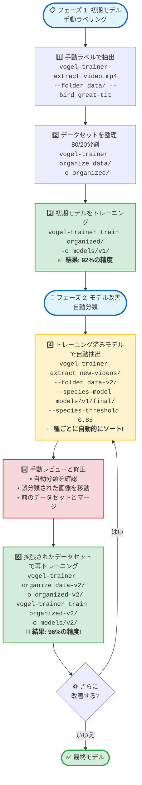

# 🐦 Vogel Model Trainer

**言語:** [🇬🇧 English](README.md) | [🇩🇪 Deutsch](README.de.md) | [🇯🇵 日本語](README.ja.md)

<p align="left">
  <a href="https://pypi.org/project/vogel-model-trainer/"></a>
  <a href="https://pypi.org/project/vogel-model-trainer/"></a>
  <a href="https://opensource.org/licenses/MIT"></a>
  <a href="https://pypi.org/project/vogel-model-trainer/"></a>
  <a href="https://pepy.tech/project/vogel-model-trainer"></a>
</p>

**YOLOv8とEfficientNetを使用して、独自の動画映像からカスタム鳥種分類器をトレーニング。**

特定の監視設定に合わせた高精度な鳥種分類器を作成するための専門ツールキット。動画からトレーニングデータを抽出し、データセットを整理し、96%以上の精度でカスタムモデルをトレーニングします。

---

## ✨ 機能

- 🎯 **YOLOベースの鳥検出** - YOLOv8を使用した動画からの自動鳥切り出し
- 🤖 **3つの抽出モード** - 手動ラベリング、自動ソート、または標準抽出
- 📁 **ワイルドカード対応** - グロブパターンで複数の動画をバッチ処理
- 🖼️ **224x224への自動リサイズ** - トレーニングに最適な画像サイズ
- 🧠 **EfficientNet-B0トレーニング** - 軽量かつ強力な分類モデル
- 🎨 **拡張データ拡張** - 回転、アフィン変換、カラージッター、ガウシアンブラー
- 📊 **最適化されたトレーニング** - コサインLRスケジューリング、ラベルスムージング、早期停止
- ⏸️ **グレースフルシャットダウン** - Ctrl+Cでモデル状態を保存
- 🔄 **反復トレーニング** - トレーニング済みモデルを使用してデータセットを拡張
- 📈 **種ごとの指標** - 種ごとの詳細な精度の内訳

---

## 🚀 クイックスタート

### インストール

#### 推奨: 仮想環境を使用

```bash
# 仮想環境を作成
python3 -m venv venv

# 仮想環境を有効化
source venv/bin/activate  # Linux/Macの場合
# または
venv\Scripts\activate     # Windowsの場合

# vogel-model-trainerをインストール
pip install vogel-model-trainer
```

#### クイックインストール

```bash
# PyPIからインストール
pip install vogel-model-trainer

# またはソースからインストール
git clone https://github.com/kamera-linux/vogel-model-trainer.git
cd vogel-model-trainer
pip install -e .
```

### 基本的なワークフロー

```bash
# 1. 動画から鳥の画像を抽出
vogel-trainer extract video.mp4 --folder ~/training-data/ --bird kohlmeise

# 2. トレーニング/検証分割に整理
vogel-trainer organize ~/training-data/ -o ~/organized-data/

# 3. カスタム分類器をトレーニング
vogel-trainer train ~/organized-data/ -o ~/models/my-classifier/

# 4. トレーニング済みモデルをテスト
vogel-trainer test ~/models/my-classifier/ -d ~/organized-data/
```

---

## 📖 使用ガイド

### ライブラリとして使用（v0.1.2の新機能）

すべてのコア機能をPythonコードでプログラム的に使用できるようになりました:

```python
from vogel_model_trainer.core import extractor, organizer, trainer, tester

# 動画から鳥を抽出
extractor.extract_birds_from_video(
    video_path="video.mp4",
    output_dir="output/",
    bird_species="great-tit",
    detection_model="yolov8n.pt",
    species_model=None,
    threshold=0.5,
    sample_rate=3,
    resize_to_target=True
)

# トレーニング/検証分割に整理
organizer.organize_dataset(
    source_dir="output/",
    output_dir="dataset/",
    train_ratio=0.8
)

# モデルをトレーニング
trainer.train_model(
    data_dir="dataset/",
    output_dir="models/",
    model_name="google/efficientnet-b0",
    batch_size=16,
    num_epochs=50,
    learning_rate=3e-4
)

# モデルをテスト
results = tester.test_model(
    model_path="models/bird_classifier/",
    data_dir="dataset/"
)
print(f"精度: {results['accuracy']:.2%}")
```

### 1. トレーニング画像の抽出

#### 手動モード（初期収集に推奨）

動画内の種がわかっている場合:

```bash
vogel-trainer extract ~/Videos/great-tit.mp4 \
  --folder ~/training-data/ \
  --bird great-tit \
  --threshold 0.5 \
  --sample-rate 3
```

#### 自動ソートモード（反復トレーニング用）

既存のモデルを使用して自動分類とソート:

```bash
vogel-trainer extract ~/Videos/mixed.mp4 \
  --folder ~/training-data/ \
  --species-model ~/models/classifier/final/ \
  --threshold 0.5
```

#### ワイルドカードでのバッチ処理

```bash
# ディレクトリ内のすべての動画を処理
vogel-trainer extract "~/Videos/*.mp4" --folder ~/data/ --bird blue-tit

# 再帰的なディレクトリ検索
vogel-trainer extract ~/Videos/ \
  --folder ~/data/ \
  --bird amsel \
  --recursive
```

**パラメータ:**
- `--folder`: 抽出された画像のベースディレクトリ（必須）
- `--bird`: 手動種ラベル（サブディレクトリを作成）
- `--species-model`: 自動分類用のトレーニング済みモデルへのパス
- `--threshold`: YOLO信頼度しきい値（デフォルト: 0.5）
- `--sample-rate`: N番目のフレームごとに処理（デフォルト: 3）
- `--detection-model`: YOLOモデルパス（デフォルト: yolov8n.pt）
- `--no-resize`: 元の画像サイズを保持（デフォルト: 224x224にリサイズ）
- `--recursive, -r`: ディレクトリを再帰的に検索

### 2. データセットの整理

```bash
vogel-trainer organize ~/training-data/ -o ~/organized-data/
```

80/20のトレーニング/検証分割を作成:
```
organized/
├── train/
│   ├── great-tit/
│   ├── blue-tit/
│   └── robin/
└── val/
    ├── great-tit/
    ├── blue-tit/
    └── robin/
```

### 3. 分類器のトレーニング

```bash
vogel-trainer train ~/organized-data/ -o ~/models/my-classifier/
```

**トレーニング設定:**
- ベースモデル: `google/efficientnet-b0` (850万パラメータ)
- オプティマイザー: コサインLRスケジュールを使用したAdamW
- 拡張: 回転、アフィン、カラージッター、ガウシアンブラー
- 正則化: 重み減衰0.01、ラベルスムージング0.1
- 早期停止: 7エポックの忍耐

**出力:**
```
~/models/my-classifier/
├── checkpoints/     # 中間チェックポイント
├── logs/           # TensorBoardログ
└── final/          # 最終トレーニング済みモデル
    ├── config.json
    ├── model.safetensors
    └── preprocessor_config.json
```

### 4. モデルのテスト

```bash
# 検証データセットでテスト
vogel-trainer test ~/models/my-classifier/ -d ~/organized-data/

# 出力:
# 🧪 検証セットでモデルをテスト中...
# 📊 精度: 96.5%
#
# 種ごとの結果:
#   great-tit: 98.2%
#   blue-tit:  95.7%
#   robin:     95.8%
```

---

## 🔄 反復トレーニングワークフロー

自動分類を使用した反復的な改善でモデルの精度を向上させます：



**主なメリット:**
- 🚀 **高速ラベリング**: 自動分類で手動作業を削減
- 📈 **精度向上**: より多くのトレーニングデータ = より良いモデル
- 🎯 **品質管理**: `--species-threshold`で不確実な予測をフィルタリング
- 🔄 **継続的改善**: 各反復でモデルが改善

**コマンド例:**

```bash
# フェーズ 1: 手動トレーニング（初期データセット）
vogel-trainer extract ~/Videos/batch1/*.mp4 --folder ~/data/ --bird great-tit
vogel-trainer organize ~/data/ -o ~/data/organized/
vogel-trainer train ~/data/organized/ -o ~/models/v1/

# フェーズ 2: トレーニング済みモデルで自動分類
vogel-trainer extract ~/Videos/batch2/*.mp4 \
  --folder ~/data-v2/ \
  --species-model ~/models/v1/final/ \
  --species-threshold 0.85

# ~/data-v2/<species>/フォルダ内の分類を確認
# 誤分類された画像を正しい種のフォルダに移動

# データセットをマージして再トレーニング
cp -r ~/data-v2/* ~/data/
vogel-trainer organize ~/data/ -o ~/data/organized-v2/
vogel-trainer train ~/data/organized-v2/ -o ~/models/v2/
```

---

## 🎯 使用例

### 例 1: 単一種のデータセット作成

```bash
# ステップ 1: シジュウカラの動画を収集
vogel-trainer extract ~/Videos/great-tit-*.mp4 \
  --folder ~/data/birds/ \
  --bird great-tit

# ステップ 2: データセットを整理
vogel-trainer organize ~/data/birds/ -o ~/data/organized/

# ステップ 3: モデルをトレーニング
vogel-trainer train ~/data/organized/ -o ~/models/tit-classifier/
```

### 例 2: トレーニング済みモデルでデータセットを拡張

```bash
# 既存のモデルを使用して新しい動画から自動的にソート
vogel-trainer extract ~/Videos/new-footage-*.mp4 \
  --folder ~/data/expanded/ \
  --species-model ~/models/tit-classifier/final/

# 手動で不正確な分類を確認して修正
# ... 画像を手動で整理 ...

# 拡張されたデータセットで再トレーニング
vogel-trainer organize ~/data/expanded/ -o ~/data/organized-v2/
vogel-trainer train ~/data/organized-v2/ -o ~/models/tit-classifier-v2/
```

### 例 3: 複数種の分類器

```bash
# 各種の動画を収集
vogel-trainer extract ~/Videos/great-tit/ --folder ~/data/ --bird great-tit --recursive
vogel-trainer extract ~/Videos/blue-tit/ --folder ~/data/ --bird blue-tit --recursive
vogel-trainer extract ~/Videos/robin/ --folder ~/data/ --bird robin --recursive

# データセットを整理してトレーニング
vogel-trainer organize ~/data/ -o ~/data/organized/
vogel-trainer train ~/data/organized/ -o ~/models/multi-species/
```

---

## 💡 ヒントとベストプラクティス

### データ収集

- 📹 **多様な照明条件** - さまざまな時間帯と天候で動画を収集
- 🎬 **複数のカメラ角度** - さまざまな視点から
- 🐦 **種ごとに200+画像** - より高い精度のため
- 🎯 **品質重視** - `--threshold 0.5`以上を使用
- 📊 **バランスの取れたデータセット** - 各種でほぼ同じ数の画像

### トレーニング

- 🔄 **反復アプローチ** - 小規模から始めて、モデルを使用して拡張
- 📈 **早期停止を監視** - 過学習を避ける
- 💾 **チェックポイントを保持** - 最高のエポックに戻る
- 🎨 **データ拡張** - デフォルトの拡張で十分
- ⚡ **GPU推奨** - Raspberry Pi 5はトレーニングに対応していますが遅い

### テスト

- ✅ **検証セット** - データの20%をトレーニングしないでおく
- 🎯 **種ごとの指標を確認** - 弱い種を特定
- 📊 **混同種** - 類似種にはより多くのトレーニングデータが必要
- 🔍 **誤分類を検査** - 共通のエラーパターンを学ぶ

---

## 🏗️ 技術スタック

- **検出**: YOLOv8n (Ultralytics)
- **分類**: EfficientNet-B0 (Hugging Face Transformers)
- **トレーニング**: PyTorch + Accelerate
- **データ処理**: OpenCV, PIL, NumPy
- **CLI**: argparse

---

## 📊 パフォーマンス

| 指標 | Raspberry Pi 5 | 標準PC (GPU) |
|------|-----------------|--------------|
| 抽出速度 | ~5-10 FPS | ~30-60 FPS |
| トレーニング時間 | ~3-4時間 (500画像) | ~20-30分 |
| モデル精度 | >96% | >96% |
| モデルサイズ | ~17MB | ~17MB |

---

## 🐛 既知の問題

- 手動ラベリングモードは未実装（標準抽出+手動ソートを使用）
- 自動ソートモードは未実装（標準抽出+手動ソートを使用）
- GUIインターフェースなし（CLIのみ）

---

## 🔮 今後の計画

- 抽出中のインタラクティブな手動ラベリング
- 事前トレーニング済みモデルを使用した自動種ソート
- 追加のモデルアーキテクチャのサポート
- リアルタイムトレーニング監視ダッシュボード
- データセット拡張プリセット
- 組み込みデバイス向けモデル最適化

---

## 🤝 コントリビューション

コントリビューションを歓迎します！[CONTRIBUTING.md](CONTRIBUTING.md)をご覧ください。

---

## 🔒 セキュリティ

セキュリティ脆弱性を発見した場合は、[SECURITY.md](SECURITY.md)をご覧ください。

---

## 📄 ライセンス

このプロジェクトはMITライセンスの下でライセンスされています - 詳細は[LICENSE](LICENSE)ファイルをご覧ください。

---

## 🙏 謝辞

- **Ultralytics** - 優れたYOLOv8実装
- **Hugging Face** - Transformersライブラリ
- **PyTorchチーム** - ディープラーニングフレームワーク
- **コントリビューター** - このプロジェクトのテストと改善に協力してくれたすべての人に感謝します！

---

## 📞 サポート

- 🐛 **バグレポート**: [Issues](https://github.com/kamera-linux/vogel-model-trainer/issues)
- 💬 **ディスカッション**: [Discussions](https://github.com/kamera-linux/vogel-model-trainer/discussions)
-  **ドキュメント**: [README.md](README.md)

---

**Happy Training! 🐦🎉**
