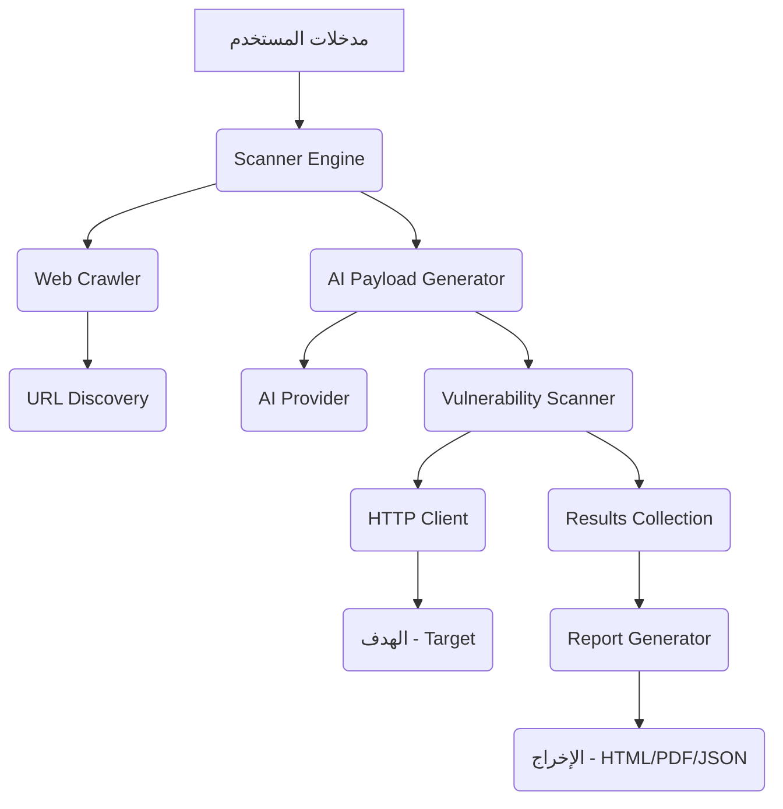

# Vulnmap: أداة فحص ورسم خرائط الثغرات الأمنية المدعومة بالذكاء الاصطناعي

**Vulnmap** هي أداة متقدمة لاختبار الاختراق (Penetration Testing) مدعومة بالذكاء الاصطناعي، مصممة لأتمتة عملية فحص الثغرات الأمنية ورسم خرائط الشبكات. تستغل الأداة قوة نماذج اللغة الكبيرة (LLMs) لتعزيز توليد الحمولة (Payload Generation)، وتحليل الاستجابات، ورفع كفاءة الفحص بشكل عام.

## الميزات الرئيسية

*   **فحص بمساعدة الذكاء الاصطناعي:** تستخدم نماذج اللغة الكبيرة لتوليد حمولات ذكية وتحليل الثغرات المعقدة.
*   **استطلاع شامل (Reconnaissance):** تتضمن وحدات لجمع معلومات النطاق، وكشف التقنيات، ورسم الخرائط الأولية.
*   **تصميم معياري (Modular Design):** سهولة التوسع بإضافة فحوصات ثغرات جديدة ومزودي ذكاء اصطناعي.
*   **تقارير مفصلة:** توليد تقارير واضحة وقابلة للتنفيذ (HTML, PDF).
*   **قابلية التكوين:** قابلة للتخصيص بدرجة عالية عبر ملف `config/config.yaml`.

## التثبيت

بما أن Vulnmap متوفرة كحزمة Python، يمكنك تثبيتها مباشرة باستخدام `pip`:

```bash
pip install vulnmap
```

### المتطلبات الأساسية

*   Python 3.8 أو أعلى.
*   مفتاح API صالح لمزود ذكاء اصطناعي (مثل Gemini أو OpenAI) يتم تكوينه في `config/config.yaml`.

## دليل البدء السريع (Quickstart Guide)

### 1. التكوين

ملف التكوين الرئيسي هو `config/config.yaml`. بعد التثبيت عبر `pip`، يجب عليك أولاً نسخ ملف التكوين الافتراضي من مجلد الحزمة إلى مجلد العمل الحالي وتسميته `config.yaml`، ثم تعديله لتعيين مفتاح API الخاص بمزود الذكاء الاصطناعي وتحديد معلمات الفحص.

**خطوات نسخ ملف التكوين:**

1.  **تحديد مسار تثبيت الحزمة:**
    ```bash
    python -c "import vulnmap; import os; print(os.path.dirname(vulnmap.__file__))"
    ```
2.  **نسخ الملف:**
    بافتراض أن الأمر أعلاه أعطاك المسار `/path/to/vulnmap/`، قم بتنفيذ:
    ```bash
    cp /path/to/vulnmap/config/config.example.yaml ./config.yaml
    ```
3.  **تعديل `config.yaml`** لتعيين مفاتيح API الخاصة بك.

**مثال على مقتطف التكوين (AI Providers):**

| المزود | التفعيل | مفتاح API | النموذج |
| :--- | :--- | :--- | :--- |
| **OpenAI** | `enabled: true` | `sk-your-key-here` | `gpt-4o` |
| **Claude** | `enabled: true` | `sk-ant-your-key-here` | `claude-3-5-sonnet-20241022` |
| **Gemini** | `enabled: true` | `AIzaSy-your-key-here` | `gemini-2.5-flash` |
| **OLLAMA** | `enabled: true` | `base_url: http://localhost:11434` | `llama2` |

### 2. تشغيل الفحص

يمكنك تشغيل Vulnmap باستخدام واجهة سطر الأوامر (CLI).

| الخيار | الوصف | مثال |
| :--- | :--- | :--- |
| `-u, --url` | عنوان URL المستهدف | `-u https://example.com` |
| `-d, --depth` | عمق الزحف (Crawl depth) | `-d 3` |
| `-t, --threads` | عدد الخيوط المتزامنة | `-t 10` |
| `--ai-provider` | مزود الذكاء الاصطناعي المراد استخدامه | `--ai-provider openai` |
| `--recon` | تفعيل وحدات الاستطلاع | `--recon` |
| `--full-scan` | تفعيل جميع الاختبارات | `--full-scan` |
| `-o, --output` | ملف الإخراج | `-o report.pdf` |

**أمثلة على أوامر التشغيل:**

```bash
# فحص أساسي
vulnmap -u https://your-target-website.com

# فحص شامل مع تقرير PDF
vulnmap -u https://testsite.com --recon --full-scan --format pdf -o full_report.pdf

# استخدام مزود AI محدد
vulnmap -u https://testsite.com --ai-provider claude --full-scan
```

---

## نظرة عامة على هيكلية Vulnmap (Architecture Overview)

تم تصميم Vulnmap بهيكلية معيارية وقابلة للتوسع، تركز على فصل الاهتمامات وقابلية التمديد.

### المكونات الأساسية

1.  **`vulnmap.py` (نقطة الدخول الرئيسية):**
    *   يتعامل مع تحليل وسائط سطر الأوامر.
    *   يحمل التكوين ويهيئ محرك الفحص ومدير مزودي الذكاء الاصطناعي.
    *   ينسق عملية الفحص الرئيسية (الاستطلاع، الزحف، الفحص).

2.  **`core/` (المنطق الأساسي):**
    *   **`scanner_engine.py`:** قلب التطبيق. يدير سير عمل الفحص، بما في ذلك الزحف وتفويض فحوصات الثغرات.
    *   **`vulnerability_scanner.py`:** يحتوي على منطق فحوصات الثغرات المحددة (مثل SQLi، XSS). يتفاعل مع `AIProviderManager` لتوليد الحمولة وتحليلها بمساعدة الذكاء الاصطناعي.
    *   **`report_generator.py`:** مسؤول عن تجميع نتائج الفحص في تقارير نهائية (HTML، PDF).

3.  **`ai_providers/` (تكامل الذكاء الاصطناعي):**
    *   **`provider_manager.py`:** يدير الاتصالات بخدمات الذكاء الاصطناعي المختلفة (Gemini، OpenAI، Claude، Grok، Ollama). يقوم بتجريد استدعاءات API للسماح للمحرك الأساسي بطلب المساعدة من الذكاء الاصطناعي دون معرفة تفاصيل المزود.

4.  **`utils/` (الأدوات المساعدة):**
    *   **`config_loader.py`:** يتعامل مع تحميل والتحقق من صحة `config.yaml`.
    *   **`http_client.py`:** غلاف حول مكتبة `requests` يوفر إدارة الجلسات ومنطق إعادة المحاولة ودعم الوكيل (Proxy).
    *   **`logger.py`:** أداة تسجيل مركزية.
    *   **`parser.py`:** أدوات مساعدة لتطبيع عناوين URL، واستخراج الروابط، وتحليل الاستجابات.

### تدفق البيانات (Data Flow)



### نظرة على بنية المجلدات

```
Vulnmap/
│
├── vulnmap.py                 # نقطة الدخول الرئيسية
├── setup.py                   # إعداد التثبيت
├── requirements.txt           # تبعيات Python
├── README.md                  # وثائق المشروع
├── core/                      # الوظائف الأساسية
├── ai_providers/              # تكامل مزودي الذكاء الاصطناعي
├── modules/                   # وحدات اختبار الأمان (مثل الاستطلاع)
├── utils/                     # وظائف مساعدة
├── config/                    # ملفات التكوين
├── templates/                 # قوالب التقارير
└── reports/                   # التقارير المولدة
```

## اطلع على المستودع

للمساهمة، الإبلاغ عن الأخطاء، أو الاطلاع على شفرة المصدر:
[https://github.com/AL-MARID/Vulnmap](https://github.com/AL-MARID/Vulnmap)

## ملاحظة أمنية هامة

⚠️ **هام**: استخدم Vulnmap فقط على الأنظمة التي تمتلكها أو لديك إذن صريح باختبارها. اختبار الأمان غير المصرح به غير قانوني.
