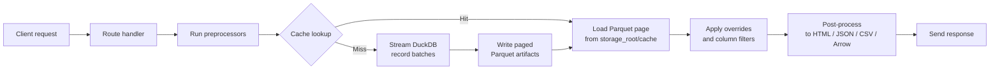

# webbed_duck

## What is webbed_duck?

`webbed_duck` is a self-contained data server that turns declarative TOML + SQL route definitions into live DuckDB-backed web endpoints.

- Each route lives in `routes_src/` as a `<stem>.toml` metadata file paired with a `<stem>.sql` query (with optional `<stem>.md` documentation). The TOML + SQL sidecar pair is the single source of truth for a route.
- The compiler translates those sources into executable Python modules and registers them as HTTP endpoints.
- The runtime ships the results as styled HTML tables or cards, JSON payloads, CSV and Parquet downloads, or Arrow streams—no custom FastAPI or Flask code required.
- Drop TOML/SQL pairs into a folder, run the bundled CLI, and immediately browse or export the data surfaces.
- Designed for operational, quality, and manufacturing review workflows where trustworthy tables with traceability matter more than bespoke UI code.

## Quick start

1. **Install the package and dependencies.**
   ```bash
   pip install webbed-duck
   ```

2. **Create your route source directory** (default is `routes_src/`) and add paired route files (see [Authoring a route](#authoring-a-route)). Each route needs `<stem>.toml` for metadata and `<stem>.sql` for the query. Add `<stem>.md` when you want extra documentation. The repository ships `routes_src/hello.toml` + `hello.sql` as a living example of the canonical layout so new contributors have a starting point for the sidecar format.

   > **Legacy `.sql.md` files:** Convert each legacy file into a TOML/SQL pair once (for example, copy the metadata into `<stem>.toml` and the query body into `<stem>.sql`). After that conversion, edit only the TOML/SQL pair—the old markdown stub can be deleted or ignored.

3. **Compile the contracts into runnable manifests (optional when auto-compile is enabled).**
   ```bash
   webbed-duck compile --source routes_src --build routes_build
   ```

4. **Launch the server.** The CLI compiles using your configuration defaults and can hot-reload routes while you edit them.
   ```bash
   webbed-duck serve --config config.toml --watch
   ```
   - `--watch` keeps the compiler running and reloads routes in-place when `.toml`, `.sql`, or `.md` files change.
   - Pass `--no-auto-compile` to serve pre-built `routes_build/` artifacts without touching the source tree.
- Watching performs filesystem polls once per second by default; disable it (or raise `server.watch_interval`) if you run on slower hardware where constant polling is undesirable.
- The watch interval is clamped to a minimum of 0.2 seconds at runtime so accidental `--watch-interval 0` or extremely small values do not spin a tight loop.
   - File watching relies on timestamp and size fingerprints of matching route files, so ensure your editor writes changes to disk (saving partial files can trigger reload attempts). Network or synced file systems that coalesce timestamp updates may require a longer `watch_interval`.
   - The `webbed-duck perf` helper expects compiled routes in the build directory, uses PyArrow tables to compute latency statistics, and accepts repeated `--param name=value` overrides for the target route.

> **FastAPI runtime dependency:** The published wheel already includes `fastapi` and `uvicorn`. Treat them as core requirements for both development and production—removing them is only safe if you intentionally vendor `webbed_duck` inside another ASGI host and accept skipped HTTP coverage during tests. The pseudo-auth login endpoints and share workflows depend on FastAPI's request parsing, so uninstalling the web stack disables those flows entirely.

> **Testing note:** The integration tests exercise the FastAPI stack via `fastapi.testclient`. When you purposefully uninstall the server stack (for example, in a trimmed-down tooling image) those tests will skip and coverage drops for auth, overlays, and caching flows. Reinstall `fastapi` and `uvicorn` whenever you need full confidence in HTTP behaviour, especially before tagging a release.

5. **Browse the routes.** Open `http://127.0.0.1:8000/hello` (or your route path) in a browser, or request alternate formats with `?format=csv`, `?format=parquet`, etc.

### Project structure

```
webbed_duck/
  core/            # compiler, executor, cache (no web)
  server/          # FastAPI & HTTP semantics
  plugins/         # adapters (charts, email, assets, auth, storage)
  routes_src/      # <stem>.toml + <stem>.sql (+ <stem>.md)
  routes_build/    # compiled artifacts imported in prod
  tests/           # unit, property, snapshot, integration
  perf/            # micro-benchmarks
```

### Quality gates (what CI runs)

- `ruff` — fast linting and import hygiene ([docs](https://docs.astral.sh/ruff/)).
- `mypy --strict webbed_duck/core/**` — enforce types in core; gradually tighten elsewhere ([docs](https://mypy.readthedocs.io/en/stable/getting_started.html)).
- `pytest` — unit/integration/snapshot/property suites (Hypothesis included).
- `pytest-benchmark` — guardrails on cache hits and Parquet throughput ([docs](https://pytest-benchmark.readthedocs.io/)).
- `vulture` — remove dead code before it rots ([repo](https://github.com/jendrikseipp/vulture)).
- `radon` — monitor cyclomatic complexity budgets ([docs](https://radon.readthedocs.io/)).
- `bandit` — static security checks across server/adapters ([docs](https://bandit.readthedocs.io/)).

## How it works today (v0.4)

### Runtime startup

- `webbed-duck serve` loads configuration from `config.toml` (defaults to host `127.0.0.1`, port `8000`, storage under `./storage`) and resolves `server.source_dir` / `server.build_dir`.
- With `server.auto_compile = true` (the default) the CLI compiles every `<stem>.toml` + `<stem>.sql` pair in the configured source directory before starting Uvicorn.
- Enabling watch mode (`server.watch = true` or the `--watch` flag) keeps a background poller running so route edits trigger re-compilation and live reloading without restarting the process.
- Combine `server.watch = true` with a sensible `server.watch_interval` (defaults to `1.0` seconds) to balance responsiveness and CPU usage.
- The server is a FastAPI application exposed via Uvicorn. No additional framework integration is necessary for development deployments.

### Route discovery and mapping

- The compiler scans the source tree for `<stem>.toml` files and requires a sibling `<stem>.sql`. Optional `<stem>.md` prose is bundled alongside the SQL body.
- Each TOML file carries the metadata that previously lived in frontmatter: route `id`, HTTP `path`, optional `version`, formats, `[params]`, `[cache]`, preprocessors, postprocessors, and display metadata. New fields such as `cache_mode`, `returns`, and declarative `[[uses]]` dependencies control execution and composition.
- Compiled artifacts are written to the `--build` directory, mirroring the source folder structure but with `.py` files. These contain serialised `ROUTE` dictionaries consumed at runtime.
- At boot—and after each live reload triggered by the watcher—the server imports every compiled module and registers the route path on the FastAPI app. The `id` doubles as the logical identifier for `/routes/{id}` helper endpoints.

### Parameter binding

- Parameters are declared under `[params]` in the TOML file. Each entry can be a table (with `type`, `required`, `default`, `description`, and extra metadata) or a string shorthand when you only need to annotate the DuckDB type.
- Within the SQL body, use `$name` placeholders to bind DuckDB parameters. Parameters declared with `template_only = true` render via `{{ name }}` before query execution, letting you safely interpolate identifiers and literals without exposing them to the database engine.
- At request time the runtime reads query string values, validates types (including boolean coercion for `true`/`false`, `1`/`0`), applies defaults, and rejects missing required parameters. Ephemeral controls like pagination and sorting stay out of `[params]` and are applied after the core relation is resolved.
- Additional runtime controls:
  - `?limit=` and `?offset=` apply post-query pagination without changing the SQL.
  - `?column=` can be repeated to restrict returned columns.

### Route dependencies and execution modes

- `cache_mode` in the TOML metadata (`materialize`, `passthrough`, or `force_live`) governs how the executor interacts with cached parquet artifacts when serving HTTP requests or answering internal calls.
- `returns` declares the default return style for internal callers: `relation` (Arrow table), `parquet` (materialized artifact), or `error_frame` (schema-compatible error payload).
- Each `[[uses]]` block defines an upstream dependency with an `alias`, the downstream route to `call`, an execution `mode` (`relation` or `parquet_path`), and an `[uses.args]` table for pass-through, renamed, or literal parameters. The executor resolves these dependencies before your SQL runs and registers them under the provided alias.
- When `mode = "parquet_path"`, the executor materializes the upstream route (using its cache settings) and exposes a DuckDB view built from the parquet paths, enabling composable, cache-aware joins without additional Python code.

### Incremental catch-up jobs

- `webbed_duck.core.incremental.run_incremental` iterates over a date range and records the last successful cursor value inside `storage_root/runtime/checkpoints.duckdb`. Subsequent runs only execute dates newer than the recorded checkpoint so you can schedule the helper daily without re-reading historical data.
- When the underlying route raises an error the checkpoint is left unchanged, ensuring the same date is retried on the next invocation after you address the failure.
- Pass a custom callable via the `runner` parameter when you need to wrap `run_route` (for example to inject observability) while keeping the checkpoint and pagination logic intact.

### Request lifecycle and paged caches



- Cache settings come from the `[cache]` table in each route's TOML metadata merged with the global `[cache]` section in `config.toml`.
- Routes must declare `cache.order_by` with one or more result columns; cache population validates the schema and every cache hit
  (including superset/shard reuse) re-sorts combined pages on those columns before applying offsets.
- The executor snaps requested offsets to cache-friendly pages when a route enforces a `rows_per_page` limit, ensuring subsequent requests reuse the same Parquet artifacts.
- Cache hits skip DuckDB entirely and hydrate the response from on-disk Parquet pages while still applying overrides, analytics, and post-processing.
- Transformation-invariant filters can be declared under `[cache.invariant_filters]` (with `param`, `column`, optional `separator`, and `case_insensitive` flags). The cache stores per-value page maps so a superset result can satisfy filtered requests, and disjoint shards (e.g., `product_code=widget` and `product_code=gadget`) can be combined when clients request multiple values within the cache TTL. When `case_insensitive = true`, both cached tokens and runtime filters are normalised to lowercase so callers may supply any casing without triggering a cache miss.
  - To request cached rows where an invariant column is `NULL`, submit the parameter with the literal token `__null__` (the UI’s `(null)` option emits this value); leaving the field blank still means “all values”.
  > **Testing reminder:** Install DuckDB, PyArrow, FastAPI, and Uvicorn before running the pytest suite so cache and HTTP coverage execute instead of skipping.

### Supported outputs

All of the following formats work today, provided the route either allows them explicitly or leaves `allowed_formats` empty (which enables everything):

| Format query       | Response                                                  |
| ------------------ | --------------------------------------------------------- |
| default / `?format=json` | JSON payload with metadata, columns, rows, and latency. |
| `?format=table`    | JSON structured identically to `json` (for compatibility). |
| `?format=html_t`   | Styled HTML table view with optional chart annotations.    |
| `?format=html_c`   | Card-style HTML view honouring `[html_c]` metadata.        |
| `?format=feed`     | Feed-style HTML view for narrative updates.               |
| `?format=chart_js` | Chart.js-ready HTML with optional `?embed=1` snippets.    |
| `?format=csv`      | Streaming CSV download with `text/csv` content type.      |
| `?format=parquet`  | Parquet file stream generated via Apache Arrow.           |
| `?format=arrow`    | Arrow IPC stream for programmatic consumers.              |
| `?format=arrow_rpc`| Arrow IPC stream with pagination headers.                 |

Routes may set `default_format` in TOML to choose the response when `?format` is omitted.

Arrow RPC endpoints mirror `x-total-rows`, `x-offset`, and `x-limit` headers, and every HTML view exposes a “Download this slice (Arrow)” link for parity.

`?format=chart_js` renders every `[[charts]]` specification as a Chart.js canvas. The server vendors Chart.js into `storage_root/static/vendor/chartjs/` on first run and serves it from `/vendor/chart.umd.min.js?v=4.4.3`, falling back to the CDN source only if the vendored copy cannot be prepared. The Python package ships with Chart.js 4.4.3 under `webbed_duck/static/chartjs/chart.umd.min.js`, so projects with read-only storage can still serve the script directly from site-packages. Override the script URL (and layout details like `canvas_height`) via `[chart_js]` metadata or `@postprocess chart_js` overrides. When you need to set a global default for every route, declare `[ui] chartjs_source = "https://cdn.example.com/chart.umd.min.js"` in `config.toml`. Provide your own build by dropping a `chart.umd.min.js` into that directory (or set `WEBDUCK_SKIP_CHARTJS_DOWNLOAD=1` to skip the automatic fetch). Air-gapped environments **must** pre-populate that folder (or mount it read-only with the asset in place); otherwise the runtime will return a 404 for `/vendor/chart.umd.min.js` and continue referencing the CDN fallback.
Append `?embed=1` to receive a snippet that includes the vendor `<script src="…chart.umd.min.js">`, the rendered `<div class='wd-chart-grid'>…</div>` markup, and a `<script type="module" src="/assets/wd/chart_boot.js?v=VERSION">` loader without the surrounding `<html>` wrapper.
The snippet ships the vendor Chart.js tag and the `/assets/wd/chart_boot.js` module so dropping it into another page still boots every `<canvas data-wd-chart>` element once Chart.js is ready.

### UI rendering architecture and progressive enhancement

The HTML layer now follows a strict separation between server-rendered structure, declarative metadata, and progressive enhancement:

- `webbed_duck/server/ui/layout.py` assembles the outer `<html>` shell and is the only module that emits `<link rel="stylesheet">` or `<script src="…">` tags. It accepts pre-rendered fragments for the top banners, summary text, filters, and the main content blocks.
- View modules under `webbed_duck/server/ui/views/` (`table.py`, `cards.py`, `feed.py`, `charts.py`) produce scrollable tables, card grids, feeds, and chart canvases without inline JavaScript.
- Widget modules under `webbed_duck/server/ui/widgets/` (`params.py`, `multi_select.py`) render the filter form, the hidden pagination inputs, and the accessible multi-select control that syncs with submitted query parameters.
- Support modules under `webbed_duck/server/ui/` handle shared logic (`invariants.py`, `pagination.py`, `rpc.py`, and `charts.py` for Chart.js configuration validation) so renderers stay thin and testable.

Static assets live in `webbed_duck/static/assets/wd/` and mirror those widgets:

- `layout.css`, `params.css`, `multi_select.css`, `table.css`, `cards.css`, `feed.css`, and `charts.css` style the layout, filters, and data surfaces.
- `progress.js`, `header.js`, `params_form.js`, `multi_select.js`, and `chart_boot.js` attach behavior to `[data-wd-*]` attributes without altering the server-rendered markup. For example, `progress.js` animates the inline progress bar during the initial page load and whenever filters submit; `header.js` manages sticky-header offsets; `multi_select.js` enhances `<select multiple>` controls; and `chart_boot.js` reads `<canvas data-wd-chart>` elements and their JSON config blocks. `table_header.js` keeps the mini header in sync with the real `<thead>` when it scrolls out of view.

Compiled routes declare the assets they require via a `[ui]` section. The metadata supports `widgets`, `styles`, and `scripts` arrays, which the server merges with renderer defaults and resolves through `resolve_assets`:

```toml
[ui]
widgets = ["header", "params", "multi_select"]
styles  = ["layout", "params", "table"]
scripts = ["header", "multi_select", "chart_boot"]
```

`resolve_assets` keeps the canonical ordering for built-in CSS and JavaScript so layout scaffolding loads before table/card overrides, while preserving the relative position of custom asset names. List a bespoke stylesheet ahead of `cards` (for example) to have it load before the built-in cards styles, and rely on renderer-supplied `extra_scripts`/`extra_styles` to append required modules without duplicating metadata in every route. `render_layout` de-duplicates requests, appends `?v={package_version}` query parameters for cache busting, and only emits the `<link>` and `<script type="module">` tags needed for the current page. Static URLs are stable, so front-end plugins can be cached aggressively.

Progressive enhancement remains optional: all pages function when JavaScript is disabled. The params form still posts via GET, the multi-select widget submits real `<select multiple>` values, tables/feeds/cards remain fully server-rendered, and Arrow download links behave like normal anchors. JavaScript enhances the experience when available but never replaces the server-side SSR flow.

### UI testing strategy

- Python unit tests exercise the renderers directly (see `tests/test_postprocess.py`), asserting structure such as the table mini header placeholder, hidden pagination inputs, `<script type="application/json">` chart configs, and asset resolution.
- Front-end plugins are written as modules that expose small `init*` helpers so they can be tested with DOM stubs. Keep those unit tests close to the asset sources to guard regressions in multi-select syncing, header offsets, mini-header visibility, and chart bootstrapping.
- End-to-end and visual verification should be automated with a browser automation framework such as [Playwright](https://playwright.dev/?utm_source=chatgpt.com) or [Cypress](https://testsigma.com/tools/open-source-testing-tools/?utm_source=chatgpt.com). Include scenarios for header collapse/expand behavior, the table mini header on scroll, multi-select open/close/filter flows, card grid responsiveness, and chart canvas bootstrapping. Pair those runs with a visual regression tool like [Galen Framework](https://en.wikipedia.org/wiki/Galen_Framework?utm_source=chatgpt.com) to catch layout drift across browsers and screen sizes.
- Front-end unit tests live in `frontend_tests/` and run with `npm test`. They exercise the theme toggle, multi-select widget, Chart.js boot loader, and CSS tokens described in [`docs/frontend_testing.md`](docs/frontend_testing.md).
- Run both suites together (`pytest && npm test`) before shipping UI changes so Python renderers, generated HTML, JavaScript, and CSS stay aligned.

### Data sources and execution model

- Every cache miss opens a fresh DuckDB connection, streams the prepared SQL with bound parameters, materialises Parquet pages under `storage_root/cache/<route>/<hash>/`, and then closes the connection.
- Cache hits reuse those Parquet pages (validated against the route signature and TTL) without touching DuckDB, so most requests read only the slice they need from disk.
- You can query DuckDB-native sources such as Parquet, CSV, or Iceberg directly inside the SQL (`SELECT * FROM read_parquet('data/orders.parquet')`).
- For derived inputs, register preprocessors in the TOML metadata to inject computed parameters (e.g., resolve the latest production date) before SQL execution.
- After loading the cached (or freshly queried) page, server-side overlays (cell-level overrides) and append metadata apply automatically when configured in the contract.
- When a route defines `cache.rows_per_page`, the backend overrides ad-hoc `limit`/`offset` requests so every consumer sees cache-aligned slices—helpful for HTML pagination and CLI batch jobs alike.
- Set `[cache].enforce_page_size = false` in TOML when you need to honour caller-supplied `limit` values even though `rows_per_page` is configured; the executor keeps materialising pages of that size but skips the clamp when responding.
- The global `[cache]` configuration exposes `page_rows` and `enforce_global_page_size` to establish a default page length when route metadata omits `rows_per_page`, keeping CLI runs and HTTP defaults aligned without editing every contract. Use `enforce_global_page_size` to set the repo-wide default, then override individual routes with `[cache].enforce_page_size` when a specific contract needs to relax or tighten the clamp.
- When invariant filters are configured, cached pages include value indexes so follow-up requests with the same `rows_per_page`
  setting can be resolved without re-querying DuckDB even if the client adds or removes filter values. The backend merges
  superset and shard caches, reorders the combined rows by `cache.order_by`, and then applies the requested offset/limit so HTML
  and RPC consumers always see deterministic paging.
- Analytics (hits, rows, latency, interactions) are tracked per route and exposed via `GET /routes` and `GET /routes/{id}/schema` today.

### Auth, sharing, and append workflows

- Authentication modes are controlled via `config.toml`. The default mode is `none`. Enabling `auth.mode="pseudo"` activates the pseudo-session API (`/auth/pseudo/session`) and share endpoints.
- Pseudo sessions enforce the `auth.allowed_domains` allow list and store only hashed session tokens/email addresses in `runtime/meta.sqlite3` for auditability. Optional bindings (`email.bind_share_to_user_agent`, `email.bind_share_to_ip_prefix`) ensure shares and sessions are tied to browser fingerprints when enabled. User agent binding stores a SHA-256 hash of the header value, while IP binding persists the first three IPv4 octets (or first four IPv6 hextets) so share links stay usable behind load balancers without leaking exact client addresses.
- When `auth.mode="external"`, configure `auth.external_adapter` to reference a callable (`module:function` or `module.factory`). The callable may optionally accept the `Config` object and **must** return an object implementing the `AuthAdapter` protocol (`async authenticate(request) -> AuthenticatedUser | None`). Adapter factories now have their signature inspected instead of blindly retrying without arguments, so `TypeError`s raised by the factory itself propagate—making misconfigurations obvious during startup and tests.
- Users with a pseudo-session can request `/routes/{id}/share` to email HTML/CSV/Parquet snapshots using the configured email adapter. The adapter is responsible for picking envelope details such as the sender address.
- When configuring `email.adapter`, point to a callable via `module:function` or `module.attr`. The server validates the object is callable during startup/tests and raises a `TypeError` if a non-callable attribute is referenced, preventing silent share-delivery failures. If you omit the delimiter entirely (for example `adapter = "custom_emailer"`) the loader now stops with `ValueError: Email adapter path must include module:callable or module.attr syntax` so misconfigurations are caught before a share is attempted.
- Shares enforce the global `share.max_total_size_mb` budget and honour `share.zip_attachments` / `share.zip_passphrase_required`. Oversized bundles return the documented `invalid_parameter` response before any email is queued, so raise the limit when exporting large CSV/Parquet attachments.
- Internal tooling can reuse share-safe validation without sending mail by POSTing to `/local/resolve`. Supply a body such as `{"reference": "local:route-id?column=greeting", "params": {"name": "Ada"}, "columns": ["greeting"], "format": "json"}` to render the response. The endpoint reuses share parameter coercion, honours optional `redact_columns`, and defaults to JSON when no format is supplied. Payloads may spell the reference as `reference`, `ref`, `target`, or `route`; whitespace is stripped and the value must be non-empty. The `column` query key may be repeated, while `columns=foo,bar` splits on commas and trims whitespace. `limit`/`offset` supplied in the reference string or JSON payload must be integers, and `format` values are normalised against the route's `allowed_formats`.
- Routes that define `[append]` metadata accept JSON payloads at `/routes/{id}/append` to persist rows into CSV logs stored under the configured storage root.

## How parameters work

Route parameters affect both cache determinism and SQL safety. Follow these guardrails when writing `.toml` and `.sql` files:

Remember:

- Never build comma-joined lists—bind Python sequences as arrays so DuckDB handles quoting and caching.
- Treat file paths and shard lists as `TEXT` / `TEXT[]` parameters and cast inside SQL instead of concatenating strings.

### Rule A — Use bound parameters for any runtime/user input

```python
con.sql(
    "SELECT * FROM base_cost WHERE product = $product AND effective_date <= $as_of_date",
    {"product": product, "as_of_date": as_of_date},
)
```

- Bind everything that comes from the request context. Bound parameters eliminate SQL injection risk and ensure cache keys include the values that change the result set.

### Rule B — Use literal interpolation only for compile-time constants

If a value is fixed in TOML (for example `plant = "US01"` in `[uses.args]`), keep it literal in SQL:

```sql
WHERE plant = 'US01'
```

To keep table names, glob patterns, or other identifiers manageable, define them once in TOML under `[const]` and reference
them with `{{const.NAME}}` inside SQL. Constants become DuckDB named parameters prefixed with `const_`, so they participate in
plan caching just like request parameters. When a constant represents an identifier (for example, a table name), declare it with
`type = "identifier"` to inline a validated literal while keeping everything else bound safely:

```toml
[const.sales_table]
type = "identifier"
value = "warehouse.daily_sales"

[secrets.reporting_password]
service = "duckdb"
username = "etl"
```

```sql
SELECT * FROM {{const.sales_table}}
WHERE password = {{const.reporting_password}}
```

Server-wide values can live in `config.toml` under a top-level `[const]` or `[secrets]` block (or within `[server.const]` /
`[server.secrets]` for compatibility) and are merged with the route frontmatter. If two sources define the same constant name,
compilation fails so collisions never reach runtime. Secrets and other value constants are bound as named parameters
(`$const_reporting_password` in the example above), while identifiers marked with `type = "identifier"` are validated against a
conservative `[A-Za-z0-9_.]` pattern before being inlined. Secrets are resolved through the system keyring via
`keyring.get_password`; missing credentials raise a compiler error to keep failures obvious during development. Prefer the
canonical `{{const.NAME}}` and `{{secrets.NAME}}` forms in SQL so the contract stays easy to read.

### Binding DuckDB file paths safely

DuckDB allows parameter binding for table functions, but file paths and lists require explicit typing so the engine does not
interpret them as SQL identifiers. Use `TEXT` parameters (or arrays) alongside casts:

```sql
SELECT *
FROM read_parquet(?::TEXT)
```

To pass multiple artifacts, bind a Python list and cast to a DuckDB array:

```sql
SELECT *
FROM read_parquet(?::TEXT[])
```

When the list needs to be composed dynamically (for example, calling another route to discover shard files), prefer a
preprocessor that returns the file list so the executor binds the resolved values rather than string-concatenating paths.
This keeps cache keys deterministic and avoids SQL injection hazards.

Executors run template-only interpolation before binding parameters, so a preprocessor can emit a sanitized DuckDB array literal (for example `['shard-2024.parquet']`) and the query can reference it with `read_parquet({{ files }})` when the parameter is marked `template_only = true` and `policy = "raw"`. This keeps cache keys deterministic while honoring the guardrail that forbids `$` bindings inside file helpers by default.

- Constants baked into the route definition are safe to inline because the compiler writes them, not the end user.

### Rule C — Handle multi-value parameters (IN filters) using named array bindings

```python
con.sql(
    "SELECT * FROM products WHERE product IN $products",
    {"products": product_list},
)
```

- DuckDB accepts sequence parameters directly. Use `IN $param` or `= ANY($param)` and pass a Python list/tuple. The executor expands these to a safe tuple internally, keeps the binding named, and folds the entire sequence into the cache key.
- Never build comma-separated lists manually (for example `','.join(...)`)—that defeats injection protection and breaks cache determinism.

### Rule D — Prefer named parameters in complex queries

```python
con.sql(
    """
    SELECT *
    FROM routed
    WHERE route IN $routes
      AND operation = $operation
      AND as_of_date BETWEEN $start AND $end
    """,
    {
        "routes": ["R1", "R2", "R3"],
        "operation": "OP10",
        "start": start_date,
        "end": end_date,
    },
)
```

- Named bindings keep long queries readable and allow you to reuse fragments safely. DuckDB will bind each occurrence by name.

### Rule E — Keep ephemeral parameters out of `[params]`

- Pagination, sorting, and debug toggles do not influence the cached dataset. Apply them after the core relation is resolved and continue to bind values where possible (for example `?limit=` is still bound when the executor applies it).

### Summary table

| Type                     | Example                       | Cache impact | Binding style       |
| ------------------------ | ----------------------------- | ------------ | ------------------- |
| Data-affecting parameter | `$product`, `$as_of_date`     | ✅ Included  | Named binding       |
| Constant from TOML       | `'US01'`                      | Fixed        | Inline literal      |
| Multi-value filter       | `$products` (list/tuple)      | ✅ Included  | Named array binding |
| UI/ephemeral parameter   | `$limit`, `$sort`             | ❌ Excluded  | Bound post-query    |

### Good vs bad patterns

- ✅ `WHERE r.route = $route` — named, cached, and bound.
- ✅ `WHERE plant = 'US01'` — static literal from TOML.
- ✅ `WHERE product IN $products` — bound array sequence.
- ❌ `f"WHERE product IN ({','.join(products)})"` — unsafe and non-deterministic.

## Authoring a route

A route now spans up to three sibling files in `routes_src/`:

1. **`<stem>.toml` (required):** Metadata, parameters, cache rules, preprocessors, postprocessors, and declarative dependencies.
2. **`<stem>.sql` (required):** The DuckDB relation that consumes registered dependencies and bound parameters.
3. **`<stem>.md` (optional):** Additional prose documentation shown in tooling or docs.

### TOML contract

Common keys inside `<stem>.toml` include:

- `id`: Stable identifier used for compilation, local runners, and helper endpoints.
- `path`: HTTP path to mount (e.g., `/ops/smt/daily`).
- `title`, `description`: Display metadata for HTML responses and route listings.
- `version`: Optional semantic or document version string.
- `default_format` / `allowed_formats`: Format negotiation defaults and restrictions.
- `[params]`: Parameter declarations (see [How parameters work](#how-parameters-work)). String values become DuckDB type hints; tables support `type`, `required`, `default`, `description`, and custom keys.
- `[cache]`: On-disk pagination and TTL controls. Set `order_by = ["column"]` so cached shards recombine deterministically and consider `invariant_filters` for safe superset reuse.
- `cache_mode`: Choose how the executor interacts with the cache (`materialize`, `passthrough`, `force_live`).
- `returns`: Default return style for internal callers (`relation`, `parquet`, or `error_frame`).
- `[[uses]]`: Declarative route dependencies with optional `[uses.args]` tables that map or override parameters when invoking the upstream route.
- Presentation metadata (`[html_t]`, `[html_c]`, `[feed]`, `[overrides]`, `[append]`, `[charts]`, `[assets]`) configuring built-in renderers and workflows.
- `[[preprocess]]` entries that call into trusted Python helpers before SQL execution.
- Unexpected keys trigger compile-time warnings so you can catch typos early.

> Legacy HTML comment directives (e.g., `<!-- @postprocess ... -->`) still parse for backwards compatibility, but new routes should express the same metadata directly in TOML. Mixing the styles makes diffs harder to audit and can hide typos that TOML validation would otherwise catch.

### SQL placeholders

- Write DuckDB SQL in `<stem>.sql`.
- Reference parameters registered in TOML using `$param_name`. Template-only parameters (`template_only = true`) render through `{{ param_name }}` before the statement reaches DuckDB, enforcing guard policies and filter rules at compile time.
- Dependencies declared via `[[uses]]` are registered under their aliases before the SQL runs, so you can `SELECT * FROM upstream_alias` directly.

### Example route trio

`routes_src/production/workstation_line.toml`

```toml
id = "workstation_line"
path = "/ops/workstations"
title = "Workstation production by line"
description = "Hourly production roll-up with scrap and labour attribution."
default_format = "html_t"
allowed_formats = ["html_t", "csv", "parquet", "json"]
cache_mode = "materialize"
returns = "relation"

[cache]
rows_per_page = 200
ttl_hours = 6
order_by = ["plant_day", "line", "hour"]
invariant_filters = [
  { param = "line", column = "line" }
]

[params]
plant_day = { type = "str", required = true, description = "Production day in YYYY-MM-DD format" }
line = { type = "str", description = "Optional production line code" }

[html_t]
title_col = "line"
meta_cols = ["plant_day", "supervisor"]

[[charts]]
id = "throughput"
type = "line"
x = "hour"
y = "units"

[[uses]]
alias = "workstations"
call = "production_base"
mode = "parquet_path"

[uses.args]
plant_day = "plant_day"
```

`routes_src/production/workstation_line.sql`

```sql
WITH source AS (
  SELECT *
  FROM workstations
  WHERE plant_day = $plant_day
)
SELECT
  plant_day,
  line,
  hour,
  SUM(units_produced) AS units,
  SUM(scrap_units) AS scrap,
  AVG(labour_hours) AS labour_hours,
  ANY_VALUE(supervisor) AS supervisor
FROM source
WHERE $line IS NULL OR line = $line
GROUP BY ALL
ORDER BY plant_day, line, hour;
```

`routes_src/production/workstation_line.md`

```markdown
# Workstation line throughput

Use this surface to reconcile hourly throughput, scrap, and labour time.
Parameters are documented in `workstation_line.toml`; the upstream `production_base`
route provides the source relation as parquet-backed views.
```

This trio mirrors the canonical on-disk structure: metadata in TOML, SQL in its own file, and optional Markdown for human context.
## Auto-compile and serve model

- **Default behaviour:** `webbed-duck serve` compiles the configured source directory before launching so you always run with fresh artifacts.
- **Configurable toggles:** Set `server.auto_compile = false` or pass `--no-auto-compile` to serve an existing `routes_build/` snapshot without touching the source tree. Enable `server.watch = true` (or `--watch`) to keep a background watcher running for instant reloads.
- **Configuration surface:** `config.toml` still controls storage (`server.storage_root`), analytics weights, auth mode, email adapter, and share behaviour alongside the new `source_dir` / `build_dir` settings. Projects migrating from older configs can also declare `[storage] root = "/mnt/web_duck"`; the loader treats it as an alias for `server.storage_root` and will raise if both are set to conflicting values.
- **Path resolution:** When running on Linux the loader resolves relative paths against the configuration file's directory and, when executed inside WSL, rewrites Windows-style drive paths such as `E:/analytics` to `/mnt/e/analytics`. On native Windows deployments the same drive-letter paths are honoured directly so caches land on the configured volume. Supplying a Windows-style path on a non-WSL POSIX host raises a validation error so misconfigured storage roots do not silently fall back to the working directory.

## Formats and responses

Each compiled route honours runtime format negotiation:

```bash
# HTML table for people on the floor
curl http://127.0.0.1:8000/ops/workstations?plant_day=2024-03-01

# CSV export for spreadsheets
curl "http://127.0.0.1:8000/ops/workstations?plant_day=2024-03-01&format=csv" -o workstations.csv

# Parquet for analytics pipelines
curl "http://127.0.0.1:8000/ops/workstations?plant_day=2024-03-01&format=parquet" -o workstations.parquet

# JSON payload (default structure)
curl "http://127.0.0.1:8000/ops/workstations?plant_day=2024-03-01&format=json"
```

Routes can further customise behaviour via presentation metadata—e.g., `[html_c]` for card decks, `[feed]` for update feeds, or `[append]` to allow operators to push corrections into CSV append logs.

### UI filters and Arrow RPC slices

- Declare parameter controls in the TOML metadata so HTML responses surface filters:

  ```toml
  [params.name]
  type = "str"
  default = "world"
  ui_control = "input"         # or "select"
  ui_label = "Name"
  ui_placeholder = "Your teammate"
  ui_help = "Type a name and press Apply"

  [html_t]
  show_params = ["name"]
  ```

  The same `show_params` list works for `[html_c]` card views, and parameters registered under `[cache.invariant_filters]` automatically receive dynamic `<select>` options when no explicit `options` list is present (the runtime treats `"...unique_values..."` as a sentinel that expands to the current invariant scope).
  listed there render controls; the rest are preserved as hidden inputs so operators can mix the sentinel with static choices such as `{ value = "Other", label = "Custom value" }` without duplicating entries—the merged list stays tidy even as cached metadata combines with filtered table values.
  filter submissions keep pagination or additional query values intact, and any caller-supplied value outside the cached index is still injected into the select so the rendered form reflects the request faithfully.

  HTML table and card responses also surface the development HTTP banner when
  `ui.show_http_warning` is enabled and reuse the error taxonomy banner toggle
  so operators see consistent guidance. Every response embeds a
  `<script id="wd-rpc-config">` payload alongside a “Download this slice
  (Arrow)” link, making it easy to resume the RPC flow programmatically while
  keeping the rendered form in sync with pagination state.

- Table (`html_t`) and card (`html_c`) responses now emit pagination metadata
  and an embedded `<script id="wd-rpc-config">` block describing the current
  slice (`offset`, `limit`, `total_rows`) plus a ready-to-use Arrow RPC
  endpoint. Clients can call that URL with updated `offset` / `limit` values to
  stream additional pages without re-rendering the HTML.

- Every HTML response mirrors the RPC headers (`x-total-rows`, `x-offset`,
  `x-limit`) and surfaces a convenience link labelled “Download this slice
  (Arrow)” so operations teams can verify the dataset powering the view or hand
  the slice to downstream tooling.

## MVP 0.4 — One-stop-shop data server

> **Promise:** By 0.4, `webbed_duck` is the standalone app for data surfaces. Drop TOML + SQL route pairs into a folder, start the server, and you get working web endpoints with HTML/CSV/Parquet/JSON output, parameter forms, lightweight auth, and optional cached snapshots. No hand-written FastAPI, no manual HTML, no bespoke export logic—just declarative route definitions.

### Highlights in 0.4

- Auto-compiling `webbed-duck serve` command with config-driven `source_dir` / `build_dir` defaults and a `--no-auto-compile` escape hatch for frozen artifacts.
- Built-in watch mode (`server.watch` / `--watch`) that recompiles `.toml` / `.sql` sources while hot-reloading FastAPI routes without restarting Uvicorn.
- Dynamic route registry inside the FastAPI app so helpers such as `/routes/{id}` and sharing workflows immediately reflect newly compiled contracts.
- CLI and docs tuned for a zero-config quick start: install, drop a contract in `routes_src/`, and run `webbed-duck serve --config config.toml --watch` to explore.

### Next up (post-0.4)

- Declarative caching / snapshot controls persisted under `storage_root/cache/`.
- Richer auto-generated parameter forms exposed directly in HTML responses.
- Additional auth adapter examples and configuration presets for external identity providers.

MVP 0.4 is the first release we expect to hand to an ops lead with no extra scaffolding.

## Extending webbed_duck

- **Preprocessors:** Drop Python files under the configured `server.plugins_dir` and reference them in TOML metadata to derive or validate parameters before the SQL runs. Each `[[preprocess]]` block now uses `callable_path = "plugin.py"`, `callable_name = "function"`, and optional `kwargs = { ... }`. The compiler resolves the callable during `webbed-duck compile`, raising a `RouteCompilationError` if the file or attribute cannot be loaded, so runtime requests never trip over missing plugins.
- **Postprocessors and presentation:** Use `[html_t]`, `[html_c]`, `[feed]`, and `[[charts]]` to pass configuration into the built-in renderers. Custom renderers can be registered via the plugin registries in `webbed_duck.plugins.*`.
- **Assets and overlays:** `[assets]` metadata controls how related images are resolved; use `base_path = "media"` (or similar) to prefix relative card thumbnails before they flow through the configured `image_getter`. `[overrides]` enables per-cell overrides with audit trails managed by the overlay store.
- **Local execution:** `webbed_duck.core.local.LocalRouteRunner` reuses the cache and overlay stores to execute compiled routes in-process. Call `runner.run("route_id", params={...}, format="arrow", offset=0, limit=None)` for repeated jobs, or keep using the convenience `run_route` wrapper for one-off invocations. The helper accepts the same pagination knobs as the HTTP surface and refreshes overlay snapshots on every execution so overrides written by other processes are picked up without rebuilding the helper.

As the plugin hooks stabilise, expect additional documentation and examples demonstrating custom formatters, enrichment joins, and sharing adapters that slot into the compile/serve lifecycle without forking the framework.

