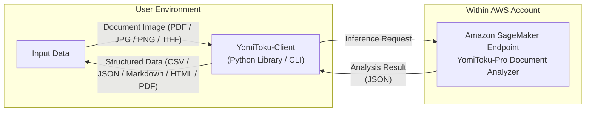

# YomiToku-Client

<div align="center">  

[](README.en.md) [](README.md)

</div>  

**YomiToku-Client** is a Python client library designed for handling the output from the YomiToku-Pro API provided on AWS SageMaker. It converts OCR analysis results into structured data and makes it easy to save or visualize them in formats such as CSV, JSON, Markdown, and PDF.
It acts as the “bridge” linking YomiToku-Pro’s high-accuracy OCR with your business applications.

---

## Key Features

* Easily, securely, and efficiently invoke a SageMaker endpoint created on AWS.
* Support conversion of OCR results into multiple output formats (CSV / JSON / Markdown / HTML / PDF).
* Visualize OCR results so you can quickly review the content.
* Batch-processing capabilities allow efficient handling of large numbers of documents.



## What is YomiToku-Pro Document Analyzer?

YomiToku-Pro Document Analyzer is a SageMaker endpoint offered via the AWS Marketplace.

* It performs fast and highly accurate inference of text reading and document-layout analysis on Japanese documents.
* Each model is trained specifically on Japanese document images, supports recognition of over 7,000 Japanese characters, and can also handle handwritten text or vertical layouts common in Japanese. (It also supports English document images.)
* With layout analysis, table-structure extraction, and reading-order estimation, it enables extraction of information while preserving the semantic structure of the document image.
* **Page rotation correction**: It estimates the page orientation and automatically corrects to the proper orientation before analysis.
* A dedicated SageMaker endpoint is created in each user’s AWS account, and processing is completed within the AWS region. **No external servers or third-party transfers are required**, allowing document analysis with high security and compliance.


### 利用方法
* 🔒 **[Authentication Setup](https://mlism-inc.github.io/yomitoku-client/iam-doc/)** – Guide to configuring AWS authentication.
* 🚀 **[Deploying the SageMaker Endpoint](https://mlism-inc.github.io/yomitoku-client/deploy-yomitoku-pro/)** – Step-by-step guide for deploying the *YomiToku-Pro Document Analyzer* endpoint.

## Example of Analysis Results

Please refer to [gellery.md](./gellery.md).

---

## Quick Links
* 📓 **[Sample Notebook](https://colab.research.google.com/github/MLism-Inc/yomitoku-client/blob/main/notebooks/yomitoku-pro-document-analyzer.ipynb)** – Tutorial on connecting to an AWS SageMaker endpoint and performing document analysis.
* 📖 **[Documentation](https://mlism-inc.github.io/yomitoku-client/)** – Detailed guide on how to use **YomiToku-Client**.

---

## Quick Start (CLI)
**single file processing**
```bash
yomitoku-client single ${path_file} -e ${endpoint_name} -r ${region} -f md
```

**batch processing**
```bash
yomitoku-client batch -i ${input_dir} -o ${output_dir} -e ${endpoint} -p ${profile_name} -f md
```

See --help for available options.

## Quick Start (Synchronous Version)

Below is the simplest usage example: you input a PDF and save the output as Markdown.

```python
from yomitoku_client import YomitokuClient, parse_pydantic_model

with YomitokuClient(endpoint="my-endpoint", region="ap-northeast-1") as client:
    result = client.analyze("notebooks/sample/image.pdf")

model = parse_pydantic_model(result)
model.to_markdown(output_path="output.md")
```
---

## Installation

### Using pip

```bash
pip install yomitoku-client
```

### Using uv (recommended)

```bash
uv add yomitoku-client
```

> **Note**: If `uv` is not installed, you can install it with:
>
> ```bash
> curl -LsSf https://astral.sh/uv/install.sh | sh
> ```

---
## Single-File Analysis (Asynchronous Version)

* **Automatic Content Type Detection**: Automatically recognizes PDF, TIFF, PNG, and JPEG formats and processes them in the optimal way.
* **Page Splitting and Asynchronous Parallel Processing**: Automatically splits multi-page PDFs and TIFFs into individual pages and performs inference in parallel.
* **Timeout Management**: Equipped with timeout control and automatic retry mechanisms.
* **Circuit Breaker Mechanism**: Temporarily halts requests to protect the endpoint when consecutive failures occur.

```python
import asyncio
from yomitoku_client import YomitokuClient
from yomitoku_client import parse_pydantic_model

ENDPOINT_NAME = "my-endpoint"
AWS_REGION = "ap-northeast-1"

target_file = "notebooks/sample/image.pdf"

async def main():
    async with YomitokuClient(
        endpoint=ENDPOINT_NAME,
        region=AWS_REGION,
    ) as client:
        result = await client.analyze_async(target_file)

    # Format conversion
    model = parse_pydantic_model(result)
    model.to_csv(output_path="output.csv")     # Save as CSV
    model.to_markdown(output_path="output.md", image_path=target_file)  # Save as Markdown
    model.to_json(output_path='output.json', mode="separate")  # Save per-page (mode="separate")
    model.to_html(output_path='output.html', image_path=target_file, page_index=[0, 2])  # Specify output pages
    model.to_pdf(output_path='output.pdf', image_path=target_file)  # Generate searchable PDF

    # Visualization of OCR results
    model.visualize(
        image_path=target_file,
        mode='ocr',
        page_index=None,
        output_directory="demo",
    )

    # Visualization of layout analysis results
    model.visualize(
        image_path=target_file,
        mode='layout',
        page_index=None,
        output_directory="demo",
    )

if __name__ == "__main__":
    asyncio.run(main())
```

---

## Batch-Processing Capabilities

YomitokuClient also supports batch processing, enabling safe and efficient handling of large numbers of documents.

* **Folder-level batch processing**: Automatically detects PDF/image files in a specified directory and executes parallel processing.
* **Intermediate log output (`process_log.jsonl`)**: Records each file’s processing result, success/failure, processing time, and error details as one JSON line per record (useful for downstream processing or retry workflows).
* **Overwrite control**: Skip files already processed (`overwrite=False`) to improve efficiency.
* **Retry support**: Easy to reprocess only failed files based on the log output.
* **Post-processing using logs**: Read `process_log.jsonl` and automatically export Markdown or visualization output for only the successful files.

### Sample Code

```python
import asyncio
import json
import os

from yomitoku_client import YomitokuClient
from yomitoku_client import parse_pydantic_model

# I/O settings
target_dir = "notebooks/sample"
outdir = "output"

# SageMaker endpoint settings
ENDPOINT_NAME = "my-endpoint"
AWS_REGION = "ap-northeast-1"

async def main():
    # Run batch analysis
    async with YomitokuClient(
        endpoint=ENDPOINT_NAME,
        region=AWS_REGION,
    ) as client:
        await client.analyze_batch_async(
            input_dir=target_dir,
            output_dir=outdir,
        )

    # Process only successful files from the log
    with open(os.path.join(outdir, "process_log.jsonl"), "r", encoding="utf-8") as f:
        logs = [json.loads(line) for line in f if line.strip()]

    out_markdown = os.path.join(outdir, "markdown")
    out_visualize = os.path.join(outdir, "visualization")

    os.makedirs(out_markdown, exist_ok=True)
    os.makedirs(out_visualize, exist_ok=True)

    for log in logs:
        if not log.get("success"):
            continue

        with open(log["output_path"], "r", encoding="utf-8") as rf:
            result = json.load(rf)

        doc = parse_pydantic_model(result)

        base = os.path.splitext(os.path.basename(log["file_path"]))[0]
        doc.to_markdown(output_path=os.path.join(out_markdown, f"{base}.md"))

        doc.visualize(
            image_path=log["file_path"],
            mode="ocr",
            output_directory=out_visualize,
            dpi=log.get("dpi", 200),
        )

if __name__ == "__main__":
    asyncio.run(main())
```

---

## License

Apache License 2.0 – See the `LICENSE` file for details.

---

## Documentation

For detailed usage instructions of **YomiToku-Client**, please refer to the [official documentation](https://mlism-inc.github.io/yomitoku-client/).


## Contact

For questions or support inquiries, please feel free to reach out:
📧 **[support-aws-marketplace@mlism.com](mailto:support-aws-marketplace@mlism.com)**