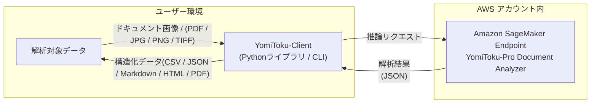

# YomiToku-Client
<div align="center">

[](README.en.md) [](README.md)

</div>

YomiToku-Clientは、AWS SageMaker上で提供されるYomiToku-Pro APIの出力を扱うためのPythonクライアントライブラリです。OCR解析結果を構造化データへ変換し、CSV・JSON・Markdown・PDFなどの形式での保存や可視化を容易にします。
YomiToku-Proの高精度OCRと、業務アプリケーションを結びつける「橋渡し」役を担います。

## 主な機能 
- AWS SageMakerで作成されたエンドポイントを簡単、安全かつ効率的に呼び出せます。
- 読み取り結果を多様な出力形式(CSV / JSON / Markdown / HTML / PDF)への変換をサポートします。
- 読み取り結果を可視化し、内容をすぐに確認できます。
- バッチ処理機能で大量の文書を効率的に処理できます。



## YomiToku-Pro Document Analyzer とは
YomiToku-Pro Document AnalyzerはAWS Marketplaceで提供されるSageMakerエンドポイントです。
- 日本語文書に対して、文字の読み取り、文書のレイアウトの解析を高速・高精度に推論します。
- 各モデルは日本語の文書画像に特化して学習されており、7000文字を超える日本語文字の認識をサポート、手書き文字、縦書きなど日本語特有のレイアウト構造の文書画像の解析も可能です。（日本語以外に、英語文書にも対応しています）。
- レイアウト解析・表の構造解析・読み順推定機能により、文書画像のレイアウトの意味的構造を壊さずに情報を抽出することが可能です。
- ページの回転補正：ページの回転の向きを推定し、自動で正しい向きに補正してから解析します。
- 各ユーザーのAWSアカウント内で専用のSageMakerエンドポイントが作成され、データはAWSリージョン内で完結して処理されます。**データは外部サーバーや第三者に送信されることはなく**、高いセキュリティとコンプライアンスを維持したまま文書解析が可能です。

### 利用方法
- 🔒 **[AWSの認証設定](https://mlism-inc.github.io/yomitoku-client/iam-doc/)** - AWSの認証の設定ガイド
- 🚀 **[SageMakerエンドポイントのデプロイ](https://mlism-inc.github.io/yomitoku-client/deploy-yomitoku-pro/)** - YomiToku-Pro Document Analyzerのエンドポイントのデプロイガイド


## 解析結果の例
[gellery.md](./gellery.md)を参照してくだい

---

## クイックリンク
- 📓 **[サンプルNotebook](https://colab.research.google.com/github/MLism-Inc/yomitoku-client/blob/main/notebooks/yomitoku-pro-document-analyzer.ipynb)** - AWS SageMakerエンドポイントとの接続とドキュメント解析のチュートリアル
- 📖 **[ドキュメント](https://mlism-inc.github.io/yomitoku-client/)** - YomiToku-Clientの利用方法の詳細

---

## クイックスタート(CLI)
**ファイル単体の解析**
```bash
yomitoku-client single ${path_file} -e ${endpoint} -p ${profile_name} -f json
```
**バッチ処理**
```bash
yomitoku-client batch -i ${input_dir} -o ${output_dir} -e ${endpoint} -p ${profile_name} -f md
```

オプションの詳細は`--help`を参照してください。


## クイックスタート(同期版)
最もシンプルな実行プログラムの例です。PDFを入力し、Markdownとして保存します。
```python
from yomitoku_client import YomitokuClient, parse_pydantic_model

with YomitokuClient(endpoint="my-endpoint", region="ap-northeast-1") as client:
    result = client.analyze("notebooks/sample/image.pdf")

model = parse_pydantic_model(result)
model.to_markdown(output_path="output.md")
```

## インストール

### pipを使用
```bash
pip install yomitoku-client
```

### uvを使用（推奨）
```bash
uv add yomitoku-client
```

> **注意**: uvがインストールされていない場合は、以下でインストールできます：
> ```bash
> curl -LsSf https://astral.sh/uv/install.sh | sh
> ```

## 単一ファイル解析（非同期版）
- **自動コンテンツタイプ判定**: PDF / TIFF / PNG / JPEG を自動認識し、最適な形式で処理
- **ページ分割と非同期並列処理**: 複数ページで構成されるPDF・TIFFを自動でページ分割し、各ページを並列で推論
- **タイムアウト制御**: タイムアウトと自動リトライ機能搭載
- **サーキットブレーカー機能**: 連続失敗時は一時停止してエンドポイントを保護

```python
import asyncio
from yomitoku_client import YomitokuClient
from yomitoku_client import parse_pydantic_model

ENDPOINT_NAME = "my-endpoint"
AWS_REGION = "ap-northeast-1"

target_file = "notebooks/sample/image.pdf"

async def main():
    async with YomitokuClient(
        endpoint=ENDPOINT_NAME,
        region=AWS_REGION,
    ) as client:
        result = await client.analyze_async(target_file)

    # フォーマットの変換
    model = parse_pydantic_model(result)
    model.to_csv(output_path="output.csv")     # CSVでの保存
    model.to_markdown(output_path="output.md", image_path=target_file) #Markdownフォーマットでの保存(図・画像出力)
    model.to_json(output_path='output.json', mode="separate")   # ページ分割での保存(mode="separate")
    model.to_html(output_path='output.html', image_path=target_file, page_index=[0, 2]) #出力ページの指定 (page_index=[0,2])
    model.to_pdf(output_path='output.pdf', image_path=target_file) # Searchable-PDFの出力

    # 解析結果の可視化
    model.visualize(
        image_path=target_file,
        mode='ocr',
        page_index=None,
        output_directory="demo",
    )

    # レイアウト解析結果の保存
    model.visualize(
        image_path=target_file,
        mode='layout',
        page_index=None,
        output_directory="demo",
    )

if __name__ == "__main__":
    asyncio.run(main())
```
## バッチ処理機能

YomitokuClientはバッチ処理機能もサポートしており、安全かつ効率的に大量の文書を解析可能です。

- **フォルダ単位での一括解析** : 指定ディレクトリ内のPDF・画像ファイルを自動で検出し、並列処理を実行。
- **中間ログ出力（process_log.jsonl）**: 各ファイルの処理結果・成功可否・処理時間・エラー内容を1行ごとに記録。（JSON Lines形式で出力され、後続処理や再実行管理に利用可能）
- **上書き制御**: 既に解析済みのファイルはスキップ（overwrite=False）設定で効率化。
- **再実行対応**:  ログをもとに、失敗したファイルのみを再解析する運用が容易。
- **ログを利用した後処理**: process_log.jsonl を読み込み、成功ファイルのみMarkdown出力や可視化を自動実行可能

### サンプルコード
```python
import asyncio
import json
import os

from yomitoku_client import YomitokuClient
from yomitoku_client import parse_pydantic_model

# 入出力設定
target_dir = "notebooks/sample"
outdir = "output"

# SageMakerエンドポイント設定
ENDPOINT_NAME = "my-endpoint"
AWS_REGION = "ap-northeast-1"

async def main():
    # バッチ解析の実行
    async with YomitokuClient(
        endpoint=ENDPOINT_NAME,
        region=AWS_REGION,
    ) as client:
        await client.analyze_batch_async(
            input_dir=target_dir,
            output_dir=outdir,
        )

    # ログから成功したファイルを処理
    with open(os.path.join(outdir, "process_log.jsonl"), "r", encoding="utf-8") as f:
        logs = [json.loads(line) for line in f if line.strip()]

    out_markdown = os.path.join(outdir, "markdown")
    out_visualize = os.path.join(outdir, "visualization")

    os.makedirs(out_markdown, exist_ok=True)
    os.makedirs(out_visualize, exist_ok=True)

    for log in logs:
        if not log.get("success"):
            continue

        # 解析結果のJSONを読み込み
        with open(log["output_path"], "r", encoding="utf-8") as rf:
            result = json.load(rf)

        doc = parse_pydantic_model(result)

        # Markdown出力
        base = os.path.splitext(os.path.basename(log["file_path"]))[0]
        doc.to_markdown(output_path=os.path.join(out_markdown, f"{base}.md"))

        # 解析結果の可視化
        doc.visualize(
            image_path=log["file_path"],
            mode="ocr",
            output_directory=out_visualize,
            dpi=log.get("dpi", 200),
        )

if __name__ == "__main__":
    asyncio.run(main())
```

## ドキュメント
YomiToku-Clientの詳細の利用方法は[ドキュメント](https://mlism-inc.github.io/yomitoku-client/)を参照してください。

## ライセンス

Apache License 2.0 - 詳細はLICENSEファイルを参照してください。


## お問い合わせ
ご質問やサポートのご依頼は、以下までご連絡ください。  
📧 **support-aws-marketplace@mlism.com**
