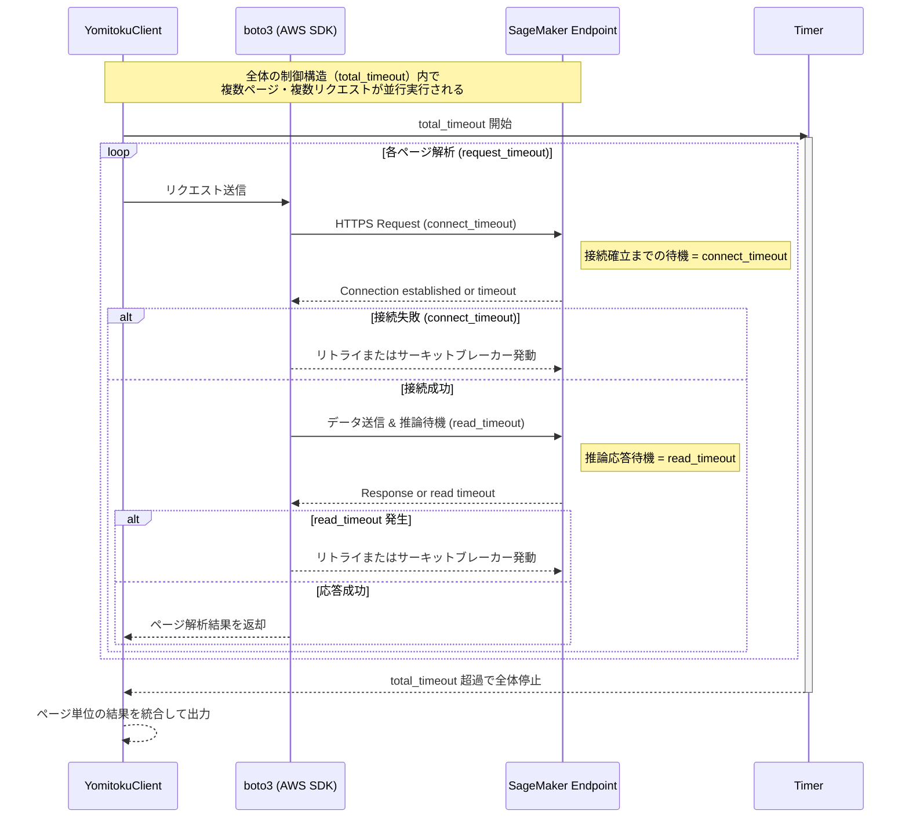

# Advanced

## API Reference

SageMaker エンドポイントから取得できる API スキーマは以下のリンクより確認できます。

* [YomiToku-Pro Document Analyzer API Schema (v1.3.2)](https://mlism-marketplace-documents.s3.ap-northeast-1.amazonaws.com/yomitoku-pro-document-analyzer-v1-3-2.html)

---

## タイムアウト / リトライ処理

YomitokuClient では、Boto3 レイヤおよびクライアントレイヤの双方でタイムアウト制御を行います。
各パラメータの意味は以下のとおりです。

| パラメータ名            | 型               | 既定値    | 対象範囲     | 説明                                                                    |
| ----------------- | --------------- | ------ | -------- | --------------------------------------------------------------------- |
| `connect_timeout` | `int`           | `10` 秒 | 各リクエスト単位 | サーバー（SageMaker Endpoint）への接続確立までの最大待機時間。TCP/HTTPS 接続が確立しない場合にタイムアウト。  |
| `read_timeout`    | `int`           | `60` 秒 | 各リクエスト単位 | 接続確立後、レスポンスを受け取るまでの最大待機時間。推論処理が遅い場合などに適用される。                          |
| `request_timeout` | `float` / `int` | 任意設定   | ページ単位    | 1ページ（または 1 ファイル）全体の推論処理に対する上限時間。`connect_timeout + read_timeout` を包括。 |
| `total_timeout`   | `float` / `int` | 任意設定   | ファイル単位   | バッチ処理全体の合計実行時間の上限。全ページの処理を含むグローバルなタイムアウト制御。                           |

---

## サーキットブレーカー

サーキットブレーカーは、連続して解析に失敗した場合にエンドポイントを保護するための仕組みです。
これが存在しない場合、複数クライアントが無制限にリトライを行い、
エンドポイントの負荷が過大になる恐れがあります。

YomitokuClient はこのリスクを防ぐため、**連続失敗時に一時的にリクエストを停止**し、
一定時間後に再試行を行う設計となっています。

---

### 🔁 シーケンス図



---

## パラメータ設定例

以下のコードは、タイムアウトおよびサーキットブレーカー設定を含む
YomitokuClient の使用例です。

```python
from yomitoku_client.client import RequestConfig, CircuitConfig, YomitokuClient

request_config = RequestConfig(
    read_timeout=120,     # Boto3 → Endpoint 応答待機タイムアウト [秒]
    connect_timeout=5,    # Boto3 → Endpoint 接続確立タイムアウト [秒]
    max_attempts=5,       # Boto3 による再試行回数の上限 [回]
)

circuit_config = CircuitConfig(
    threshold=3,          # 連続失敗のしきい値
    cooldown_sec=60,      # サーキットブレーカー適用後のクールダウン時間 [秒]
)

with YomitokuClient(
    endpoint=ENDPOINT_NAME,
    region=AWS_REGION,
    request_config=request_config,
    circuit_config=circuit_config,
) as client:
    result = client.analyze(
        path_img=PATH_IMG,
        request_timeout=150,   # ページ単位の解析時間上限 [秒]
        total_timeout=300,     # ファイル全体の解析時間上限 [秒]
    )
```

---

## 🧠 補足

* **`connect_timeout` / `read_timeout`**：
  Boto3 レイヤーでリクエストごとに適用されます（1 ページごとなど）。
* **`request_timeout` / `total_timeout`**：
  YomitokuClient 側の高レベル制御で、ページ単位・全体単位の上限時間を定義します。
* **`circuit_config`**：
  短時間に連続失敗が発生した場合の再試行抑止とエンドポイント保護を担います。

---
