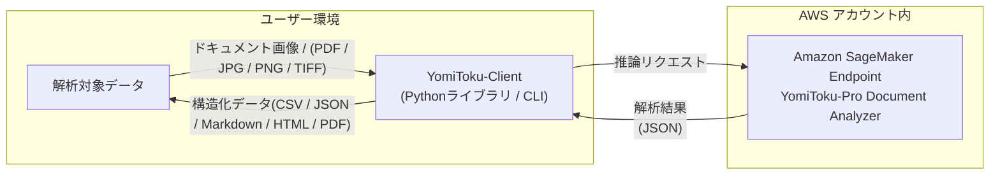

# YomiToku-Client

## 概要

YomiToku-Clientは、AWS SageMaker上で提供されるYomiToku-Pro APIの出力を扱うためのPythonクライアントライブラリです。OCR解析結果を構造化データへ変換し、CSV・JSON・Markdown・PDFなどの形式での保存や可視化を容易にします。YomiToku-Proの高精度OCRと、業務アプリケーションを結びつける「橋渡し」役を担います。

## 利用の手順
1. [YomiToku-Clientをインストール](installation.md)
1. [AWS Marketplace](https://aws.amazon.com/marketplace/pp/prodview-64qkuwrqi4lhi?sr=0-1&ref_=beagle&applicationId=AWSMPContessa)より**YomiToku-Pro - Document Analyzer**をサブスクライブ
1. [AWSの認証の設定する](iam-doc.md)
1. [AWS SageMakerにYomiToku-Pro Document-AnalyzerのEndpointを作成する](deploy-yomitoku-pro.md)
1. CLIかモジュールを実行し、エンドポイントを呼び出して、文書を解析する

## YomiToku-Clientの機能 
- AWS SageMakerで作成されたエンドポイントを簡単、安全かつ効率的に呼び出せます。
- 読み取り結果を多様な出力形式(CSV / JSON / Markdown / HTML / PDF)への変換をサポートします。
- 読み取り結果を可視化し、内容をすぐに確認できます。
- バッチ処理機能で大量の文書を効率的に処理できます。

## YomiToku-Pro Document Analyzer とは
YomiToku-Pro Document AnalyzerはAWS Marketplaceで提供されるSageMakerエンドポイントです。

- 日本語文書に対して、文字の読み取り、文書のレイアウトの解析を高速・高精度に推論します。
- 各モデルは日本語の文書画像に特化して学習されており、7000文字を超える日本語文字の認識をサポート、手書き文字、縦書きなど日本語特有のレイアウト構造の文書画像の解析も可能です。（日本語以外に、英語文書にも対応しています）。
- レイアウト解析・表の構造解析・読み順推定機能により、文書画像のレイアウトの意味的構造を壊さずに情報を抽出することが可能です。
- ページの回転補正：ページの回転の向きを推定し、自動で正しい向きに補正してから解析します。
- 各ユーザーのAWSアカウント内で専用のSageMakerエンドポイントが作成され、データはAWSリージョン内で完結して処理されます。外部サーバーや第三者に送信されることはなく、高いセキュリティとコンプライアンスを維持したまま文書解析が可能です。

## お問い合わせ

お問い合わせは[YomiToku-ClientのGitHubリポジトリ](https://github.com/MLism-Inc/yomitoku-client/tree/main)のIssueに投稿するか、もしくは<support-aws-marketplace@mlism.com>までご連絡ください。
