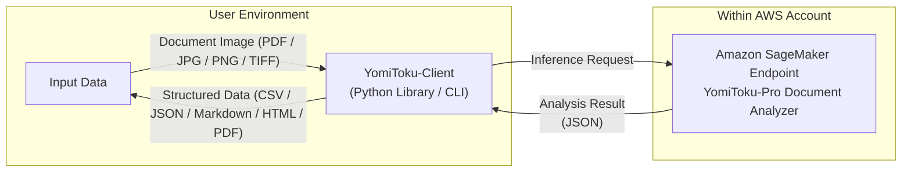

[日本語版](README.md) | English

[](https://mlism-inc.github.io/yomitoku-client/)


# YomiToku-Client

**YomiToku-Client** is a Python client library designed for handling the output from the YomiToku-Pro API provided on AWS SageMaker. It converts OCR analysis results into structured data and makes it easy to save or visualize them in formats such as CSV, JSON, Markdown, and PDF.
It acts as the “bridge” linking YomiToku-Pro’s high-accuracy OCR with your business applications.

---

## Key Features

* Easily, securely, and efficiently invoke a SageMaker endpoint created on AWS.
* Support conversion of OCR results into multiple output formats (CSV / JSON / Markdown / HTML / PDF).
* Visualize OCR results so you can quickly review the content.
* Batch-processing capabilities allow efficient handling of large numbers of documents.


---

## What is **YomiToku-Pro Document Analyzer**?

**YomiToku-Pro Document Analyzer** is a **high-precision Japanese document analysis engine** provided on **AWS Marketplace** as a dedicated **Amazon SageMaker endpoint**.

It is deployed securely within your own AWS account as a private endpoint, enabling **fast, accurate, and secure document analysis** with **no data ever sent to external servers**.

---

### 🔍 Key Features

* **High-accuracy Japanese OCR and layout analysis**
  Trained specifically for Japanese documents, it supports recognition of **over 7,000 Japanese characters**, including variant and traditional forms.
  It accurately handles handwritten text, vertical writing, and complex form layouts, and includes **page orientation correction** and **advanced layout analysis** capabilities.

* **High-speed inference (≈ 0.6 – 1.2 seconds per page)**
  A standard A4-sized page can be processed in **under 1 second on average**.
  Parallel processing is supported, making it ideal for high-volume batch document analysis.

* **Secure-by-design architecture**
  All processing takes place entirely **within your AWS environment**.
  No data is transmitted to external networks or third-party servers, ensuring full data privacy and compliance.

* **Unlimited scalability**
  Delivered as a dedicated SageMaker endpoint, the service has **no rate limits or request quotas** — you can process as many documents as needed while the endpoint is active.

---

## Quick Links

* 🔒 **[AWS Authentication Setup](https://mlism-inc.github.io/yomitoku-client/iam-doc/)** – Guide for configuring AWS authentication.
* 🚀 **[Deploying the SageMaker Endpoint](https://mlism-inc.github.io/yomitoku-client/deploy-yomitoku-pro/)** – Deployment guide for the **YomiToku-Pro Document Analyzer** endpoint.
* 📋 **[Sample Analysis Results](./gallery.md)** – Example datasets of analysis results.
* 📓 **[Notebook](https://colab.research.google.com/github/MLism-Inc/yomitoku-client/blob/main/notebooks/yomitoku-pro-document-analyzer.ipynb)** – Tutorial notebook for connecting to the AWS SageMaker endpoint and performing document analysis.
* 📖 **[Documentation](https://mlism-inc.github.io/yomitoku-client/)** – Detailed usage guide for **YomiToku-Client**.
---

## Quick Start (CLI)
**single file processing**
```bash
yomitoku-client single ${path_file} -e ${endpoint_name} -r ${region} -f md
```

**batch processing**
```bash
yomitoku-client batch -i ${input_dir} -o ${output_dir} -e ${endpoint} -p ${profile_name} -f md
```

See --help for available options.

## Quick Start (Synchronous Version)

Below is the simplest usage example: you input a PDF and save the output as Markdown.

```python
from yomitoku_client import YomitokuClient, parse_pydantic_model

with YomitokuClient(endpoint="my-endpoint", region="ap-northeast-1") as client:
    result = client.analyze("notebooks/sample/image.pdf")

model = parse_pydantic_model(result)
model.to_markdown(output_path="output.md")
```
---

## Installation

### Using pip

```bash
pip install yomitoku-client
```

### Using uv (recommended)

```bash
uv add yomitoku-client
```

> **Note**: If `uv` is not installed, you can install it with:
>
> ```bash
> curl -LsSf https://astral.sh/uv/install.sh | sh
> ```

---


## Throughput

The following table shows **theoretical throughput reference values** based on internal testing conducted by **MLism (Local → AWS)**.
Each value represents performance measured using the **batch processing feature of YomiToku-Client**, analyzing **randomly sampled single-sided A4 documents**.

| Instance Type    | SageMaker License Fee | Theoretical Throughput (pages/hour) | **Theoretical Processing Time per Page (seconds)** | Estimated Cost per Page  | Notes                                     |
| ---------------- | ----------------------------- | ----------------------------------- | -------------------------------------------------- | ------------------------ | ----------------------------------------- |
| **ml.g5.xlarge** | $10 / hour                    | Approx. **6,000 pages / hour**      | Approx. **0.60 s / page**                          | Approx. **¥0.29 / page** | High-speed GPU-optimized configuration    |
| **ml.g6.xlarge** | $10 / hour                    | Approx. **4,500 pages / hour**      | Approx. **0.80 s / page**                          | Approx. **¥0.40 / page** | Balanced stability and throughput         |
| **ml.g4.xlarge** | $10 / hour                    | Approx. **3,000 pages / hour**      | Approx. **1.20 s / page**                          | Approx. **¥0.55 / page** | Cost-efficient standard GPU configuration |

> **Notes**
>
> * Exchange rate: **1 USD ≒ 153.2 JPY (as of November 2025)**
> * Instance charges are billed separately.
> * Actual performance may vary depending on network latency and throughput.
> * Model used: **YomiToku-Pro – Document Analyzer v1.0.3**
> * Theoretical values exclude I/O wait times and initialization overhead (effective throughput is typically **60–80%** of theoretical values).
> * Processing time may vary depending on document complexity, text density, and layout structure.

If you plan to use the SageMaker endpoint for real-time processing or long-term / continuous operation,
discounted pricing is available through private offers.
Please contact us at the email address listed at the bottom of this page for more details.

---
## Single-File Analysis (Asynchronous Version)

* **Automatic Content Type Detection**: Automatically recognizes PDF, TIFF, PNG, and JPEG formats and processes them in the optimal way.
* **Page Splitting and Asynchronous Parallel Processing**: Automatically splits multi-page PDFs and TIFFs into individual pages and performs inference in parallel.
* **Timeout Management**: Equipped with timeout control and automatic retry mechanisms.
* **Circuit Breaker Mechanism**: Temporarily halts requests to protect the endpoint when consecutive failures occur.

```python
import asyncio
from yomitoku_client import YomitokuClient
from yomitoku_client import parse_pydantic_model

ENDPOINT_NAME = "my-endpoint"
AWS_REGION = "ap-northeast-1"

target_file = "notebooks/sample/image.pdf"

async def main():
    async with YomitokuClient(
        endpoint=ENDPOINT_NAME,
        region=AWS_REGION,
    ) as client:
        result = await client.analyze_async(target_file)

    # Format conversion
    model = parse_pydantic_model(result)
    model.to_csv(output_path="output.csv")     # Save as CSV
    model.to_markdown(output_path="output.md", image_path=target_file)  # Save as Markdown
    model.to_json(output_path='output.json', mode="separate")  # Save per-page (mode="separate")
    model.to_html(output_path='output.html', image_path=target_file, page_index=[0, 2])  # Specify output pages
    model.to_pdf(output_path='output.pdf', image_path=target_file)  # Generate searchable PDF

    # Visualization of OCR results
    model.visualize(
        image_path=target_file,
        mode='ocr',
        page_index=None,
        output_directory="demo",
    )

    # Visualization of layout analysis results
    model.visualize(
        image_path=target_file,
        mode='layout',
        page_index=None,
        output_directory="demo",
    )

if __name__ == "__main__":
    asyncio.run(main())
```

---

## Batch-Processing Capabilities

YomitokuClient also supports batch processing, enabling safe and efficient handling of large numbers of documents.

* **Folder-level batch processing**: Automatically detects PDF/image files in a specified directory and executes parallel processing.
* **Intermediate log output (`process_log.jsonl`)**: Records each file’s processing result, success/failure, processing time, and error details as one JSON line per record (useful for downstream processing or retry workflows).
* **Overwrite control**: Skip files already processed (`overwrite=False`) to improve efficiency.
* **Retry support**: Easy to reprocess only failed files based on the log output.
* **Post-processing using logs**: Read `process_log.jsonl` and automatically export Markdown or visualization output for only the successful files.

### Sample Code

```python
import asyncio
import json
import os

from yomitoku_client import YomitokuClient
from yomitoku_client import parse_pydantic_model

# I/O settings
target_dir = "notebooks/sample"
outdir = "output"

# SageMaker endpoint settings
ENDPOINT_NAME = "my-endpoint"
AWS_REGION = "ap-northeast-1"

async def main():
    # Run batch analysis
    async with YomitokuClient(
        endpoint=ENDPOINT_NAME,
        region=AWS_REGION,
    ) as client:
        await client.analyze_batch_async(
            input_dir=target_dir,
            output_dir=outdir,
        )

    # Process only successful files from the log
    with open(os.path.join(outdir, "process_log.jsonl"), "r", encoding="utf-8") as f:
        logs = [json.loads(line) for line in f if line.strip()]

    out_markdown = os.path.join(outdir, "markdown")
    out_visualize = os.path.join(outdir, "visualization")

    os.makedirs(out_markdown, exist_ok=True)
    os.makedirs(out_visualize, exist_ok=True)

    for log in logs:
        if not log.get("success"):
            continue

        with open(log["output_path"], "r", encoding="utf-8") as rf:
            result = json.load(rf)

        doc = parse_pydantic_model(result)

        base = os.path.splitext(os.path.basename(log["file_path"]))[0]
        doc.to_markdown(output_path=os.path.join(out_markdown, f"{base}.md"))

        doc.visualize(
            image_path=log["file_path"],
            mode="ocr",
            output_directory=out_visualize,
            dpi=log.get("dpi", 200),
        )

if __name__ == "__main__":
    asyncio.run(main())
```

---

## License

Apache License 2.0 – See the `LICENSE` file for details.

---

## Documentation

For detailed usage instructions of **YomiToku-Client**, please refer to the [official documentation](https://mlism-inc.github.io/yomitoku-client/).


## Contact

For questions or support inquiries, please feel free to reach out:
📧 **[support-aws-marketplace@mlism.com](mailto:support-aws-marketplace@mlism.com)**