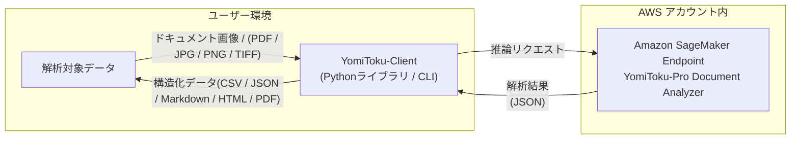

日本語版 | [English](README.en.md)

[](https://mlism-inc.github.io/yomitoku-client/)


# YomiToku-Client

YomiToku-Clientは、AWS SageMaker上で提供されるYomiToku-Pro APIの出力を扱うためのPythonクライアントライブラリです。OCR解析結果を構造化データへ変換し、CSV・JSON・Markdown・PDFなどの形式での保存や可視化を容易にします。
YomiToku-Proの高精度OCRと、業務アプリケーションを結びつける「橋渡し」役を担います。

## 主な機能 
- AWS SageMakerで作成されたエンドポイントを簡単、安全かつ効率的に呼び出せます。
- 読み取り結果を多様な出力形式(CSV / JSON / Markdown / HTML / PDF)への変換をサポートします。
- 読み取り結果を可視化し、内容をすぐに確認できます。
- バッチ処理機能で大量の文書を効率的に処理できます。



---

## YomiToku-Pro Document Analyzer とは

**YomiToku-Pro Document Analyzer** は、AWS Marketplace 上で提供される **Amazon SageMaker 専用の高精度日本語ドキュメント解析エンジン** です。

お客様の AWS アカウント上に専用エンドポイントとして構築され、外部サーバーへのデータ送信を一切行わずに、安全かつ高速、高精度な解析を実行します。

---

### 🔍 特長

* **高精度な日本語 OCR / レイアウト解析**
  日本語文書に特化して学習されており、**7,000 文字を超える日本語文字**を認識可能。手書き文字、縦書き、複雑な帳票レイアウトにも対応し、**ページ向き補正** や **詳細レイアウト解析** 機能を備えています。

* **高速推論（約 0.6〜1.2 秒 / ページ）**
  一般的な A4 片面文書を **平均 1 秒未満** で解析可能。
  並列処理にも対応しており、大量ページのバッチ処理にも適しています。

* **高セキュリティ設計**
  解析はすべてお客様の AWS 環境内で完結します。
  データは外部ネットワークや第三者サーバーに送信されず、安全にデータを解析可能です。

* **無制限のスケーラビリティ**
  SageMaker の専用エンドポイントとして提供されるため、
  **レートリミットやクオーター制限がなく**、起動中は無制限にリクエストを実行できます。

---

## クイックリンク
- 🔒 **[AWSの認証設定](https://mlism-inc.github.io/yomitoku-client/iam-doc/)** - AWSの認証の設定ガイド
- 🚀 **[SageMakerエンドポイントのデプロイ](https://mlism-inc.github.io/yomitoku-client/deploy-yomitoku-pro/)** - YomiToku-Pro Document Analyzerのエンドポイントのデプロイガイド
- 📋 **[解析結果のサンプル](./gallery.md)** - 解析結果のサンプルデータを載せています。
- 📓 **[Notebook](https://colab.research.google.com/github/MLism-Inc/yomitoku-client/blob/main/notebooks/yomitoku-pro-document-analyzer.ipynb)** - AWS SageMakerエンドポイントとの接続とドキュメント解析のチュートリアルNotebook
- 📖 **[ドキュメント](https://mlism-inc.github.io/yomitoku-client/)** - YomiToku-Clientの利用方法の詳細

---

## クイックスタート(CLI)
**ファイル単体の解析**
```bash
yomitoku-client single ${path_file} -e ${endpoint} -p ${profile_name} -f json
```
**バッチ処理**
```bash
yomitoku-client batch -i ${input_dir} -o ${output_dir} -e ${endpoint} -p ${profile_name} -f md
```

オプションの詳細は`--help`を参照してください。


## クイックスタート(同期版)
最もシンプルな実行プログラムの例です。PDFを入力し、Markdownとして保存します。
```python
from yomitoku_client import YomitokuClient, parse_pydantic_model

with YomitokuClient(endpoint="my-endpoint", region="ap-northeast-1") as client:
    result = client.analyze("notebooks/sample/image.pdf")

model = parse_pydantic_model(result)
model.to_markdown(output_path="output.md")
```

## インストール

### pipを使用
```bash
pip install yomitoku-client
```

### uvを使用（推奨）
```bash
uv add yomitoku-client
```

> **注意**: uvがインストールされていない場合は、以下でインストールできます：
> ```bash
> curl -LsSf https://astral.sh/uv/install.sh | sh
> ```

---

## スループット
以下は MLism 社内検証（ローカル → AWS） に基づく理論スループットの参考値です。
各インスタンスタイプ上で YomiToku-Client のバッチ処理機能を使用し、A4片面文書をランダムサンプリングして解析した際の理論値を示します。

| インスタンスタイプ        | SageMakerライセンス料金 | 理論解析性能（ページ/時）       | **1ページあたりの理論解析時間（秒）** | 1ページあたりの理論コスト（概算）  | 備考              |
| ---------------- | ----------- | ------------------- | --------------------- | ------------------ | --------------- |
| **ml.g5.xlarge** | $10 / hour  | 約 **6,000 ページ / hour** | 約 **0.60 秒 / ページ**    | 約 **0.29 円 / ページ** | 高速・GPU最適化構成     |
| **ml.g6.xlarge** | $10 / hour  | 約 **4,500 ページ / hour** | 約 **0.80 秒 / ページ**    | 約 **0.40 円 / ページ** | 安定性とスループットのバランス |
| **ml.g4.xlarge** | $10 / hour  | 約 **3,000 ページ / hour** | 約 **1.20 秒 / ページ**    | 約 **0.55 円 / ページ** | 低コスト・標準GPU構成    |

> **Notes**
> - 為替レート：1 USD ≒ 153.2 円（2025年11月時点）
> - インスタンス料金が別途発生します。
> - ネットワークのレイテンシやスループットにより、実際の性能は変動します。
> - 使用モデル: YomiToku-Pro - Document Analyzer v1.0.3
> - 理論値には I/O 待機時間や初期化時間を含みません（実効値は理論値の約 60〜80 % が目安）。
> - 文書の複雑度や文字量等に応じて、解析時間は前後します。

リアルタイム処理などのユースケースでSagaMakerエンドポイントを長時間 / 常時運用をご希望する場合は、プライベートオファーにて割引価格での提供も行っています。
ご希望する場合は、最下部のメールにお問い合わせください。

---

# サンプルプログラム
## 単一ファイル解析（非同期版）
- **自動コンテンツタイプ判定**: PDF / TIFF / PNG / JPEG を自動認識し、最適な形式で処理
- **ページ分割と非同期並列処理**: 複数ページで構成されるPDF・TIFFを自動でページ分割し、各ページを並列で推論
- **タイムアウト制御**: タイムアウトと自動リトライ機能搭載
- **サーキットブレーカー機能**: 連続失敗時は一時停止してエンドポイントを保護

```python
import asyncio
from yomitoku_client import YomitokuClient
from yomitoku_client import parse_pydantic_model

ENDPOINT_NAME = "my-endpoint"
AWS_REGION = "ap-northeast-1"

target_file = "notebooks/sample/image.pdf"

async def main():
    async with YomitokuClient(
        endpoint=ENDPOINT_NAME,
        region=AWS_REGION,
    ) as client:
        result = await client.analyze_async(target_file)

    # フォーマットの変換
    model = parse_pydantic_model(result)
    model.to_csv(output_path="output.csv")     # CSVでの保存
    model.to_markdown(output_path="output.md", image_path=target_file) #Markdownフォーマットでの保存(図・画像出力)
    model.to_json(output_path='output.json', mode="separate")   # ページ分割での保存(mode="separate")
    model.to_html(output_path='output.html', image_path=target_file, page_index=[0, 2]) #出力ページの指定 (page_index=[0,2])
    model.to_pdf(output_path='output.pdf', image_path=target_file) # Searchable-PDFの出力

    # 解析結果の可視化
    model.visualize(
        image_path=target_file,
        mode='ocr',
        page_index=None,
        output_directory="demo",
    )

    # レイアウト解析結果の保存
    model.visualize(
        image_path=target_file,
        mode='layout',
        page_index=None,
        output_directory="demo",
    )

if __name__ == "__main__":
    asyncio.run(main())
```
## バッチ処理機能

YomitokuClientはバッチ処理機能もサポートしており、安全かつ効率的に大量の文書を解析可能です。

- **フォルダ単位での一括解析** : 指定ディレクトリ内のPDF・画像ファイルを自動で検出し、並列処理を実行。
- **中間ログ出力（process_log.jsonl）**: 各ファイルの処理結果・成功可否・処理時間・エラー内容を1行ごとに記録。（JSON Lines形式で出力され、後続処理や再実行管理に利用可能）
- **上書き制御**: 既に解析済みのファイルはスキップ（overwrite=False）設定で効率化。
- **再実行対応**:  ログをもとに、失敗したファイルのみを再解析する運用が容易。
- **ログを利用した後処理**: process_log.jsonl を読み込み、成功ファイルのみMarkdown出力や可視化を自動実行可能

### サンプルコード
```python
import asyncio
import json
import os

from yomitoku_client import YomitokuClient
from yomitoku_client import parse_pydantic_model

# 入出力設定
target_dir = "notebooks/sample"
outdir = "output"

# SageMakerエンドポイント設定
ENDPOINT_NAME = "my-endpoint"
AWS_REGION = "ap-northeast-1"

async def main():
    # バッチ解析の実行
    async with YomitokuClient(
        endpoint=ENDPOINT_NAME,
        region=AWS_REGION,
    ) as client:
        await client.analyze_batch_async(
            input_dir=target_dir,
            output_dir=outdir,
        )

    # ログから成功したファイルを処理
    with open(os.path.join(outdir, "process_log.jsonl"), "r", encoding="utf-8") as f:
        logs = [json.loads(line) for line in f if line.strip()]

    out_markdown = os.path.join(outdir, "markdown")
    out_visualize = os.path.join(outdir, "visualization")

    os.makedirs(out_markdown, exist_ok=True)
    os.makedirs(out_visualize, exist_ok=True)

    for log in logs:
        if not log.get("success"):
            continue

        # 解析結果のJSONを読み込み
        with open(log["output_path"], "r", encoding="utf-8") as rf:
            result = json.load(rf)

        doc = parse_pydantic_model(result)

        # Markdown出力
        base = os.path.splitext(os.path.basename(log["file_path"]))[0]
        doc.to_markdown(output_path=os.path.join(out_markdown, f"{base}.md"))

        # 解析結果の可視化
        doc.visualize(
            image_path=log["file_path"],
            mode="ocr",
            output_directory=out_visualize,
            dpi=log.get("dpi", 200),
        )

if __name__ == "__main__":
    asyncio.run(main())
```

## ドキュメント
YomiToku-Clientの詳細の利用方法は[ドキュメント](https://mlism-inc.github.io/yomitoku-client/)を参照してください。

## ライセンス

Apache License 2.0 - 詳細はLICENSEファイルを参照してください。


## お問い合わせ
ご質問やサポートのご依頼は、以下までご連絡ください。  
📧 **support-aws-marketplace@mlism.com**
