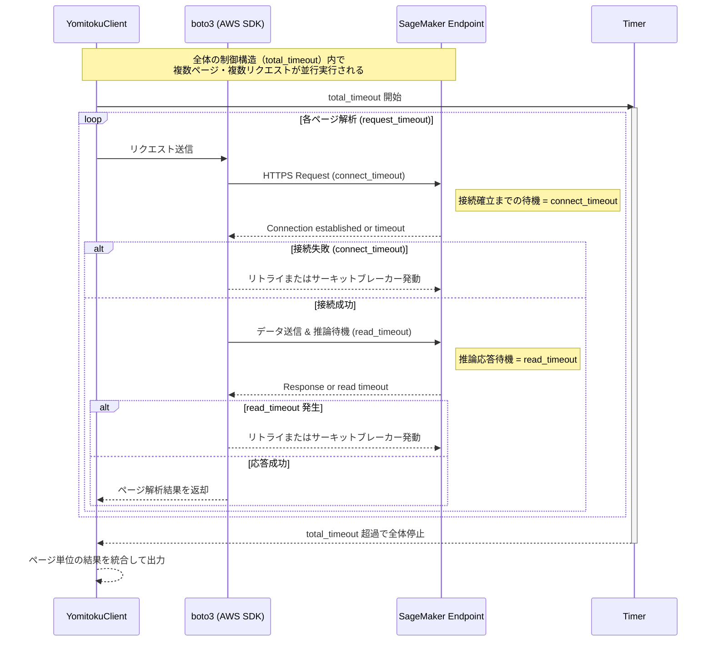

# Advanced

## API Reference

SageMaker エンドポイントから取得できる API スキーマは以下のリンクより確認できます。

* [YomiToku-Pro Document Analyzer API Schema (v1.3.2)](https://mlism-marketplace-documents.s3.ap-northeast-1.amazonaws.com/yomitoku-pro-document-analyzer-v1-3-2.html)

---

## 詳細設定
### 並列処理
YomitokuClientでは、複数ページで構成されるPDFなどのデータをページ単位で分割し、Endpointに並列でリクエストを行います。並列処理のワーカーの数の設定が可能です。

```bash
yomitoku-client batch -i ./input -o ./output -e my-endpoint --workers 8
```

### タイムアウト / リトライ処理

YomitokuClient では、Boto3 レイヤおよびクライアントレイヤの双方でタイムアウト制御を行います。
各パラメータの意味は以下のとおりです。

| パラメータ名              | 型       | 既定値    | 対象範囲     | 説明                                  |
| ------------------- | ------- | ------ | -------- | ----------------------------------- |
| `--connect_timeout` | `int`   | `10` 秒 | 各リクエスト単位 | SageMaker Endpoint への接続確立までの最大待機時間。 |
| `--read_timeout`    | `int`   | `60` 秒 | 各リクエスト単位 | 接続確立後、レスポンス受信までの最大待機時間。推論遅延時に適用。    |
| `--max_retries`     | `int`   | `3` 回  | 各リクエスト単位 | boto3 の再試行回数の上限。通信エラーや 5xx 応答時に再試行。 |
| `--request_timeout` | `float` | 任意設定   | ページ単位    | 1 ページ（または 1 ファイル）の処理上限時間。           |
| `--total_timeout`   | `float` | 任意設定   | バッチ全体    | 全ページ合計の処理上限時間。超過時は未完了タスクをキャンセル。    |

**使用例**
```bash
yomitoku-client batch \
  -i ./input -o ./output -e my-endpoint \
  --connect_timeout 5 \
  --read_timeout 120 \
  --max_retries 5 \
  --request_timeout 150 \
  --total_timeout 300
```

---

### サーキットブレーカー

サーキットブレーカーは、連続して解析に失敗した場合にエンドポイントを保護するための仕組みです。
これが存在しない場合、複数クライアントが無制限にリトライを行い、エンドポイントの負荷が過大になる恐れがあります。

YomitokuClient はこのリスクを防ぐため、**連続失敗時に一時的にリクエストを停止**し、一定時間後に再試行を行う設計となっています。

| パラメータ名                | 型     | 既定値    | 説明                           |
| --------------------- | ----- | ------ | ---------------------------- |
| `--threthold_circuit` | `int` | `5`    | 連続失敗のしきい値。これを超えるとリクエストを一時停止。 |
| `--cooldown_time`     | `int` | `30` 秒 | サーキットが開いた後に再試行を許可するまでの待機時間。  |

**使用例**
```bash
yomitoku-client batch \
  -i ./input -o ./output -e my-endpoint \
  --threthold_circuit 3 \
  --cooldown_time 60
```

> 🔒 連続失敗が 3 回発生した場合、60 秒間すべてのリクエストが停止します。
> クールダウン経過後に自動的にリクエストを再開します。

---

### 上書き制御
YomiToku-Clientのバッチ処理は過去のログ情報(`${OUTPUT_DIR}/process_log.jsonl`)を参照し、処理に失敗したデータのみ再推論が可能です。通常は`overwrite=False`のときはエラーの発生などにより、推論が実行されていないデータのみを対象としてリクエストします。`overwrite=True`のときは、フォルダ内の全データを対象に再リクエストを行います。

`--overwrite`オプションを使用すると、処理の実施/未実施に関わらずフォルダ内の全ファイルを再リクエストします。
```bash
yomitoku-client batch -i ./input -o ./output -e my-endpoint --overwrite
```

| オプション         | 型        | 説明                            |
| ------------- | -------- | ----------------------------- |
| `--overwrite` | *(flag)* | True の場合、既存の出力に関係なく全ファイルを再処理。 |

---

## 🔁 シーケンス図



## パラメータ設定例(Python API)

以下のコードは、タイムアウトおよびサーキットブレーカー設定を含む
YomitokuClient の使用例です。

```python
from yomitoku_client.client import RequestConfig, CircuitConfig, YomitokuClient

request_config = RequestConfig(
    read_timeout=120,     # 応答待機タイムアウト [秒]
    connect_timeout=5,    # 接続確立タイムアウト [秒]
    max_retries=5,       # boto3 のリトライ回数
)

circuit_config = CircuitConfig(
    threshold=3,          # 連続失敗のしきい値
    cooldown_time=60,      # サーキットブレーカー発動後のクールダウン [秒]
)

async with YomitokuClient(
    endpoint=ENDPOINT_NAME,
    region=AWS_REGION,
    request_config=request_config,
    circuit_config=circuit_config,
    max_workers=5,        # 並列ワーカー数
) as client:
    await client.analyze_batch_async(
        input_dir="./input",
        output_dir="./output",
        request_timeout=150,   # ページ単位の解析上限時間 [秒]
        total_timeout=300,     # 全体解析上限時間 [秒]
        overwrite=False,       # 未処理データのみ対象
    )

```